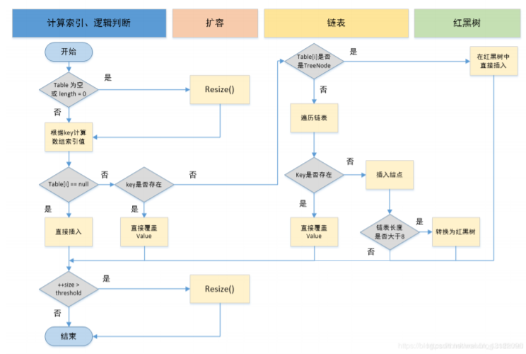
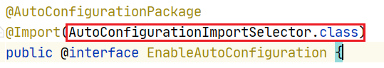

# 基础问题(100%)

参考博学谷就业专题

## 1. java常见的集合类有哪些

Map接口和Collection接口是所有集合框架的父接口： 

1. Collection接口的子接口包括：Set接口和List接口 
2. Map接口的实现类主要有：HashMap、TreeMap、Hashtable、ConcurrentHashMap以及 Properties等 
3. Set接口的实现类主要有：HashSet、TreeSet、LinkedHashSet等 
4. List接口的实现类主要有：ArrayList、LinkedList、Stack以及Vector等

## 2. 常用的线程安全的类有哪些 ? 

      1. Vector：就比Arraylist多了个 synchronized （线程安全），因为效率较低，现在已经不太建议使 用。
    
      2. hashTable：就比hashMap多了个synchronized (线程安全)，不建议使用。
    
      3. ConcurrentHashMap：是Java5中支持高并发、高吞吐量的线程安全HashMap实现

## 3. ArrayList 和 LinkedList 的区别是什么？

1. 数据结构实现：ArrayList 是动态数组的数据结构实现，而 LinkedList 是双向链表的数据结构实 现。 

2. 随机访问效率：ArrayList 比 LinkedList 在随机访问的时候效率要高，因为 LinkedList 是线性的数 据存储方式，所以需要移动指针从前往后依次查找。 

3. 增加和删除效率：在非首尾的增加和删除操作，LinkedList 要比 ArrayList 效率要高，因为 ArrayList 增删操作要影响数组内的其他数据的下标。 

4. 内存空间占用：LinkedList 比 ArrayList 更占内存，因为 LinkedList 的节点除了存储数据，还存储 了两个引用，一个指向前一个元素，一个指向后一个元素。 

5. 线程安全：ArrayList 和 LinkedList 都是不同步的，也就是不保证线程安全； 

## 4. 说一下HashMap的实现原理？

HashMap的数据结构： HashMap实际上是一个“链表散列”的数据结构，即数组和链表的结合体。 

HashMap 基于 Hash 算法实现的 

1. 当我们往HashMap中put元素时，利用key的hashCode重新hash计算出当前对象的元素在数 组中的下标 
2. 存储时，如果出现hash值相同的key，此时有两种情况。
   1. 如果key相同，则覆盖原始值；
   2. 如果key不同（出现冲突），则将当前的key-value放入链表中 
3. 获取时，直接找到hash值对应的下标，在进一步判断key是否相同，从而找到对应值。

**HashMap JDK1.8之前**

JDK1.8之前采用的是拉链法。拉链法：将链表和数组相结合。也就是说创建一个链表数组，数组中每一格就是一个链表。若遇到哈希冲突，则将冲突的值加到链表中即可。

**HashMap JDK1.8之后**

相比于之前的版本，jdk1.8在解决哈希冲突时有了较大的变化，当链表长度大于阈值（默认为8） 时，将链表转化为红黑树，以减少搜索时间。扩容 resize( ) 时，红黑树拆分成的 树的结点数小于等于临界值6个，则退化成链表。

## 5. HashMap的put方法的具体流程？

> 1. 判断键值对数组table[i]是否为空或为null，否则执行resize()进行扩容；
> 2. 根据键值key计算hash值得到插入的数组索引i，如果table[i]==null，直接新建节点添加，转向 ⑥，如果table[i]不为空，转向③； 
> 3. 判断table[i]的首个元素是否和key一样，如果相同直接覆盖value，否则转向④，这里的相同指的 是hashCode以及equals；
> 4. 判断table[i] 是否为treeNode，即table[i] 是否是红黑树，如果是红黑树，则直接在树中插入键值 对，否则转向5；
> 5. 遍历table[i]，判断链表长度是否大于8，大于8的话把链表转换为红黑树，在红黑树中执行插入操 作，否则进行链表的插入操作；遍历过程中若发现key已经存在直接覆盖value即可； 
> 6. 插入成功后，判断实际存在的键值对数量size是否超多了最大容量threshold，如果超过，进行扩 容。

## 6. 讲一讲HashMap的扩容机制

1. 在jdk1.8中，resize方法是在hashmap中的键值对大于阀值(0.75)时或者初始化时，就调用resize方法进 行扩容；
2. 每次扩展的时候，都是扩展2倍； 
3. 扩展后Node对象的位置要么在原位置，要么移动到原偏移量两倍的位置。

> 在putVal()中，我们看到在这个函数里面使用到了2次resize()方法，resize()方法表示的在进行第一 次初始化时会对其进行扩容，或者当该数组的实际大小大于其临界值值(第一次为12) , 这个时候在扩 容的同时也会伴随的桶上面的元素进行重新分发，这也是JDK1.8版本的一个优化的地方，在1.7 中，扩容之后需要重新去计算其Hash值，根据Hash值对其进行分发，但在1.8版本中，则是根据 在同一个桶的位置中进行判断(e.hash & oldCap)是否为0，重新进行hash分配后，该元素的位置 要么停留在原始位置，要么移动到原始位置+增加的数组大小这个位置上

## 7. ConcurrentHashMap 底层具体实现知道吗？

ConcurrentHashMap 是一种线程安全的高效Map集合

**底层数据结构：**

- JDK1.7的 ConcurrentHashMap 底层采用 分段的数组+链表 实现，

- JDK1.8 采用的数据结构跟HashMap1.8的结构一样，数组+链表/红黑二叉树。

  

**JDK1.7**

首先将数据分为一段一段的存储，然后给每一段数据配一把锁，当一个线程占用锁访问其中一个段 数据时，其他段的数据也能被其他线程访问。

在JDK1.7中，ConcurrentHashMap采用Segment + HashEntry的方式进行实现

一个 ConcurrentHashMap 里包含一个 Segment 数组。Segment 的结构和HashMap类似，是一 种数组和链表结构，一个 Segment 包含一个 HashEntry 数组，每个 HashEntry 是一个链表结构 的元素，每个 Segment 守护着一个HashEntry数组里的元素，当对 HashEntry 数组的数据进行修 改时，必须首先获得对应的 Segment的锁。

Segment 是一种可重入的锁 ReentrantLock，每个 Segment 守护一个HashEntry 数组里得元 素，当对 HashEntry 数组的数据进行修改时，必须首先获得对应的 Segment 锁。

**JDK1.8**

在JDK1.8中，放弃了Segment臃肿的设计，取而代之的是采用Node + CAS + Synchronized来保 证并发安全进行实现，synchronized只锁定当前链表或红黑二叉树的首节点，这样只要hash不冲 突，就不会产生并发 , 效率得到提升

# 项目问题

## 01- 你们是如何对用户的身份进行校验的 ? 程序中如何获取登录用户信息 ?

 

## 02- 拦截器用过嘛 ? 如何定义一个拦截器 ? 在你们的项目中有没有使用过拦截器 ?

## 03- 你们项目中的一些图片和视频数据如何存储的 ? 

## 04- SpringBoot常用注解有哪些 ? 讲一讲SpringBoot自动装配的原理 ?

 **SpringBoot常用注解有哪些?**

**SpringBoot自动装配的原理**

1.在SpringBoot项目的启动引导类上都有一个注解`@SpringBootApplication`

这个注解是一个复合注解, 其中有三个注解构成 , 分别是

- @SpringBootConfiguration : 是@Configuration的派生注解 , 标注当前类是一个SpringBoot的配置类
- @ComponentScan : 开启组件扫描, 默认扫描的是当前启动引导了所在包以及子包
- **@EnableAutoConfiguration : 开启自动配置(自动配置核心注解)**

2.在@EnableAutoConfiguration注解的内容使用@Import注解导入了一个`AutoConfigurationImportSelector.class`的类

在`AutoConfigurationImportSelector.class`中的`selectImports`方法内通过一系列的方法调用, 最终需要加载类加载路径下`META-INF`下面的`spring.factories`配置文件

3.在`META-INF/spring.factories`配置文件中, 定义了很多的自动配置类的完全限定路径

这些配置类都会被加载

4.加载配置类之后, 会配置类或者配置方法上的@ConditionalOnXxxx条件化注解是否满足条件

如果满足条件就会从属性配置类中读取相关配置 , 执行配置类中的配置方法 , 完成自动配置

