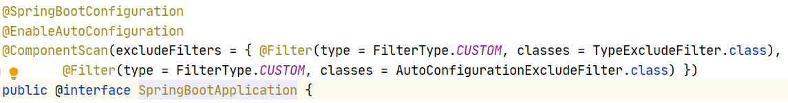
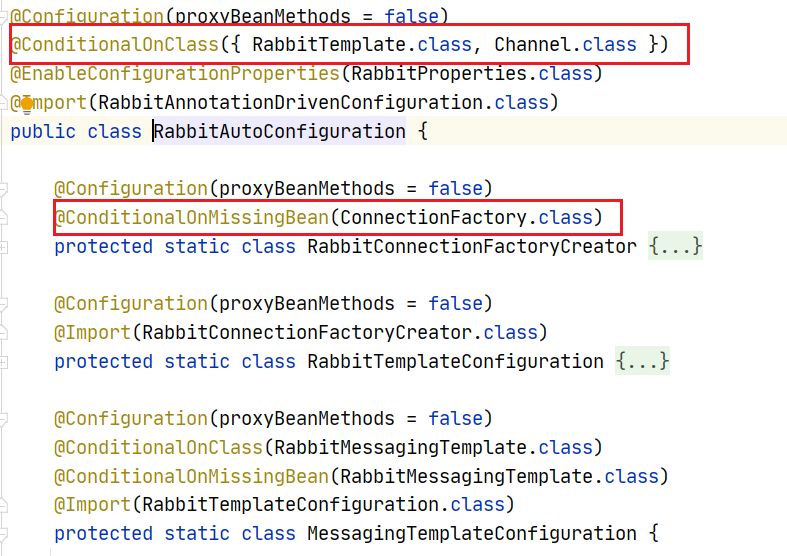
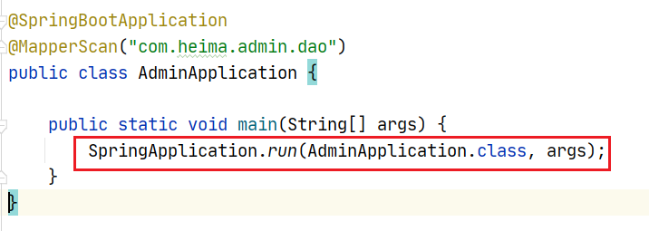
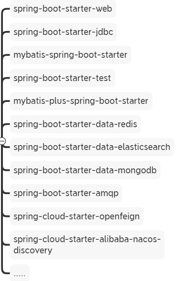

# 基础问题

## 01- 讲一讲SpringBoot自动装配的原理

1.在SpringBoot项目的启动引导类上都有一个注解`@SpringBootApplication`


这个注解是一个复合注解, 其中有三个注解构成 , 分别是



- @SpringBootConfiguration : 是@Configuration的派生注解 , 标注当前类是一个SpringBoot的配置类
- @ComponentScan : 开启组件扫描, 默认扫描的是当前启动引导了所在包以及子包
- **@EnableAutoConfiguration : 开启自动配置(自动配置核心注解)**

2.在@EnableAutoConfiguration注解的内容使用@Import注解导入了一个`AutoConfigurationImportSelector.class`的类


在`AutoConfigurationImportSelector.class`中的`selectImports`方法内通过一系列的方法调用, 最终需要加载类加载路径下`META-INF`下面的`spring.factories`配置文件

3.在`META-INF/spring.factories`配置文件中, 定义了很多的自动配置类的完全限定路径


这些配置类都会被加载

4.加载配置类之后, 会配置类或者配置方法上的@ConditionalOnXxxx条件化注解是否满足条件



如果满足条件就会从属性配置类中读取相关配置 , 执行配置类中的配置方法 , 完成自动配置

## 02- 讲一讲SpringBoot启动流程

springboot项目在启动的时候, 首先会执行启动引导类里面的`SpringApplication.run(AdminApplication.class, args)`方法



这个run方法主要做的事情可以分为三个部分 : 

第一部分进行SpringApplication的初始化模块，配置一些基本的环境变量、资源、构造器、监听器

第二部分实现了应用具体的启动方案，包括启动流程的监听模块、加载配置环境模块、及核心的创建上下文环境模块

第三部分是自动化配置模块，该模块作为springboot自动配置核心，在后面的分析中会详细讨论


## 03- 你们常用的SpringBoot起步依赖有哪些



## 04- springBoot支持的配置文件有哪些 ? 加载顺序是什么样的

1 properties文件
2 YAML文件 
3 系统环境变量 
4 命令行参数

如果有相同的配置参数, 后加载的会覆盖先加载的


## 05- 运行一个SpringBoot项目有哪些方式

1. 直接使用jar -jar 运行

2. 开发过程中运行main方法

3. 可以配置插件 , 将springboot项目打war包, 部署到Tomcat中运行

4. 直接用maven插件运行 maven spring-boot：run

## 07-Spring Boot的核心注解是哪个？他由哪几个注解组成的？

Spring Boot的核心注解是@SpringBootApplication , 他由几个注解组成 : 

- @SpringBootConfiguration： 组合了- @Configuration注解，实现配置文件的功能；
- @EnableAutoConfiguration：打开自动配置的功能，也可以关闭某个自动配置的选项
- @ComponentScan：Spring组件扫描


## 08-Spring Boot 中如何解决跨域问题 ?

SpringMVC项目中使用@CrossOrigin注解来解决跨域问题 , 本质是CORS

```java
@RequestMapping("/hello")
@CrossOrigin(origins = "*")
//@CrossOrigin(value = "http://localhost:8081") //指定具体ip允许跨域
public String hello() {
    return "hello world";
}
```

SpringBoot项目采用自动配置的方式来配置CORS , 可以通过实现 WebMvcConfigurer接口然后重写addCorsMappings方法解决跨域问题。

```java
@Configuration
public class CorsConfig implements WebMvcConfigurer {

    @Override
    public void addCorsMappings(CorsRegistry registry) {
        registry.addMapping("/**")
                //是否发送Cookie
                .allowCredentials(true)
                //放行哪些原始域
                .allowedOrigins("*")
                .allowedMethods(new String[]{"GET", "POST", "PUT", "DELETE"})
                .allowedHeaders("*")
                .exposedHeaders("*");
    }
}
```

在SpringCloud项目中一般都会有网关 , 在网关中可以配置CORS跨域, 这样所有通过网关的请求都解决了跨域问题

```yml
spring:
  cloud:
    gateway:
      globalcors:
        cors-configurations:
          '[/**]': # 匹配所有请求
            allowedOrigins: "*" #跨域处理 允许所有的域
            allowedMethods: # 支持的方法
              - GET
              - POST
              - PUT
              - DELETE
```


## 09- 你们项目中使用的SpringBoot是哪个版本 ? 

- SpringBoot : 2.3.4.RELEASE

- SpringCloud : Hoxton.SR10

- SpringCloudAlibaba : 2.2.5.RELEASE

## 10- Spring Cloud 5大组件有哪些？

早期我们一般认为的Spring Cloud五大组件是 

- Eureka   : 注册中心
- Ribbon  : 负载均衡
- Feign     : 远程调用
- Hystrix :  服务熔断
- Zuul/Gateway  : 网关

随着SpringCloudAlibba在国内兴起 , 我们项目中使用了一些阿里巴巴的组件 

- 注册中心/配置中心 Nacos

- 负载均衡 Ribbon

- 服务调用 Feign

- 服务保护 sentinel

- 服务网关 Gateway


## 项目问题

## 01- 在你们项目中文章的定时发布如何完成的  ? 


## 02- 在你们项目中是如何完成数据同步的 ? 


## 03- 为什么要使用Freemarker对文章详情进行静态化处理 ? 