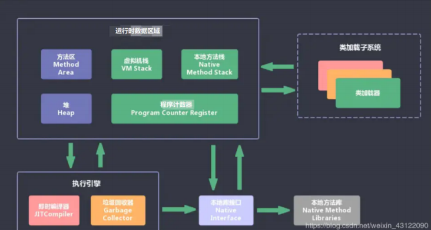
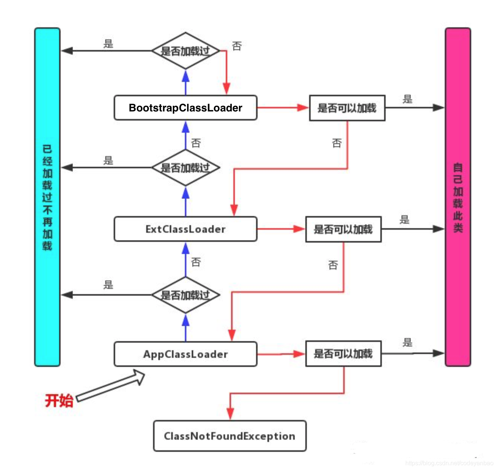

# 基础问题

参考 : 

## 01. 讲一讲JVM的组成

JVM包含两个子系统和两个组件:  

- 两个子系统为Class loader(类装载)、Execution engine(执行引 擎)； 
- 两个组件为Runtime data area(运行时数据区)、Native Interface(本地接口)。 
  - Class loader(类装载)：根据给定的全限定名类名(如：java.lang.Object)来装载class文件到 Runtime data area中的method area。 
  - Execution engine（执行引擎）：执行classes中的指令。
  - Native Interface(本地接口)：与native libraries交互，是其它编程语言交互的接口。 
  - Runtime data area(运行时数据区域)：这就是我们常说的JVM的内存。

## 02. JAVA代码在JVM是怎么执行的

首先通过编译器把 Java 代码转换成字节码，类加载器（ClassLoader）再把字节码加载到 内存中，将其放在运行时数据区（Runtime data area）的方法区内，而字节码文件只是 JVM 的一 套指令集规范，并不能直接交给底层操作系统去执行，因此需要特定的命令解析器执行引擎 （Execution Engine），将字节码翻译成底层系统指令，再交由 CPU 去执行，而这个过程中需要 调用其他语言的本地库接口（Native Interface）来实现整个程序的功能。

## 03. 说一下 JVM 运行时数据区

Java 虚拟机在执行 Java 程序的过程中会把它所管理的内存区域划分为若干个不同的数据区域。这 些区域都有各自的用途，以及创建和销毁的时间，有些区域随着虚拟机进程的启动而存在，有些区 域则是依赖线程的启动和结束而建立和销毁。Java 虚拟机所管理的内存被划分为如下几个区域

**程序计数器（Program Counter Register）**：当前线程所执行的字节码的行号指示器，字节码解 析器的工作是通过改变这个计数器的值，来选取下一条需要执行的字节码指令，分支、循环、跳 转、异常处理、线程恢复等基础功能，都需要依赖这个计数器来完成； 为什么要线程计数器？因为线程是不具备记忆功能

 **Java 虚拟机栈（Java Virtual Machine Stacks）：**每个方法在执行的同时都会在Java 虚拟机栈中创 建一个栈帧（Stack Frame）用于存储局部变量表、操作数栈、动态链接、方法出口等信息； 栈帧就是Java虚拟机栈中的下一个单位 

**本地方法栈（Native Method Stack）：**与虚拟机栈的作用是一样的，只不过虚拟机栈是服务 Java 方法的，而本地方法栈是为虚拟机调用 Native 方法服务的； Native 关键字修饰的方法是看不到的，Native 方法的源码大部分都是 C和C++ 的代码

 **Java 堆（Java Heap）：**Java 虚拟机中内存最大的一块，是被所有线程共享的，几乎所有的**对象实例**都在这里分配内存； 

**方法区（Methed Area）：**用于存储已被虚拟机加载的**类信息、常量、静态变量、即时编译后的 代码**等数据。

## 04. 堆栈的区别是什么？

## 05. 什么是类加载器，类加载器有哪些?

主要有一下四种类加载器: 

1. 启动类加载器(Bootstrap ClassLoader)用来加载java核心类库，无法被java程序直接引用。
2. 扩展类加载器(extensions class loader):它用来加载 Java 的扩展库。Java 虚拟机的实现会提 供一个扩展库目录。该类加载器在此目录里面查找并加载 Java 类。
3. 系统类加载器（system class loader）：它根据 Java 应用的类路径（CLASSPATH）来加载 Java 类。一般来说，Java 应用的类都是由它来完成加载的。可以通过 ClassLoader.getSystemClassLoader()来获取它。
4. 用户自定义类加载器，通过继承 java.lang.ClassLoader类的方式实现

## 06. 什么是双亲委派模型？

双亲委派模型：如果一个类加载器收到了类加载的请求，它首先不会自己去加载这个类，而是把这 个请求委派给父类加载器去完成，每一层的类加载器都是如此，这样所有的加载请求都会被传送到 顶层的启动类加载器中，只有当父加载无法完成加载请求（它的搜索范围中没找到所需的类）时， 子加载器才会尝试去加载类。 

**总结就是： 当一个类收到了类加载请求时，不会自己先去加载这个类，而是将其委派给父类，由父类去加 载，如果此时父类不能加载，反馈给子类，由子类去完成类的加载。**

## 07. 对于java的Stream流有使用过嘛 , 讲一讲stream流中的常用方法

## 08. jdk8有哪些新特性

1. 函数式方法
2. 方法引用
3. stream流
4. optional
5. .....

# 项目问题

## 01- 在你们的项目中如何对用户发布内容的安全性进行审核 ? 

## 02- 在你们的项目中是怎么整合第三方技术的 ?

