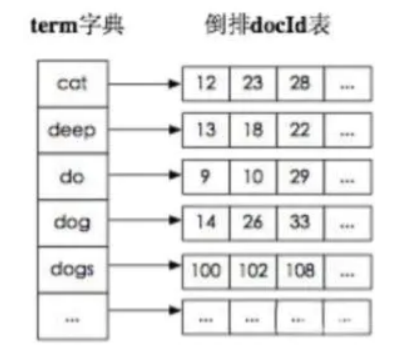
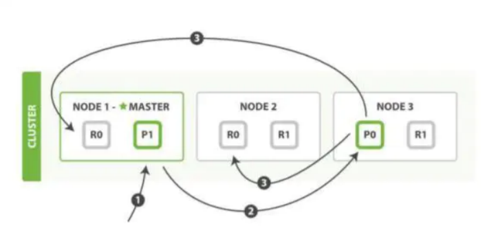
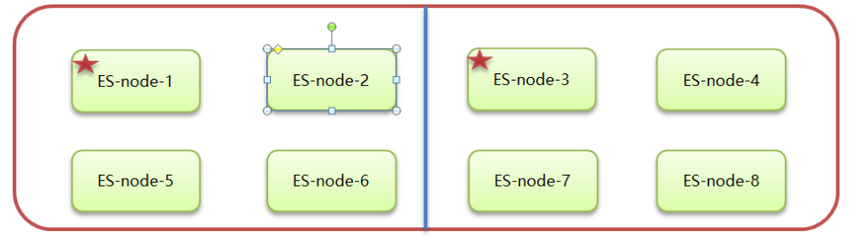
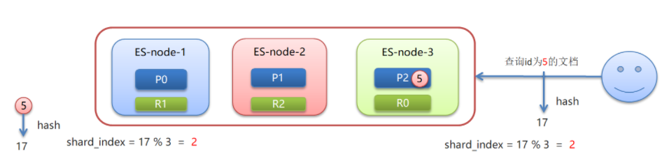

## elasticsearch 的倒排索引是什么

传统的我们的检索是通过文章，逐个遍历找到对应关键词的位置。 

而倒排索引，是通过分词策略，形成了词和文章的映射关系表，这种词典+映射表即为倒排索引。有了 倒排索引，就能实现 o（1）时间复杂度的效率检索文章了，极大的提高了检索效率。




## 什么是分片(SHARDS)

由于应用程序在不同的机器上使用了多个*ElasticSearch*实例，因此在扩展方面存在诸如RAM、VCPU等资源限制。索引中的数据可以分为多个部分，由一个单独的*ElasticSearch*节点或实例管理。每个部分称为一个SHARDS。默认情况下，ElasticSearch索引有5个*SHARDS*。


## 什么是副本REPLICAS

一个索引被分解成碎片以便于分发和扩展。副本是分片的副本。一个节点是一个属于一个集群的ElasticSearch的运行实例。一个集群由一个或多个共享相同集群名称的节点组成。

## ElasticSearch中的分词器是什么？

在ElasticSearch中索引数据时，数据由为索引定义的Analyzer在内部进行转换。 分析器由一个Tokenizer和零个或多个TokenFilter组成。编译器可以在一个或多个CharFilter之前。分析模块允许您在逻辑名称下注册分析器，然后可以在映射定义或某些API中引用它们。我们主要用的就是IK分词器


索引 : 

> 1. 分词    我们 主要 用 的 就是 IK 分词器 ,
> 2. 过滤    我们 主要  就是   IK 分词器 


## 你在项目中是如何使用ES的, 主要用到ES哪些功能 ?

**如何使用的**

1. 使用 spring-data-elasticsearch 
   1. ElasticSearchTemplate
   2. 基于JPA定义 ElasticSearchRepository 
2. 使用ES原生API查询 SearchQueryBuilders

**用到哪些功能**

1. 关键词搜索
2. GEO地理位置查询

## ElasticSearch常用的查询方式有哪些 ? 如何构建查询条件

**ElasticSearch查询方式有很多 :** 

1. matchAllQuery : 查询所有
2. termQuery : 根据关键词查询 
3. matchQuery : 查询条件分词查询 , 默认取并集 , 可以设置operation 指定取值方式
4. wildcard : 模糊查询(不推荐)
5. regexpQuery : 正则匹配
6. prefixQuery : 前缀查询
7. rangeQuery : 范围查询
8. queryStringQuery : 查询条件分词查询,可以设置多个检索字段, 默认取并集 , 可以设置operation 指定取值方式
10. boolQuery : 多条件组合查询 ,  must , must_not , shoud , shoud_not , filter

**如何构建查询条件 ?** 

1. 使用new关键字创建对应的 SearchQueryBuilders
2. 使用QueryBuilders进行构建


## ElasticSearch如何实现聚合查询

AggregationBuilders构建聚合条件, 使用 aggregation 设置聚合条件

> ```java
>     //3. 设置查询条件
>     sourceBuilder.query(QueryBuilders.matchQuery("title","手机"))
>             //设置桶聚合条件
>             .aggregation(AggregationBuilders.terms("goods_brands").field("brandName").size(100));
> ```

## ElasticSearch如何实现高亮查询

使用`HighlightBuilder `设置高亮查询前后缀 , 以及高亮域

```

HighlightBuilder highlightBuilder  =new HighlightBuilder() ;
//设置高亮字段
highlightBuilder.field("title");
//设置高亮前缀
highlightBuilder.preTags("<font color='red'>");
//设置高亮后缀
highlightBuilder.postTags("</font>");

sourceBuilder.query(QueryBuilders.matchQuery("title","手机"))
        .highlighter(highlightBuilder);
```

##  如果想修改ES中某一个域的类型 , 该如何操作

>  注意  : ES中映射创建之后是不允许修改的 , 索引简历之后是不支持改名

1. 创建新的索引库

2. 将老的索引数据, 保存到新的索引库

  ```
  POST _reindex
  {
    "source": {
   	"index": "goods"
    },
    "dest": {
   	"index": "goods_v2"
    }
  }
  ```

  >  这个时候虽然已经可以重新的索引库中查询到数据课 , 但是索引名称变了, 可以使用索引别名解决这个问题
  >
  > 1. 删除原来的索引
  >
  >    DELETE goods
  >
  > 2. 创建索引别名 , 别名为原来的索引名称
  >
  >    POST goods_v2/_alias/goods

  

## Elasticsearch数据储存在哪里

*ElasticSearch*是一个带有多个目录的分布式文档存储。它可以实时存储和检索序列化为JSON文档的复杂数据结构。


## 详细描述一下 Elasticsearch 存入数据的过程



第一步：客户写集群某节点写入数据，发送请求。（如果没有指定路由/协调节点，请求的节点扮演路由节点的角色。）

第二步：节点 1 接受到请求后，使用文档_id 来确定文档属于分片 0。请求会被转到另外的节点，假定节点 3。因此分片 0 的主分片分配到节点 3 上。

> 借助路由算法获取，路由算法就是根据路由和文档 id 计算目标的分片 id 的过程。

第三步：节点 3 在主分片上执行写操作，如果成功，则将请求并行转发到节点 1和节点 2 的副本分片 上，等待结果返回。所有的副本分片都报告成功，节点 3 将向协调节点（节点 1）报告成功，节点 1 向 请求客户端报告写入成功。


## 详细描述一下 Elasticsearch 搜索的过程？

搜索分为为“query then fetch” 两个阶段。

query 阶段的目的：定位到位置，但不取。

> 1. 假设一个索引数据有 5 主+1 副本 共 10 分片，一次请求会命中（主或者副本分片中）的一个。 
>
> 2. 每个分片在本地进行查询，结果返回到本地有序的优先队列中。 
>
> 3. 第 2）步骤的结果发送到协调节点，协调节点产生一个全局的排序列表。

fetch 阶段的目的：取数据。


## Elasticsearch 是如何实现 Master 选举的？

1. Elasticsearch 的选主是 ZenDiscovery 模块负责的，主要包含 Ping（节点之间通过这个 RPC 来发 现彼此）和 Unicast（单播模块包含一个主机列表以控制哪些节点需要 ping 通）这两部分； 

2. 对所有可以成为 master 的节点（node.master: true）根据 nodeId 字典排序，每次选举每个节 点都把自己所知道节点排一次序，然后选出第一个（第 0 位）节点，暂且认为它是 master 节点。 

3. 如果对某个节点的投票数达到一定的值（可以成为 master 节点数 n/2+1）并且该节点自己也选 举自己，那这个节点就是 master。否则重新选举一直到满足上述条件。 

   >  master 节点的职责主要包括集群、节点和索引的管理，不负责文档级别的管理；data 节 点可以关闭 http 功能


## 什么是脑裂，Elasticsearch是如何避免脑裂现象的

所谓集群脑裂，是指 Elasticsearch 集群中的节点（比如共 8 个），其中的4 个选了一个 master，另外 4 个选了另一个 master 的情况。



当集群 master 候选数量不小于 3 个时，可以通过设置最少投票通过数量（discovery.zen.minimum_master_nodes）超过所有候选节点一半以上来解决脑裂问题； 节点总数量/2 + 1
当候选数量为两个时，只能修改为唯一的一个 master 候选，其他作为 data 节点，避免脑裂问题。

## 什么是ES路由

文档存入对应的分片，ES计算分片编号的过程，称为路由。

Elasticsearch 是怎么知道一个文档应该存放到哪个分片中呢？

查询时，根据文档id查询文档， Elasticsearch 又该去哪个分片中查询数据呢？

路由算法 ：shard_index = hash(id) % number_of_primary_shards

例如 : 查询id为5的文档：假如hash(5)=17 ，根据算法17%3=2




## 什么是分片与自平衡

当节点挂掉后，挂掉的节点分片会自平衡到其他节点中

注意：分片数量一旦确定好，不能修改。

**索引分片推荐配置方案：**

1.每个分片推荐大小10-30GB

2.分片数量推荐 = 节点数量 * 1~3倍

**思考：比如有1000GB数据，应该有多少个分片？多少个节点**

1.每个分片20GB 则可以分为40个分片

2.分片数量推荐 = 节点数量 * 1~3倍 --> 40/2=20 即20个节点


## 在并发情况下，Elasticsearch 如果保证读写一致？

1.  可以通过版本号使用乐观并发控制，以确保新版本不会被旧版本覆盖，由应用层来处理具体的冲 突； 

2. 另外对于写操作，一致性级别支持 quorum/one/all，默认为 quorum，即只有当大多数分片可用 时才允许写操作。但即使大多数可用，也可能存在因为网络等原因导致写入副本失败，这样该副本被认 为故障，分片将会在一个不同的节点上重建。 

3. 对于读操作，可以设置 replication 为 sync(默认)，这使得操作在主分片和副本分片都完成后才会 返回；如果设置 replication 为 async 时，也可以通过设置搜索请求参数_preference 为 primary 来查 询主分片，确保文档是最新版本


## ES调优手段

**设计阶段**

1. 根据业务增量需求，采取基于日期模板创建索引，通过 roll over API 滚动索引；
2. 使用别名进行索引管理； 
3. 每天凌晨定时对索引做 force_merge 操作，以释放空间； 
4. 采取冷热分离机制，热数据存储到 SSD，提高检索效率；冷数据定期进行 shrink操作，以缩减存 储； 
6. 仅针对需要分词的字段，合理的设置分词器； 
7. Mapping 阶段充分结合各个字段的属性，是否需要检索、是否需要存储等。


**写入调优**

1. 写入前副本数设置为 0； 
2. 写入前关闭 refresh_interval 设置为-1，禁用刷新机制； 
3. 写入过程中：采取 bulk 批量写入； 
4. 写入后恢复副本数和刷新间隔； 
5. 尽量使用自动生成的 id。


**查询调优**

1. 禁用 wildcard； 
2. 禁用批量 terms（成百上千的场景）； 
3. 充分利用倒排索引机制，能 keyword 类型尽量 keyword； 
4. 数据量大时候，可以先基于时间敲定索引再检索； 
5. 设置合理的路由机制。

