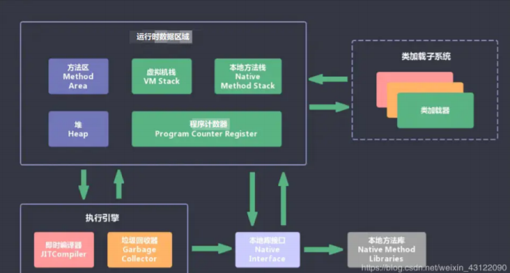
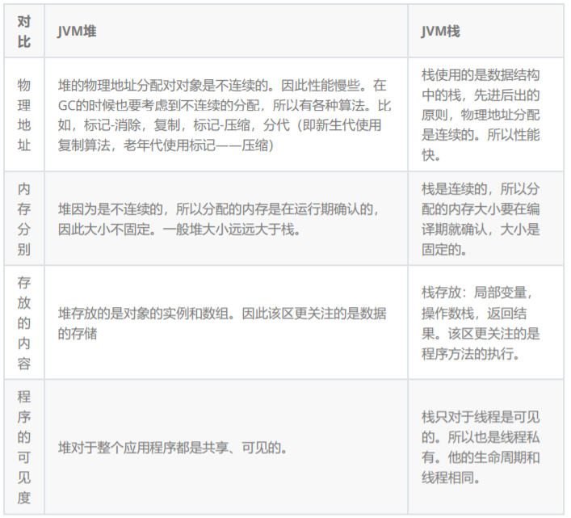
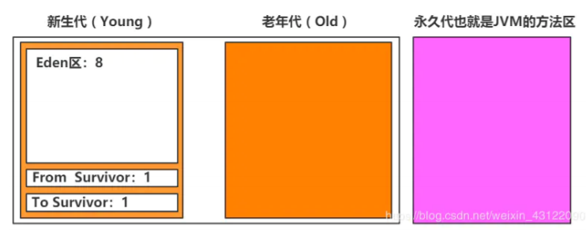

## JVM由那些部分组成，运行流程是什么？



JVM包含两个子系统和两个组件:  

- 两个子系统为Class loader(类装载)、Execution engine(执行引 擎)； 
- 两个组件为Runtime data area(运行时数据区)、Native Interface(本地接口)。 
  - Class loader(类装载)：根据给定的全限定名类名(如：java.lang.Object)来装载class文件到 Runtime data area中的method area。 
  - Execution engine（执行引擎）：执行classes中的指令。
  -  Native Interface(本地接口)：与native libraries交互，是其它编程语言交互的接口。 
  - Runtime data area(运行时数据区域)：这就是我们常说的JVM的内存。
- **流程 ：**首先通过编译器把 Java 代码转换成字节码，类加载器（ClassLoader）再把字节码加载到 内存中，将其放在运行时数据区（Runtime data area）的方法区内，而字节码文件只是 JVM 的一 套指令集规范，并不能直接交给底层操作系统去执行，因此需要特定的命令解析器执行引擎 （Execution Engine），将字节码翻译成底层系统指令，再交由 CPU 去执行，而这个过程中需要 调用其他语言的本地库接口（Native Interface）来实现整个程序的功能。

## 说一下 JVM 运行时数据区

Java 虚拟机在执行 Java 程序的过程中会把它所管理的内存区域划分为若干个不同的数据区域。这 些区域都有各自的用途，以及创建和销毁的时间，有些区域随着虚拟机进程的启动而存在，有些区 域则是依赖线程的启动和结束而建立和销毁。Java 虚拟机所管理的内存被划分为如下几个区域


**程序计数器（Program Counter Register）**：当前线程所执行的字节码的行号指示器，字节码解 析器的工作是通过改变这个计数器的值，来选取下一条需要执行的字节码指令，分支、循环、跳 转、异常处理、线程恢复等基础功能，都需要依赖这个计数器来完成； 为什么要线程计数器？因为线程是不具备记忆功能

 **Java 虚拟机栈（Java Virtual Machine Stacks）：**每个方法在执行的同时都会在Java 虚拟机栈中创 建一个栈帧（Stack Frame）用于存储局部变量表、操作数栈、动态链接、方法出口等信息； 栈帧就是Java虚拟机栈中的下一个单位 

**本地方法栈（Native Method Stack）：**与虚拟机栈的作用是一样的，只不过虚拟机栈是服务 Java 方法的，而本地方法栈是为虚拟机调用 Native 方法服务的； Native 关键字修饰的方法是看不到的，Native 方法的源码大部分都是 C和C++ 的代码

 **Java 堆（Java Heap）：**Java 虚拟机中内存最大的一块，是被所有线程共享的，几乎所有的对象实 例都在这里分配内存； 

**方法区（Methed Area）：**用于存储已被虚拟机加载的类信息、常量、静态变量、即时编译后的 代码等数据。


## 什么是程序计数器？

1. 程序计数器是一块较小的内存空间，它可以看作是：保存当前线程所正在执行的字节码指令的地址 (行号) 

2. 由于Java虚拟机的多线程是通过线程轮流切换并分配处理器执行时间的方式来实现的，一个处理器 都只会执行一条线程中的指令。因此，为了线程切换后能恢复到正确的执行位置，每条线程都有一 个独立的程序计数器，各个线程之间计数器互不影响，独立存储。称之为“线程私有”的内存。

## 你能给我详细的介绍Java堆吗?

java堆（Java Heap）是java虚拟机所管理的内存中最大的一块，是被所有线程共享的一块内存区 域，在虚拟机启动时创建。此内存区域的唯一目的就是存放对象实例。

在Java虚拟机规范中的描述是：所有的对象实例以及数组都要在堆上分配。

java堆是垃圾收集器管理的主要区域，因此也被成为“GC堆”

从内存回收角度来看java堆可分为：新生代和老年代。

从内存分配的角度看，线程共享的Java堆中可能划分出多个线程私有的分配缓冲区。

无论怎么划分，都与存放内容无关，无论哪个区域，存储的都是对象实例，进一步的划分都是为了 更好的回收内存，或者更快的分配内存。

## 能不能解释一下方法区？

1. 方法区是所有线程共享的内存区域，它用于存储已被Java虚拟机加载的类信息、常量、静态变量、 即时编译器编译后的代码等数据。 

2. 它有个别命叫Non-Heap（非堆）。当方法区无法满足内存分配需求时，抛出OutOfMemoryError 异常。


## 你听过直接内存吗？

直接内存（Direct Memory）并不是虚拟机运行时数据区的一部分，也不是Java虚拟机中定义的内 存区域。但是这部分内存也被频繁地使用，而且也可能导致 OutOfMemoryError 异常出现，所以 我们放到这里一起讲解。 

我的理解就是直接内存是基于物理内存和Java虚拟机内存的中间内存


## 堆栈的区别是什么？



注意： 静态变量放在方法区  , 静态的对象还是放在堆。


## 深拷贝和浅拷贝

浅拷贝（shallowCopy）只是增加了一个指针指向已存在的内存地址， 

深拷贝（deepCopy）是增加了一个指针并且申请了一个新的内存，使这个增加的指针指向这个新 的内存，

浅复制：仅仅是指向被复制的内存地址，如果原地址发生改变，那么浅复制出来的对象也会相应的 改变。 

深复制：在计算机中开辟一块新的内存地址用于存放复制的对象。


## 简述Java垃圾回收机制

在java中，程序员是不需要显示的去释放一个对象的内存的，而是由虚拟机自行执行。在JVM中， 有一个垃圾回收线程，它是低优先级的，在正常情况下是不会执行的，只有在虚拟机空闲或者当前 堆内存不足时，才会触发执行，扫面那些没有被任何引用的对象，并将它们添加到要回收的集合 中，进行回收。


## GC是什么？为什么要GC

GC 是垃圾收集的意思（Gabage Collection）,内存处理是编程人员容易出现问题的地方，忘记或者错误的内存回收会导致程序或系统的不稳定甚至崩溃，Java 提供的 GC 功能可以自动监测对象 是否超过作用域从而达到自动回收内存的目的，Java 语言没有提供释放已分配内存的显示操作方 法。


## 垃圾回收器的原理是什么？有什么办法手动进行垃圾回收？

对于GC来说，当程序员创建对象时，GC就开始监控这个对象的地址、大小以及使用情况。

 通常，GC采用有向图的方式记录和管理堆(heap)中的所有对象。通过这种方式确定哪些对象是"可达的"，哪些对象是"不可达的"。当GC确定一些对象为"不可达"时，GC就有责任回收这些内存空 间。 

**程序员可以手动执行System.gc()，通知GC运行，但是Java语言规范并不保证GC一定会执 行**。


## Full GC是什么

清理整个堆空间—包括年轻代和老年代和永久代 因为Full GC是清理整个堆空间所以Full GC执行速度非常慢，在Java开发中最好保证少触发Full GC


## 对象什么时候可以被垃圾器回收

当对象对当前使用这个对象的应用程序变得不可触及的时候，这个对象就可以被回收了。 

垃圾回收不会发生在永久代，如果永久代满了或者是超过了临界值，会触发完全垃圾回收(Full GC)。


## JVM 垃圾回收算法有哪些？

**标记-清除算法：**标记无用对象，然后进行清除回收。缺点：效率不高，无法清除垃圾碎片。

 **复制算法：**按照容量划分二个大小相等的内存区域，当一块用完的时候将活着的对象复制到另一块 上，然后再把已使用的内存空间一次清理掉。缺点：内存使用率不高，只有原来的一半。

 **标记-整理算法：**标记无用对象，让所有存活的对象都向一端移动，然后直接清除掉端边界以外的 内存。

 **分代算法：**根据对象存活周期的不同将内存划分为几块，一般是新生代和老年代，新生代基本采用 复制算法，老年代采用标记整理算法。


## JVM中的永久代中会发生垃圾回收吗

垃圾回收不会发生在永久代，如果永久代满了或者是超过了临界值，会触发完全垃圾回收(Full GC)。

**垃圾收集器以及新生代、老年代、永久代**


## 讲一下新生代、老年代、永久代的区别




在 Java 中，堆被划分成两个不同的区域：新生代 ( Young )、老年代 ( Old )。而新生代 ( Young ) 又被划分为三个区域：Eden、From Survivor、To Survivor。这样划分的目的是为了使 JVM 能够 更好的管理堆内存中的对象，包括内存的分配以及回收。

 新生代中一般保存新出现的对象，所以每次垃圾收集时都发现大批对象死去，只有少量对象存活， 便采用了 复制算法 ，只需要付出少量存活对象的复制成本就可以完成收集。 

老年代中一般保存存活了很久的对象，他们存活率高、没有额外空间对它进行分配担保，就必须采 用 “标记-清理”或者“标记-整理” 算法。 

永久代就是JVM的方法区。在这里都是放着一些被虚拟机加载的类信息，静态变量，常量等数据。 这个区中的东西比老年代和新生代更不容易回收。

## Minor GC、Major GC、Full GC是什么

1. Minor GC是新生代GC，指的是发生在新生代的垃圾收集动作。由于java对象大都是朝生夕死的， 所以Minor GC非常频繁，一般回收速度也比较快。（一般采用复制算法回收垃圾）
2.  Major GC是老年代GC，指的是发生在老年代的GC，通常执行Major GC会连着Minor GC一起执 行。Major GC的速度要比Minor GC慢的多。（可采用标记清楚法和标记整理法） 
3. Full GC是清理整个堆空间，包括年轻代和老年代


## 什么是类加载器，类加载器有哪些?

主要有一下四种类加载器: 

1. 启动类加载器(Bootstrap ClassLoader)用来加载java核心类库，无法被java程序直接引用。
2. 扩展类加载器(extensions class loader):它用来加载 Java 的扩展库。Java 虚拟机的实现会提 供一个扩展库目录。该类加载器在此目录里面查找并加载 Java 类。
3. 系统类加载器（system class loader）：它根据 Java 应用的类路径（CLASSPATH）来加载 Java 类。一般来说，Java 应用的类都是由它来完成加载的。可以通过 ClassLoader.getSystemClassLoader()来获取它。
4. 用户自定义类加载器，通过继承 java.lang.ClassLoader类的方式实现

## 说一下类装载的执行过程？

类装载分为以下 5 个步骤： 

加载：根据查找路径找到相应的 class 文件然后导入；

验证：检查加载的 class 文件的正确性； 

准备：给类中的静态变量分配内存空间； 

解析：虚拟机将常量池中的符号引用替换成直接引用的过程。

初始化：对静态变量和静态代码块执行初始化工作。


## 什么是双亲委派模型？

双亲委派模型：如果一个类加载器收到了类加载的请求，它首先不会自己去加载这个类，而是把这 个请求委派给父类加载器去完成，每一层的类加载器都是如此，这样所有的加载请求都会被传送到 顶层的启动类加载器中，只有当父加载无法完成加载请求（它的搜索范围中没找到所需的类）时， 子加载器才会尝试去加载类。 

总**结就是： 当一个类收到了类加载请求时，不会自己先去加载这个类，而是将其委派给父类，由父类去加 载，如果此时父类不能加载，反馈给子类，由子类去完成类的加载。**


## 强引用、软引用、弱引用、虚引用的区别？

**强引用**

我们平时new了一个对象就是强引用，例如 Object obj = new Object(); 即使在内存不足的情况下，JVM 宁愿抛出OutOfMemory错误也不会回收这种对象

**软引用**

如果一个对象只具有软引用，则内存空间足够，垃圾回收器就不会回收它；如果内存空间不足了，就会 回收这些对象的内存。

```
SoftReference<String> softRef = new SoftReference<String>(str); // 软引用
```

**弱引用**

具有弱引用的对象拥有更短暂的生命周期。在垃圾回收器线程扫描它所管辖的内存区域的过程中，一旦 发现了只具有弱引用的对象，不管当前内存空间足够与否，都会回收它的内存

```
String str=new String("abc");
WeakReference<String> abcWeakRef = new WeakReference<String>(str);
```

**虚引用**

如果一个对象仅持有虚引用，那么它就和没有任何引用一样，在任何时候都可能被垃圾回收器回收。虚 引用主要用来跟踪对象被垃圾回收器回收的活动。


## 说一下 JVM 调优的工具？

JDK 自带了很多监控工具，都位于 JDK 的 bin 目录下，其中最常用的是 jconsole 和 jvisualvm 这 两款视图监控工具。

- jconsole：用于对 JVM 中的内存、线程和类等进行监控；
- jvisualvm：JDK 自带的全能分析工具，可以分析：内存快照、线程快照、程序死锁、监控内存的变化、gc 变化等。


## 常用的 JVM 调优的参数都有哪些？

```
#常用的设置
-Xms：初始堆大小，JVM 启动的时候，给定堆空间大小。
-Xmx：最大堆大小，JVM 运行过程中，如果初始堆空间不足的时候，最大可以扩展到多少。
-Xmn：设置堆中年轻代大小。整个堆大小=年轻代大小+年老代大小+持久代大小。
-XX:NewSize=n 设置年轻代初始化大小大小
-XX:MaxNewSize=n 设置年轻代最大值
-XX:NewRation 设置年轻代和年老代的比值。如: -XX:NewRatio=3，表示年轻代与年老代比值为 1:3，年轻代占整个年轻代+年老代和的 1/4
-XX:SurvivorRatio=n 年轻代中 Eden 区与两个 Survivor 区的比值。注意 Survivor 区有两个。8表示两个Survivor :eden=2:8 , 即一个Survivor占年轻代的1/10，默认就为8
-Xss：设置每个线程的堆栈大小。JDK5后每个线程 Java 栈大小为 1M，以前每个线程堆栈大小为 256K。
-XX:ThreadStackSize=n 线程堆栈大小
-XX:PermSize=n 设置持久代初始值
-XX:MaxPermSize=n 设置持久代大小
-XX:MaxTenuringThreshold=n 设置年轻带垃圾对象最大年龄。如果设置为 0 的话，则年轻代对象不经过 Survivor 区，直接进入年老代。

```


## JVM 调优的参数可以在那设置参数值

如果上线了是WAR包的话可以在Tomcat设置

如果是Jar包直接 ：java -jar 是直接插入JVM命令就好了

```
java -Xms1024m -Xmx1024m ...等等等 JVM参数 -jar springboot_app.jar &
```

