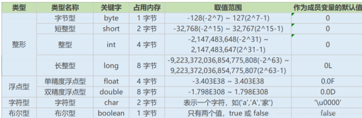
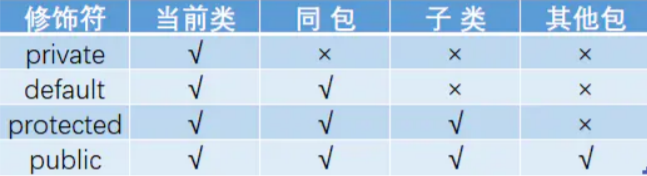
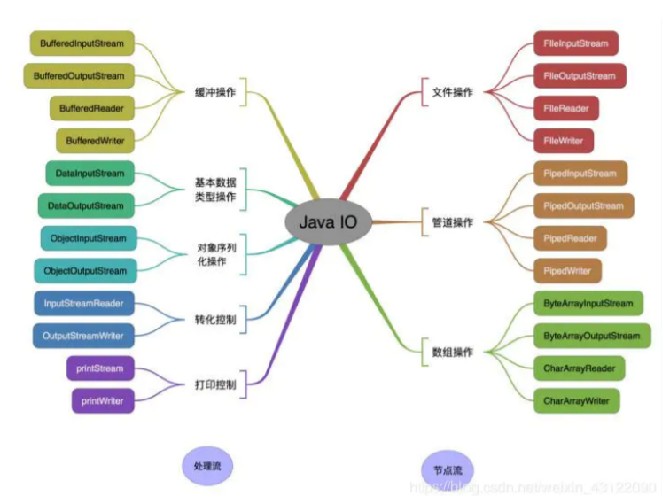

## Jdk和Jre和JVM的区别

JDK ：Jdk还包括了一些Jre之外的东西 ，就是这些东西帮我们编译Java代码的， 还有就是监控Jvm 的一些工具 Java Development Kit是提供给Java开发人员使用的，其中包含了Java的开发工具，也 包括了JRE。所以安装了JDK，就无需再单独安装JRE了。其中的开发工具：编译工具(javac.exe)， 打包工具(jar.exe)等 JRE ：

Jre大部分都是 C 和 C++ 语言编写的，他是我们在编译java时所需要的基础的类库 Java Runtime Environment包括Java虚拟机和Java程序所需的核心类库等。核心类库主要是java.lang 包：包含了运行Java程序必不可少的系统类，如基本数据类型、基本数学函数、字符串处理、线 程、异常处理类等，系统缺省加载这个包

## 数据类型




## 用最有效率的方法计算 2 乘以 8

2 << 3（左移 3 位相当于乘以 2 的 3 次方，右移 3 位相当于除以 2 的 3 次方）。


## 访问修饰符 public,private,protected,以及不写（默认）时的区别




> private : 在同一类内可见。使用对象：变量、方法。 注意：不能修饰类（外部类） 
>
> default (即缺省，什么也不写，不使用任何关键字）: 在同一包内可见，不使用任何修饰符。 使用对象：类、接口、变量、方法。 
>
> protected : 对同一包内的类和所有子类可见。使用对象：变量、方法。 注意：不能修饰类 （外部类）。 
>
> public : 对所有类可见。使用对象：类、接口、变量、方法

## &和&&的区别

&运算符有两种用法：(1)按位与；(2)逻辑与。

 &&运算符是短路与运算。逻辑与跟短路与的差别是非常巨大的，虽然二者都要求运算符左右两端 的布尔值都是true 整个表达式的值才是 true。

&&之所以称为短路运算，是因为如果&&左边的表 达式的值是 false，右边的表达式会被直接短路掉，不会进行运算。

> 注意：逻辑或运算符（|）和短路或运算符（||）的差别也是如此。


## final 有什么用？

被final修饰的类不可以被继承 

被final修饰的方法不可以被重写 

被final修饰的变量不可以被改变，

**被final修饰不可变的是变量的引用，而不是引用指向的内容， 引用指向的内容是可以改变的**


## final finally finalize区别

final可以修饰类、变量、方法，修饰类表示该类不能被继承、修饰方法表示该方法不能被重写、 修饰变量表 示该变量是一个常量不能被重新赋值。 

finally一般作用在try-catch代码块中，在处理异常的时候，通常我们将一定要执行的代码方法 finally代码块 中，表示不管是否出现异常，该代码块都会执行，一般用来存放一些关闭资源的代 码。

 finalize是一个方法，属于Object类的一个方法，而Object类是所有类的父类，该方法一般由垃圾 回收器来调 用，当我们调用System.gc() 方法的时候，由垃圾回收器调用finalize()，回收垃圾，一 个对象是否可回收的 最后判断。


## this关键字的用法

this是自身的一个对象，代表对象本身，可以理解为：指向对象本身的一个指针。 

this的用法在java中大体可以分为2种： 

1.普通的直接引用，this相当于是指向当前对象本身。 

```
public Person(String name, int age) {
	this.name = name;
	this.age = age;
}
```

2.形参与成员名字重名，用this来区分

3.引用本类的构造函数

```

class Person{

    private String name;
    private int age;
    public Person() {
    
    }
    public Person(String name) {
   	 this.name = name;
    }
    public Person(String name, int age) {
        this(name);
        this.age = age;
    }
}

```


## super关键字的用法

super可以理解为是指向自己超（父）类对象的一个指针，而这个超类指的是离自己最近的一个父 类。

 super也有三种用法：

1.普通的直接引用

2.子类中的成员变量或方法与父类中的成员变量或方法同名时，用super进行区分

3.引用父类构造函数


## this与super的区别

 super: 它引用当前对象的直接父类中的成员

 this：它代表当前对象名

super()和this()类似,区别是，super()在子类中调用父类的构造方法，this()在本类内调用本类的其 它构造方法。

 super()和this()均需放在构造方法内第一行。 this和super不能同时出现在一个构造函数里面，因为this必然会调用其它的构造函数，其它的构 造函数必然也会有super语句的存在

this()和super()都指的是对象，所以，均不可以在static环境中使用。包括：static变量,static方 法，static语句块。 

从本质上讲，this是一个指向本对象的指针, 然而super是一个Java关键字。


## static存在的主要意义

static的主要意义是在于创建独立于具体对象的域变量或者方法。以致于即使没有创建对象，也能 使用属性和调用方法！ 

static关键字还有一个比较关键的作用就是 用来形成静态代码块以优化程序性能。

static块可以置 于类中的任何地方，类中可以有多个static块。在类初次被加载的时候，会按照static块的顺序来执 行每个static块，并且只会执行一次。 

为什么说static块可以用来优化程序性能，是因为它的特性:只会在类加载的时候执行一次。因此， 很多时候会将一些只需要进行一次的初始化操作都放在static代码块中进行。


## static应用场景

因为static是被类的实例对象所共享，因此如果某个成员变量是被所有对象所共享的，那么这个成 员变量就应该定义为静态变量。

 因此比较常见的static应用场景有：

1、修饰成员变量 

2、修饰成员方法 

3、静态代码块 

4、修饰类【只能修饰内部类也就是静态内部 类】 

5、静态导包

> static注意事项 : 
>
> 1. 静态只能访问静态。 
>
> 2. 非静态既可以访问非静态的，也可以访问静态的。

## break ,continue ,return 的区别及作用

break 跳出总上一层循环，不再执行循环(结束当前的循环体) 

continue 跳出本次循环，继续执行下次循环(结束正在执行的循环 进入下一个循环条件) 

return 程序返回，不再执行下面的代码(结束当前的方法 直接返回)


## 面向对象三大特性

**抽象：**抽象是将一类对象的共同特征总结出来构造类的过程，包括数据抽象和行为抽象两方面。抽 象只关注对象有哪些属性和行为，并不关注这些行为的细节是什么。 

**封装:**  把一个对象的属性私有化，同时提供一些可以被外界访问的属性的方法，如果属性不想被外界 访问，我们大可不必提供方法给外界访问。但是如果一个类没有提供给外界访问的方法，那么这个 类也没有什么意义了。 

**继承: **是使用已存在的类的定义作为基础建立新类的技术，新类的定义可以增加新的数据或新的功 能，也可以用父类的功能，但不能选择性地继承父类。通过使用继承我们能够非常方便地复用以前 的代码。

**多态：**父类或接口定义的引用变量可以指向子类或具体实现类的实例对象。提高了程序的拓展性。 在Java中有两种形式可以实现多态：继承（多个子类对同一方法的重写）和接口（实现接口并覆盖 接口中同一方法）。

## 什么是多态机制？Java语言是如何实现多态的？

所谓多态就是指程序中定义的引用变量所指向的具体类型和通过该引用变量发出的方法调用在编程 时并不确定，而是在程序运行期间才确定，即一个引用变量倒底会指向哪个类的实例对象，该引用 变量发出的方法调用到底是哪个类中实现的方法，必须在由程序运行期间才能决定。因为在程序运 行时才确定具体的类，这样，**不用修改源程序代码，就可以让引用变量绑定到各种不同的类实现 上，让程序可以选择多个运行状态，这就是多态性。** 

多态分为编译时多态和运行时多态。其中编辑时多态是静态的，主要是指方法的重载，它是根据参数列表的不同来区分不同的函数，通过编辑之后会变成两个不同的函数，在运行时谈不上多态。而 运行时多态是动态的，它是通过动态绑定来实现的，也就是我们所说的多态性

**Java实现多态有三个必要条件：继承、重写、向上转型。**

 继承：在多态中必须存在有继承关系的子类和父类。 

重写：子类对父类中某些方法进行重新定义，在调用这些方法时就会调用子类的方法。 

向上转型：在多态中需要将子类的引用赋给父类对象，只有这样该引用才能够具备技能调用 父类的方法和子类的方法。

## 抽象类能使用 final 修饰吗？

不能，定义抽象类就是让其他类继承的，如果定义为 final 该类就不能被继承，这样彼此就会产生 矛盾，所以 final 不能修饰抽象类


## 静态变量和实例变量区别

静态变量： 静态变量由于不属于任何实例对象，属于类的，所以在内存中只会有一份，在类的加 载过程中，JVM只为静态变量分配一次内存空间。 

实例变量： 每次创建对象，都会为每个对象分配成员变量内存空间，实例变量是属于实例对象 的，在内存中，创建几次对象，就有几份成员变量。


## 局部内部类和匿名内部类访问局部变量的时候，为什么变量必须要加上final？

```
public class Outer {
    void outMethod(){
    
        final int a =10;
        
        class Inner {
        
        	void innerMethod(){
            	System.out.println(a);
            }
        }
    }
}

```

以上例子，为什么要加final呢？是因为生命周期不一致， 局部变量直接存储在栈中，当方法执行 结束后，非final的局部变量就被销毁。而局部内部类对局部变量的引用依然存在，如果局部内部 类要调用局部变量时，就会出错。加了final，可以确保局部内部类使用的变量与外层的局部变量 区分开，解决了这个问题。


## 构造器（constructor）是否可被重写（override）

构造器不能被继承，因此不能被重写，但可以被重载。


## 重载（Overload）和重写（Override）的区别。重载的方法能否根据返回类 型进行区分？

方法的重载和重写都是实现多态的方式，区别在于前者实现的是编译时的多态性，而后者实现的是 运行时的多态性。 

重载：发生在同一个类中，方法名相同参数列表不同（参数类型不同、个数不同、顺序不同），与 方法返回值和访问修饰符无关，**即重载的方法不能根据返回类型进行区分** 

重写：发生在父子类中，方法名、参数列表必须相同，返回值小于等于父类，抛出的异常小于等于 父类，访问修饰符大于等于父类（里氏代换原则）；如果父类方法访问修饰符为private则子类中 就能是重写。

## == 和 equals 的区别是什么

**== :** 它的作用是判断两个对象的地址是不是相等。即，判断两个对象是不是同一个对象。(基本数 据类型 == 比较的是值，引用数据类型 == 比较的是内存地址)

**equals() :** 它的作用也是判断两个对象是否相等。

> 类没有覆盖 equals() 方法。则通过 equals() 比较该类的两个对象时，等价于通过 “==”比较这两个对象。 
>
> 类覆盖了 equals() 方法。一般，我们都覆盖 equals() 方法来两个对象的内容相等； 若它们的内容相等，则返回 true (即，认为这两个对象相等)。
>
> String中的equals方法是被重写过的，因为object的equals方法是比较的对象的内存地址， 而String的equals方法比较的是对象的值。 当创建String类型的对象时，虚拟机会在常量池中查找有没有已经存在的值和要创建的值相 同的对象，如果有就把它赋给当前引用。如果没有就在常量池中重新创建一个String对象。

## hashCode 方法的作用

hashCode() 的作用是获取哈希码，也称为散列码；它实际上是返回一个int整数。这个哈希码的作 用是确定该对象在哈希表中的索引位置。hashCode() 定义在JDK的Object.java中，这就意味着 Java中的任何类都包含有hashCode()函数。

散列表存储的是键值对(key-value)，它的特点是：能根据“键”快速的检索出对应的“值”。这其中就 利用到了散列码！（可以快速找到所需要的对象）

**我们以“HashSet 如何检查重复”为例子来说明为什么要有 hashCode：**

当你把对象加入 HashSet 时，HashSet 会先计算对象的 hashcode 值来判断对象加入的位置，同 时也会与其他已经加入的对象的 hashcode 值作比较，如果没有相符的hashcode，HashSet会假 设对象没有重复出现。但是如果发现有相同 hashcode 值的对象，这时会调用 equals()方法来检查 hashcode 相等的对象是否真的相同。如果两者相同，HashSet 就不会让其加入操作成功。如果不 同的话，就会重新散列到其他位置。

hashCode()与equals()的相关规定 :  

-  如果两个对象相等，则hashcode一定也是相同的 

- 两个对象相等，对两个对象分别调用equals方法都返回true 

- 两个对象有相同的hashcode值，它们也不一定是相等的 

  因此，equals 方法被覆盖过，则 hashCode 方法也必须被覆盖 hashCode() 的默认行为是对堆上的对象产生独特值。**如果没有重写 hashCode()，则该 class 的两个对象 无论如何都不会相等**（即使这两个对象指向相同的数据）

## 对象的相等与指向他们的引用相等，两者有什么不同？

对象的相等 比的是内存中存放的内容是否相等而 引用相等 比较的是他们指向的内存地址是否相 等。


## java 中 IO 流分为几种?

按照流的流向分，可以分为输入流和输出流； 

按照操作单元划分，可以划分为字节流和字符流； 

按照流的角色划分为节点流和处理流。




## BIO,NIO,AIO 有什么区别?

BIO：Block IO 同步阻塞式 IO，就是我们平常使用的传统 IO，它的特点是模式简单使用方 便，并发处理能力低。 

NIO：Non IO 同步非阻塞 IO，是传统 IO 的升级，客户端和服务器端通过 Channel（通道） 通讯，实现了多路复用

AIO：Asynchronous IO 是 NIO 的升级，也叫 NIO2，实现了异步非堵塞 IO ，异步 IO 的操 作基于事件和回调机制。

## 什么是反射机制？

JAVA反射机制是在运行状态中，对于任意一个类，都能够知道这个类的所有属性和方法；对于任 意一个对象，都能够调用它的任意一个方法和属性；这种动态获取的信息以及动态调用对象的方法 的功能称为java语言的反射机制。 

静态编译和动态编译 

- 静态编译：在编译时确定类型，绑定对象 
- 动态编译：运行时确定类型，绑定对象

## 反射机制优缺点

优点： 运行期类型的判断，动态加载类，提高代码灵活度。

 缺点： 性能瓶颈：反射相当于一系列解释操作，通知 JVM 要做的事情，性能比直接的java代码要 慢很多


## 反射机制的应用场景有哪些？

在我们平时的项目开发过程中，基本上很少会直接使用到反射机制，但这不能说明反射机制没有 用，实际上有很多设计、开发都与反射机制有关，例如模块化的开发，通过反射去调用对应的字节 码；动态代理设计模式也采用了反射机制，还有我们日常使用的 Spring／SpringMVC / Mybatis 等框架也大 量使用到了反射机制。


## Java获取反射的三种方法

1.通过new对象实现反射机制

 2.通过路径实现反射机制 

3.通过类名实现反射机制


## String s = new String(“xyz”);创建了几个字符串对象

两个对象，一个是静态区的"xyz"，一个是用new创建在堆上的对象。


## 2. String str="i"与 String str=new String(“i”)一样吗？

不一样，因为内存的分配方式不一样。String str="i"的方式，java 虚拟机会将其分配到常量池中； 而 String str=new String(“i”) 则会被分到堆内存中。


## String和StringBuffer、StringBuilder的区别是什么？String为什么是不可 变的

**可变性 :**  String类中使用字符数组保存字符串，private final char value[]，所以string对象是不可变 的。StringBuilder与StringBuffer都继承自AbstractStringBuilder类，在AbstractStringBuilder中 也是使用字符数组保存字符串，char[] value，这两种对象都是可变的。 

**线程安全性 :**  String中的对象是不可变的，也就可以理解为常量，线程安全。StringBuffer对方法加了同步锁或者对调用的方法加了同 步锁，所以是线程安全的。StringBuilder并没有对方法进行加同步锁，所以是非线程安全的。

**性能 :**  每次对String 类型进行改变的时候，都会生成一个新的String对象，然后将指针指向新的String 对 象。StringBuffer每次都会对StringBuffer对象本身进行操作，而不是生成新的对象并改变对象引 用。相同情况下使用StirngBuilder 相比使用StringBuffer 仅能获得10%~15% 左右的性能提升。

> 如果要操作少量的数据用 String 
>
> 单线程操作字符串缓冲区下操作大量数据 用StringBuilder 
>
> 多线程操作字符串缓冲区 下操作大量数据用 StringBuffer


## Integer a= 127 与 Integer b = 127相等吗

对于对象引用类型：==比较的是对象的内存地址。 

对于基本数据类型：==比较的是值。

> 如果整型字面量的值在-128到127之间，那么自动装箱时不会new新的Integer对象，而是直接引用常量池中的 Integer对象，超过范围 a1==b1的结果是false

