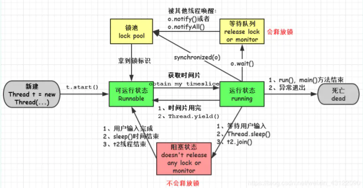
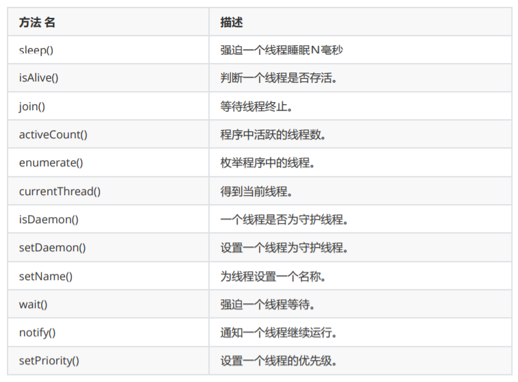
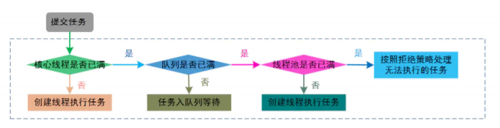

## 什么是线程死锁

死锁是指两个或两个以上的进程（线程）在执行过程中，由于竞争资源或者由于彼此通信而造成的 一种阻塞的现象，若无外力作用，它们都将无法推进下去。此时称系统处于死锁状态或系统产生了 死锁，这些永远在互相等待的进程（线程）称为死锁进程（线程）


## 形成死锁的四个必要条件是什么

互斥条件：在一段时间内某资源只由一个进程占用。如果此时还有其它进程请求资源，就只能等 待，直至占有资源的进程用毕释放。 

占有且等待条件：指进程已经保持至少一个资源，但又提出了新的资源请求，而该资源已被其它进 程占有，此时请求进程阻塞，但又对自己已获得的其它资源保持不放。 

不可抢占条件：别人已经占有了某项资源，你不能因为自己也需要该资源，就去把别人的资源抢过 来。 

循环等待条件：若干进程之间形成一种头尾相接的循环等待资源关系。（比如一个进程集合，A在 等B，B在等C，C在等A）


##  如何避免线程死锁

1. 避免一个线程同时获得多个锁 
2. 避免一个线程在锁内同时占用多个资源，尽量保证每个锁只占用一个资源 
3. 尝试使用定时锁，使用lock.tryLock(timeout)来替代使用内部锁机制

## 创建线程的四种方式

1. 继承 Thread 类；

2. 实现 Runnable 接口；

3. 实现 Callable 接口；

4. 使用匿名内部类方式

   ```
   public class CreateRunnable {
       public static void main(String[] args) {
           //创建多线程创建开始
           Thread thread = new Thread(new Runnable() {
               public void run() {
               	for (int i = 0; i < 10; i++) {
                   	System.out.println("i:" + i);
                   }
               }
           });
           thread.start();
       }
   }
   ```

## runnable 和 callable 有什么区别

- Runnable 接口 run 方法无返回值；Callable 接口 call 方法有返回值，是个泛型，和Future、 FutureTask配合可以用来获取异步执行的结果 
- Runnable 接口 run 方法只能抛出运行时异常，且无法捕获处理；Callable 接口 call 方法允许抛出 异常，可以获取异常信息 注：Callalbe接口支持返回执行结果，需要调用FutureTask.get()得到， 此方法会阻塞主进程的继续往下执行，如果不调用不会阻塞。


## 线程的 run()和 start()有什么区别？

每个线程都是通过某个特定Thread对象所对应的方法run()来完成其操作的，run()方法称为线程 体。通过调用Thread类的start()方法来启动一个线程。


## 什么是 Callable 和 Future?

Callable 接口类似于 Runnable，从名字就可以看出来了，但是 Runnable 不会返回结果，并且无 法抛出返回结果的异常，而 Callable 功能更强大一些，被线程执行后，可以返回值，这个返回值可以被 Future 拿到，也就是说，Future 可以拿到异步执行任务的返回值。

Future 接口表示异步任务，是一个可能还没有完成的异步任务的结果。所以说 Callable用于产生 结果，Future 用于获取结果。


## 线程的状态




## 线程同步以及线程调度相关的方法。

- wait()：使一个线程处于等待（阻塞）状态，并且释放所持有的对象的锁； 

- sleep()：使一个正在运行的线程处于睡眠状态，是一个静态方法，调用此方法要处理 InterruptedException 异常； 

- notify()：唤醒一个处于等待状态的线程，当然在调用此方法的时候，并不能确切的唤醒某一 个等待状态的线程，而是由 JVM 确定唤醒哪个线程，而且与优先级无关； 

- notityAll()：唤醒所有处于等待状态的线程，该方法并不是将对象的锁给所有线程，而是让它 们竞争，只有获得锁的线程才能进入就绪状态；

## Java 中你怎样唤醒一个阻塞的线程？

首先 ，wait()、notify() 方法是针对对象的，调用任意对象的 wait()方法都将导致线程阻塞，阻塞 的同时也将释放该对象的锁，相应地，调用任意对象的 notify()方法则将随机解除该对象阻塞的线 程，但它需要重新获取该对象的锁，直到获取成功才能往下执行； 

其次，wait、notify 方法必须在 synchronized 块或方法中被调用，并且要保证同步块或方法的锁 对象与调用 wait、notify 方法的对象是同一个，如此一来在调用 wait 之前当前线程就已经成功获 取某对象的锁，执行 wait 阻塞后当前线程就将之前获取的对象锁释放。

## notify() 和 notifyAll() 有什么区别？

如果线程调用了对象的 wait()方法，那么线程便会处于该对象的等待池中，等待池中的线程不会去 竞争该对象的锁。 

notifyAll() 会唤醒所有的线程，notify() 只会唤醒一个线程。

 notifyAll() 调用后，会将全部线程由等待池移到锁池，然后参与锁的竞争，竞争成功则继续执行， 如果不成功则留在锁池等待锁被释放后再次参与竞争。而 notify()只会唤醒一个线程，具体唤醒哪 一个线程由虚拟机控制。

## 什么是线程同步和线程互斥，有哪几种实现方式？

当一个线程对共享的数据进行操作时，应使之成为一个”原子操作“，即在没有完成相关操作之前， 不允许其他线程打断它，否则，就会破坏数据的完整性，必然会得到错误的处理结果，这就是线程 的同步。

实现线程同步的方法 同步代码方法：

1. sychronized 关键字修饰的方法 
2. 同步代码块：sychronized 关键字修饰的代码块 
3. 使用特殊变量域volatile实现线程同步：volatile关键字为域变量的访问提供了一种免锁机制 
4. 使用重入锁实现线程同步：reentrantlock类是可冲入、互斥、实现了lock接口的锁他与 sychronized方法具有相同的基本行为和语义


##  如果你提交任务时，线程池队列已满，这时会发生什么

有俩种可能： 

1. 如果使用的是无界队列 LinkedBlockingQueue，也就是无界队列的话，没关系，继续添加任务到 阻塞队列中等待执行，因为 LinkedBlockingQueue 可以近乎认为是一个无穷大的队列，可以无限存放 任务 
2. 如果使用的是有界队列比如 ArrayBlockingQueue，任务首先会被添加到ArrayBlockingQueue 中ArrayBlockingQueue 满了，会根据maximumPoolSize 的值增加线程数量，如果增加了线程数量 还是处理不过来，ArrayBlockingQueue 继续满，那么则会使用拒绝策略RejectedExecutionHandler 处理满了的任务，默认是 AbortPolicy

## 在 Java 程序中怎么保证多线程的运行安全？

1. 使用安全类，比如 java.util.concurrent 下的类，使用原子类AtomicInteger 

2. 使用自动锁 synchronized。 

3. 使用手动锁 Lock。 

   ```
   Lock lock = new ReentrantLock();
   lock. lock();
   try {
   	System. out. println("获得锁");
   } catch (Exception e) {
   	// TODO: handle exception
   } finally {
   	System. out. println("释放锁");
   	lock. unlock();
   }
   ```


## 线程的常用API有哪些




## 线程之间如何通信及线程之间如何同步

通 过 在 线 程 之 间 共 享 对 象 就 可 以 了 ， 然 后 通 过 wait/notify/notifyAll 、 await/signal/signalAll 进行唤起和等待，比方说阻塞队列 BlockingQueue 就是为线程 之间共享数据而设计的


## 说说自己是怎么使用 synchronized 关键字，在项目中用到了吗

修饰实例方法:  作用于当前对象实例加锁，进入同步代码前要获得当前对象实例的锁 

修饰静态方法: 也就是给当前类加锁，会作用于类的所有对象实例，因为静态成员不属于任何一个 实例对象，是类成员（ static 表明这是该类的一个静态资源，不管new了多少个对象，只有一 份）。所以如果一个线程A调用一个实例对象的非静态 synchronized 方法，而线程B需要调用这个 实例对象所属类的静态 synchronized 方法，是允许的，不会发生互斥现象，因为访问静态 synchronized 方法占用的锁是当前类的锁，而访问非静态 synchronized 方法占用的锁是当前实 例对象锁。 

修饰代码块: 指定加锁对象，对给定对象加锁，进入同步代码库前要获得给定对象的锁。

> 总结： synchronized 关键字加到 static 静态方法和 synchronized(class)代码块上都是是给 Class 类上锁。synchronized 关键字加到实例方法上是给对象实例上锁。尽量不要使用 synchronized(String a) 因为JVM中，字符串常量池具有缓存功能！


## 单例模式了解吗？给我解释一下双重检验锁方式实现单例模式！

单例模式主要有2种模式 : 懒汉式 , 饿汉式

**懒汉式**(线程不安全)

```java
public class Singleton {
    private static Singleton instance;
    private Singleton (){}

    public static Singleton getInstance() {
     if (instance == null) {
         instance = new Singleton();
     }
     return instance;
    }
}
```

**饿汉式**

```java
public class Singleton{
    //类加载时就初始化
    private static final Singleton instance = new Singleton();
    
    private Singleton(){}

    public static Singleton getInstance(){
        return instance;
    }
}
```

**类一加载就创建对象**

**双重检查锁**

```java
public static Singleton getSingleton() {
    if (instance == null) {                         //Single Checked
        synchronized (Singleton.class) {
            if (instance == null) {                 //Double Checked
                instance = new Singleton();
            }
        }
    }
    return instance ;
}
```


## 什么是 CAS

CAS 是 compare and swap 的缩写，即我们所说的比较交换。

CAS 是一种基于锁的操作，而且是乐观锁。在 java 中锁分为乐观锁和悲观锁。悲观锁是将资源锁 住，等一个之前获得锁的线程释放锁之后，下一个线程才可以访问。而乐观锁采取了一种宽泛的态 度，通过某种方式不加锁来处理资源，比如通过给记录加 version 来获取数据，性能较悲观锁有很 大的提高。

CAS 操作包含三个操作数 —— 内存位置（V）、预期原值（A）和新值(B)。如果内存地址里面的 值和 A 的值是一样的，那么就将内存里面的值更新成 B。CAS是通过无限循环来获取数据的，如果在第一轮循环中，a 线程获取地址里面的值被b 线程修改了，那么 a 线程需要自旋到下次循环才有可能机会执行。

https://www.cnblogs.com/juncaoit/p/12386737.html

> java.util.concurrent.atomic 包下的类大多是使用 CAS 操作来实现的 (AtomicInteger,AtomicBoolean,AtomicLong)

## CAS 的会产生什么问题？

1. ABA 问题： 比如说一个线程 one 从内存位置 V 中取出 A，这时候另一个线程 two 也从内存中取出 A，并且 two 进 行了一些操作变成了 B，然后 two 又将 V 位置的数据变成 A，这时候线程 one 进行 CAS 操作发现内存 中仍然是 A，然后 one 操作成功。尽管线程 one 的 CAS 操作成功，但可能存在潜藏的问题。从 Java1.5 开始 JDK 的 atomic包里提供了一个类 AtomicStampedReference 来解决 ABA 问题。

2. 循环时间长开销大： 对于资源竞争严重（线程冲突严重）的情况，CAS 自旋的概率会比较大，从而浪费更多的 CPU 资源， 效率低于 synchronized。 

3. 只能保证一个共享变量的原子操作： 当对一个共享变量执行操作时，我们可以使用循环 CAS 的方式来保证原子操作，但是对多个共享变量 操作时，循环 CAS 就无法保证操作的原子性，这个时候就可以用锁。

## 什么是可重入锁

重入锁是指一个线程获取到该锁之后，该线程可以继续获得该锁。底层原理维护一个计数器，当线程获取该锁时，计数器加一，再次获得该锁时继续加一，释放锁时，计数器减一，当计数器值为0 时，表明该锁未被任何线程所持有，其它线程可以竞争获取锁。

可重入锁有 :

- synchronized : 自动加锁, 自动释放锁
- ReentrantLock : 手动加锁, 手动释放锁


## 什么是偏向锁

偏向锁，顾名思义，它会偏向于第一个访问锁的线程，如果在运行过程中，同步锁只有一个线程访 问，不存在多线程争用的情况，则线程是不需要触发同步的，减少加锁／解锁的一些CAS操作（比 如等待队列的一些CAS操作），这种情况下，就会给线程加一个偏向锁。 如果在运行过程中，遇 到了其他线程抢占锁，则持有偏向锁的线程会被挂起，JVM会消除它身上的偏向锁，将锁恢复到标准的轻量级锁。

> CAS操作的就是乐观锁，每次不加锁而是假设没有冲突而去完成某项操作，如果因为冲突失败就重试，直到成功为止 , 可以理解成一个无阻塞多线程争抢资源的模型

轻量级锁是由偏向所升级来的，偏向锁运行在一个线程进入同步块的情况下，当第二个线程加入锁 争用的时候，轻量级锁就会升级为重量级锁；

重量级锁是synchronized ，是 Java 虚拟机中最为基础的锁实现。在这种状态下，Java 虚拟机会阻 塞加锁失败的线程，并且在目标锁被释放的时候，唤醒这些线程。


## 什么是自旋锁

很多 synchronized 里面的代码只是一些很简单的代码，执行时间非常快，此时等待的线程都加锁 可能是一种不太值得的操作，因为线程阻塞涉及到用户态和内核态切换的问题。既然 synchronized 里面的代码执行得非常快，不妨让等待锁的线程不要被阻塞，而是在 synchronized 的边界做忙循环，这就是自旋。如果做了多次循环发现还没有获得锁，再阻塞 

> 忙循环：就是程序员用循环让一个线程等待，不像传统方法wait(), sleep() 或 yield() 它们都放弃了 CPU控制，而忙循环不会放弃CPU，它就是在运行一个空循环。这么做的目的是为了保留CPU缓 存，在多核系统中，一个等待线程醒来的时候可能会在另一个内核运行，这样会重建缓存。为了避 免重建缓存和减少等待重建的时间就可以使用它了

**自旋锁存在的问题**

1. 如果某个线程持有锁的时间过长，就会导致其它等待获取锁的线程进入循环等待，消耗CPU。使用不当会造成CPU使用率极高。
2. 上面Java实现的自旋锁不是公平的，即无法满足等待时间最长的线程优先获取锁。不公平的锁就会存在“线程饥饿”问题。

**自旋锁的优点**

1. 自旋锁不会使线程状态发生切换，一直处于用户态，即线程一直都是active的；不会使线程进入阻塞状态，减少了不必要的上下文切换，执行速度快
2. 非自旋锁在获取不到锁的时候会进入阻塞状态，从而进入内核态，当获取到锁的时候需要从内核态恢复，需要线程上下文切换。 （线程被阻塞后便进入内核（Linux）调度状态，这个会导致系统在用户态与内核态之间来回切换，严重影响锁的性能）

**自旋锁代码示例**

```java
public class SpinLockTest {

    private AtomicBoolean available = new AtomicBoolean(false);

    public void lock(){

        // 循环检测尝试获取锁
        while (!tryLock()){
            // doSomething...
        }

    }

    public boolean tryLock(){
        // 尝试获取锁，成功返回true，失败返回false
        return available.compareAndSet(false,true);
    }

    public void unLock(){
        if(!available.compareAndSet(true,false)){
            throw new RuntimeException("释放锁失败");
        }
    }

}
```

## 什么是轻量级锁 , 重量级锁

锁的状态总共有四种：无锁状态、偏向锁、轻量级锁和重量级锁。随着锁的竞争，锁可以从偏向锁升级到轻量级锁，再升级的重量级锁（但是锁的升级是单向的，也就是说只能从低到高升级，不会出现锁的降级）

https://www.cnblogs.com/paddix/p/5405678.html


## 多线程中 synchronized 锁升级的原理是什么？

synchronized 锁升级原理：在锁对象的对象头里面有一个 threadid 字段，在第一次访问的时候 threadid 为空，jvm 让其持有偏向锁，并将 threadid 设置为其线程 id，再次进入的时候会先判断 threadid 是否与其线程 id 一致，如果一致则可以直接使用此对象，如果不一致，则升级偏向锁为 轻量级锁，通过自旋循环一定次数来获取锁，执行一定次数之后，如果还没有正常获取到要使用的对象，此时就会把锁从轻量级升级为重量级锁，此过程就构成了 synchronized 锁的升级。


## 线程 B 怎么知道线程 A 修改了变量

1. volatile 修饰变量 

2. synchronized 修饰修改变量的方法 

3. wait/notify 

4. while 轮询

## synchronized、volatile、CAS 比较

1. synchronized 是悲观锁，属于抢占式，会引起其他线程阻塞。 

2. volatile 提供多线程共享变量可见性和禁止指令重排序优化。 

3. CAS 是基于冲突检测的乐观锁（非阻塞）


## synchronized 和 Lock 有什么区别？

首先synchronized是Java内置关键字，在JVM层面，Lock是个Java类；

 synchronized 可以给类、方法、代码块加锁；而 lock 只能给代码块加锁。 

synchronized 不需要手动获取锁和释放锁，使用简单，发生异常会自动释放锁，不会造成死锁； 而 lock 需要自己加锁和释放锁，如果使用不当没有 unLock()去释放锁就会造成死锁。 

通过 Lock 可以知道有没有成功获取锁，而 synchronized 却无法办到。


## synchronized 和 ReentrantLock 区别是什么？

两者都是可重入锁。主要区别如下：

ReentrantLock 使用起来比较灵活，但是必须有释放锁的配合动作；

 ReentrantLock 必须手动获取与释放锁，而 synchronized 不需要手动释放和开启锁； 

ReentrantLock 只适用于代码块锁，而 synchronized 可以修饰类、方法、变量等。 二者的锁机制其实也是不一样的

ReentrantLock 底层调用的是 Unsafe 的park 方法加锁， synchronized 操作的应该是对象头中 mark word


## volatile 关键字的作用

对于可见性，Java 提供了 volatile 关键字来保证可见性和禁止指令重排。 volatile 提供 happensbefore 的保证，确保一个线程的修改能对其他线程是可见的。当一个共享变量被 volatile 修饰 时，它会保证修改的值会立即被更新到主内存中，当有其他线程需要读取时，它会去内存中读取新 值。 

从实践角度而言，volatile 的一个重要作用就是和 CAS 结合，保证了原子性，volatile 常用于多线程环境下的单次操作(单次读或者单次写)。


## volatile 变量和 atomic 变量有什么不同？

volatile 变量可以确保先行关系，即写操作会发生在后续的读操作之前, 但它并不能保证原子性。 例如用 volatile 修饰 count 变量，那么 count++ 操作就不是原子性的。


 AtomicInteger 类提供的 atomic 方法可以让这种操作具有原子性如getAndIncrement()方法会 原子性的进行增量操作把当前值加一，其它数据类型和引用变量也可以进行相似操作。


## volatile 能使得一个非原子操作变成原子操作吗

关键字volatile的主要作用是使变量在多个线程间可见，但无法保证原子性，对于多个线程访问同 一个实例变量需要加锁进行同步。 

虽然volatile只能保证可见性不能保证原子性，但用volatile修饰long和double可以保证其操作原子 性。


## 乐观锁和悲观锁的理解及如何实现，有哪些实现方式？

悲观锁：总是假设最坏的情况，每次去拿数据的时候都认为别人会修改，所以每次在拿数据的时候 都会上锁，这样别人想拿这个数据就会阻塞直到它拿到锁。传统的关系型数据库里边就用到了很多 这种锁机制，比如行锁，表锁等，读锁，写锁等，都是在做操作之前先上锁。再比如 Java 里面的 同步原语 synchronized 关键字的实现也是悲观锁。 

乐观锁：顾名思义，就是很乐观，每次去拿数据的时候都认为别人不会修改，所以不会上锁，但是 在更新的时候会判断一下在此期间别人有没有去更新这个数据，可以使用版本号等机制。乐观锁适 用于多读的应用类型，这样可以提高吞吐量，像数据库提供的类似于 write_condition 机制，其实 都是提供的乐观锁。在 Java中 java.util.concurrent.atomic 包下面的原子变量类就是使用了乐观 锁的一种实现方式 CAS 实现的。


## 什么是原子类

java.util.concurrent.atomic包：是原子类的小工具包，支持在单个变量上解除锁的线程安全编程 原子变量类相当于一种泛化的 volatile 变量，能够支持原子的和有条件的读-改-写操作。

**常用原子类**

- AtomicBoolean 

- AtomicInteger 

- AtomicLong 

- AtomicReference

## 什么是线程池？

Java中的线程池是运用场景最多的并发框架，几乎所有需要异步或并发执行任务的程序都可以使用 线程池。在开发过程中，合理地使用线程池能够带来许多好处

- 降低资源消耗。通过重复利用已创建的线程降低线程创建和销毁造成的消耗。 

- 提高响应速度。当任务到达时，任务可以不需要等到线程创建就能立即执行。 

- 提高线程的可管理性。线程是稀缺资源，如果无限制地创建，不仅会消耗系统资源，还会降 低系统的稳定性，使用线程池可以进行统一分配、调优和监控。但是，要做到合理利用


## 常用的四种线程池

1. newCachedThreadPool创建一个可缓存线程池，如果线程池长度超过处理需要，可灵活回 收空闲线程，若无可回收，则新建线程。 
2. newFixedThreadPool 创建一个定长线程池，可控制线程最大并发数，超出的线程会在队列 中等待。 
3. newScheduledThreadPool 创建一个定长线程池，支持定时及周期性任务执行。 
4. newSingleThreadExecutor 创建一个单线程化的线程池，它只会用唯一的工作线程来执行任 务，保证所有任务按照指定顺序(FIFO, LIFO, 优先级)执行。

## 创建线程池的参数有哪些

corePoolSize 核心线程数量 

maximumPoolSize 最大线程数量 

keepAliveTime 线程保持时间，N个时间单位 

unit 时间单位（比如秒，分） 

workQueue 阻塞队列 

threadFactory 线程工厂 

handler 线程池拒绝策略


## 什么是Executors？

Executors框架实现的就是线程池的功能。Executors工厂类中提供的newCachedThreadPool、newFixedThreadPool 、 newScheduledThreadPool 、newSingleThreadExecutor 等方法其实也只是 ThreadPoolExecutor的构造函数参数不同而已。通过传入不同的参数，就可以构造出适用于不同 应用场景下的线程池


## 线程池的执行原理？



提交一个任务到线程池中，线程池的处理流程如下：

1. 判断线程池里的核心线程是否都在执行任务，如果不是（核心线程空闲或者还有核心线程没 有被创建）则创建一个新的工作线程来执行任务。如果核心线程都在执行任务，则进入下个 流程。 
2. 线程池判断工作队列是否已满，如果工作队列没有满，则将新提交的任务存储在这个工作队 列里。如果工作队列满了，则进入下个流程。 
3. 判断线程池里的线程是否都处于工作状态，如果没有，则创建一个新的工作线程来执行任 务。如果已经满了，则交给饱和策略来处理这个任务。

## 如何合理分配线程池大小?

要合理的分配线程池的大小要根据实际情况来定，简单的来说的话就是根据CPU密集和IO密集来 分配

**什么是CPU密集**

CPU密集的意思是该任务需要大量的运算，而没有阻塞，CPU一直全速运行。

CPU密集任务只有在真正的多核CPU上才可能得到加速(通过多线程)，而在单核CPU上，无论你开 几个模拟的多线程，该任务都不可能得到加速，因为CPU总的运算能力就那样。


**什么是IO密集**

IO密集型，即该任务需要大量的IO，即大量的阻塞。在单线程上运行IO密集型的任务会导致浪费 大量的CPU运算能力浪费在等待。所以在IO密集型任务中使用多线程可以大大的加速程序运行， 即时在单核CPU上，这种加速主要就是利用了被浪费掉的阻塞时间。

**分配CPU和IO密集**

1. CPU密集型时，任务可以少配置线程数，大概和机器的cpu核数相当，这样可以使得每个线程都在 执行任务 

2. IO密集型时，大部分线程都阻塞，故需要多配置线程数，2*cpu核数

   

## 什么是Java并发容器(JUC)

java.util包中的大部分容器都是非线程安全的，若要在多线程中使用容器，你可以使用Collections提供的包装函数：synchronizedXXX，将普通容器变成线程安全的容器。但该方法仅仅是简单地给容器使用同步，效率很低。

因此并发大师Doug Lea提供了java.util.concurrent包，提供高效的并发容器。并且为了保持与普通的容器的接口一致性，仍然使用util包的接口，从而易于使用、易于理解。

> 并发容器 : https://mikechen.cc/3416.html


## 常用的并发工具类有哪些？

1. CountDownLatch

   CountDownLatch 类位于java.util.concurrent包下，利用它可以实现类似计数器的功能。比如有 一个任务A，它要等待其他3个任务执行完毕之后才能执行，此时就可以利用CountDownLatch来 实现这种功能了。

2. CyclicBarrier(回环栅栏)

   CyclicBarrier它的作用就是会让所有线程都等待完成后才会继续下一步行 动。 CyclicBarrier初始化时规定一个数目，然后计算调用了CyclicBarrier.await()进入等待的线程数。 当线程数达到了这个数目时，所有进入等待状态的线程被唤醒并继续。

3. Semaphore(信号量)

   Semaphore 是 synchronized 的加强版，作用是控制线程的并发数量（允许 自定义多少线程同时访问）。就这一点而言，单纯的synchronized 关键字是实现不了的。

## 新建 T1、T2、T3 三个线程，如何保证它们按顺序执行？

用 join 方法。 代码示例 : 

```java
public class TestJoin {
 
	public static void main(String[] args) throws InterruptedException {
		// TODO Auto-generated method stub
		ThreadTest t1=new ThreadTest("A");
		ThreadTest t2=new ThreadTest("B");
		t1.start();
		t1.join();
		t2.start();
	}
	
	class ThreadTest extends Thread {
		private String name;
        public ThreadTest(String name){
            this.name=name;
        }
        public void run(){
            for(int i=1;i<=5;i++){
                System.out.println(name+"-"+i);
            }		
        }
    }
}
```


## 线程池启动线程 submit()和 execute()方法有什么不同？

 execute 没有返回值，如果不需要知道线程的结果就使用 execute 方法，性能会好很 多。

 submit 返回一个 Future 对象，如果想知道线程结果就使用 submit 提交，而且它能 在主线程中通过 Future 的 get 方法捕获线程中的异常。

   

## CyclicBarrier 和 CountDownLatch 的区别？

两个看上去有点像的类，都在 java.util.concurrent 下，都可以用来表示代码运行到 某个点上，二者的区别在于：

1. CyclicBarrier 的某个线程运行到某个点上之后，该线程即停止运行，直到所有的 线程都到达了这个点，所有线程才重新运行；CountDownLatch 则不是，某线程运行到某个点上之后，只是给某个数值-1 而已，该线程继续运行
2. CyclicBarrier 只能唤起一个任务，CountDownLatch 可以唤起多个任务 
3. CyclicBarrier 可 重 用 ， CountDownLatch 不 可 重 用 ， 计 数 值 为 0 该 CountDownLatch就不可再用了

## ThreadLocal的底层原理

1. ThreadLocal是Java中所提供的线程本地存储机制，可以利⽤该机制将数据缓存在某个线程内部， 该线程可以在任意时刻、任意⽅法中获取缓存的数据
2. ThreadLocal底层是通过ThreadLocalMap来实现的，每个Thread对象（注意不是ThreadLocal对 象）中都存在⼀个ThreadLocalMap，Map的key为ThreadLocal对象，Map的value为需要缓存的 值
3. 如果在线程池中使⽤ThreadLocal会造成内存泄漏，因为当ThreadLocal对象使⽤完之后，应该要 把设置的key，value，也就是Entry对象进⾏回收，但线程池中的线程不会回收，⽽线程对象是通过 强引⽤指向ThreadLocalMap，ThreadLocalMap也是通过强引⽤指向Entry对象，线程不被回收， Entry对象也就不会被回收，从⽽出现内存泄漏，解决办法是，在使⽤了ThreadLocal对象之后，⼿ 动调⽤ThreadLocal的remove⽅法，⼿动清楚Entry对象
4. ThreadLocal经典的应⽤场景就是连接管理（⼀个线程持有⼀个连接，该连接对象可以在不同的⽅ 法之间进⾏传递，线程之间不共享同⼀个连接）

## ThreadLocal 是什么？有什么应用场景？

ThreadLocal 的作用是提供线程内的局部变量，这种变量在线程的生命周期内起作 用，减少同一个线程内多个函数或者组件之间一些公共变量的传递的复杂度。用来 解决数据库连接、Session 管理等。

## ReadWriteLock 有什么用？

ReadWriteLock 是一个读写锁接口，ReentrantReadWriteLock 是 ReadWriteLock 接 口的一个具体实现，实现了读写的分离，读锁是共享的，写锁是独占的，读和读之 间不会互斥，读和写、写和读、写和写之间才会互斥，提升了读写的性能。

