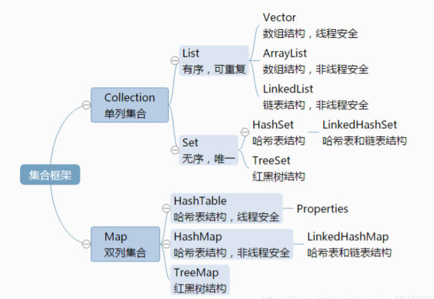

## 常用的集合类有哪些？

Map接口和Collection接口是所有集合框架的父接口： 

1. Collection接口的子接口包括：Set接口和List接口 
2.  Map接口的实现类主要有：HashMap、TreeMap、Hashtable、ConcurrentHashMap以及 Properties等 
3. Set接口的实现类主要有：HashSet、TreeSet、LinkedHashSet等 
4. List接口的实现类主要有：ArrayList、LinkedList、Stack以及Vector等

## List，Set，Map三者的区别？




## 集合框架底层数据结构

Collection : 

1. List 

   1. Arraylist： Object数组
   2.  Vector： Object数组 LinkedList： 双向循环链表 

2. Set 

   1. HashSet（无序，唯一）：基于 HashMap 实现的，底层采用 HashMap 来保存元素 
   2. LinkedHashSet： LinkedHashSet 继承与 HashSet，并且其内部是通过 LinkedHashMap 来 实现的。有点类似于我们之前说的LinkedHashMap 其内部是基于 Hashmap 实现一样，不 过还是有一点点区别的。 
   3. TreeSet（有序，唯一）： 红黑树(自平衡的排序二叉树。)

3. Map

   1. HashMap： JDK1.8之前HashMap由数组+链表组成的，数组是HashMap的主体，链表则是 主要为了解决哈希冲突而存在的（“拉链法”解决冲突）. JDK1.8以后在解决哈希冲突时有了较 大的变化，当链表长度大于阈值（默认为8）时，将链表转化为红黑树，以减少搜索时间 
   2. LinkedHashMap：LinkedHashMap 继承自 HashMap，所以它的底层仍然是基于拉链式散 列结构即由数组和链表或红黑树组成。另外，LinkedHashMap 在上面结构的基础上，增加 了一条双向链表，使得上面的结构可以保持键值对的插入顺序。同时通过对链表进行相应的 操作，实现了访问顺序相关逻辑。 
   3. HashTable： 数组+链表组成的，数组是 HashMap 的主体，链表则是主要为了解决哈希冲突 而存在的 
   4. TreeMap： 红黑树（自平衡的排序二叉树）

## 哪些集合类是线程安全的？

   1. Vector：就比Arraylist多了个 synchronized （线程安全），因为效率较低，现在已经不太建议使 用。

   2. hashTable：就比hashMap多了个synchronized (线程安全)，不建议使用。

   3. ConcurrentHashMap：是Java5中支持高并发、高吞吐量的线程安全HashMap实现。它由 Segment数组结构和HashEntry数组结构组成。Segment数组在ConcurrentHashMap里扮演锁的角色，HashEntry则用于存储键-值对数据。一个ConcurrentHashMap里包含一个Segment数组， Segment的结构和HashMap类似，是一种数组和链表结构；一个Segment里包含一个HashEntry 数组，每个HashEntry是一个链表结构的元素；每个Segment守护着一个HashEntry数组里的元 素，当对HashEntry数组的数据进行修改时，必须首先获得它对应的Segment锁。（推荐使用）

## 遍历一个 List 有哪些不同的方式？

   1. for 循环遍历，基于计数器。在集合外部维护一个计数器，然后依次读取每一个位置的元素， 当读取到最后一个元素后停止。 
   2. 迭代器遍历，Iterator。Iterator 是面向对象的一个设计模式，目的是屏蔽不同数据集合的特 点，统一遍历集合的接口。Java 在 Collections 中支持了 Iterator 模式。
   3. foreach 循环遍历。foreach 内部也是采用了 Iterator 的方式实现，使用时不需要显式声明 Iterator 或计数器。优点是代码简洁，不易出错；缺点是只能做简单的遍历，不能在遍历过 程中操作数据集合，例如删除、替换。

   > 如何选择遍历方式 : 
   >
   > Java Collections 框架中提供了一个 RandomAccess 接口，用来标记 List 实现是否支 持 Random Access。 
   >
   > 如果一个数据集合实现了该接口，就意味着它支持 Random Access，按位置读取元素的平均 时间复杂度为 O(1)，如ArrayList。 
   >
   > 如果没有实现该接口，表示不支持 Random Access，如LinkedList。
   >
   > 推荐的做法就是，支持 Random Access 的列表可用 for 循环遍历，否则建议用 Iterator 或 foreach 遍历。

## 说一下 ArrayList 的优缺点

   ArrayList的优点如下： 

   - ArrayList 底层以数组实现，是一种随机访问模式。ArrayList 实现了 RandomAccess 接口， 因此查找的时候非常快。
   -  ArrayList 在顺序添加一个元素的时候非常方便。

   ArrayList 的缺点如下： 

   - 删除元素的时候，需要做一次元素复制操作。如果要复制的元素很多，那么就会比较耗费性 能。 
   - 插入元素的时候，也需要做一次元素复制操作

## 如何实现数组和 List 之间的转换？

数组转 List：使用 Arrays. asList(array) 进行转换。 

List 转数组：使用 List 自带的 toArray() 方法。


## ArrayList 和 LinkedList 的区别是什么？

1. 数据结构实现：ArrayList 是动态数组的数据结构实现，而 LinkedList 是双向链表的数据结构实 现。 

2. 随机访问效率：ArrayList 比 LinkedList 在随机访问的时候效率要高，因为 LinkedList 是线性的数 据存储方式，所以需要移动指针从前往后依次查找。 

3. 增加和删除效率：在非首尾的增加和删除操作，LinkedList 要比 ArrayList 效率要高，因为 ArrayList 增删操作要影响数组内的其他数据的下标。 

4. 内存空间占用：LinkedList 比 ArrayList 更占内存，因为 LinkedList 的节点除了存储数据，还存储 了两个引用，一个指向前一个元素，一个指向后一个元素。 

5. 线程安全：ArrayList 和 LinkedList 都是不同步的，也就是不保证线程安全； 

综合来说，在需要频繁读取集合中的元素时，更推荐使用 ArrayList，而在插入和删除操作较多 时，更推荐使用 LinkedList。 

LinkedList 的双向链表也叫双链表，是链表的一种，它的每个数据结点中都有两个指针，分别指向 直接后继和直接前驱。所以，从双向链表中的任意一个结点开始，都可以很方便地访问它的前驱结 点和后继结点。

## 多线程场景下如何使用 ArrayList？

ArrayList 不是线程安全的，如果遇到多线程场景，可以通过 Collections 的 synchronizedList 方 法将其转换成线程安全的容器后再使用

```
List<String> synchronizedList = Collections.synchronizedList(list);
synchronizedList.add("aaa");
synchronizedList.add("bbb");

for (int i = 0; i < synchronizedList.size(); i++) {
    System.out.println(synchronizedList.get(i));
}

```

## 说一下 HashSet 的实现原理？

HashSet 是基于 HashMap 实现的，HashSet的值存放于HashMap的key上，HashMap的value统 一为present，因此 HashSet 的实现比较简单，相关 HashSet 的操作，基本上都是直接调用底层 HashMap 的相关方法来完成，HashSet 不允许重复的值。

##  HashSet如何检查重复？HashSet是如何保证数据不可重复的？

向HashSet 中add ()元素时，判断元素是否存在的依据，不仅要比较hash值，同时还要结合 equles 方法比较。 

HashSet 中的add ()方法会使用HashMap 的put()方法。

HashMap 的 key 是唯一的，由源码可以看出 HashSet 添加进去的值就是作为HashMap 的key， 并且在HashMap中如果K/V相同时，会用新的V覆盖掉旧的V，然后返回旧的V。所以不会重复（ HashMap 比较key是否相等是先比较hashcode 再比较equals ）。

```
private static final Object PRESENT = new Object();
private transient HashMap<E,Object> map;
public HashSet() {
	map = new HashMap<>();
}
public boolean add(E e) {
	// 调用HashMap的put方法,PRESENT是一个至始至终都相同的虚值
	return map.put(e, PRESENT)==null;
}
```

## HashSet与HashMap的区别


## 什么是Hash算法

哈希算法是指把任意长度的二进制映射为固定长度的较小的二进制值，这个较小的二进制值叫做哈 希值

## 什么是链表

链表是可以将物理地址上不连续的数据连接起来，通过指针来对物理地址进行操作，实现增删改查 等功能。

链表大致分为单链表和双向链表

1. 单链表:每个节点包含两部分,一部分存放数据变量的data,另一部分是指向下一节点的next指 针

   

2. 双向链表:除了包含单链表的部分,还增加的pre前一个节点的指针

   

**链表的优点**

- 插入删除速度快（因为有next指针指向其下一个节点，通过改变指针的指向可以方便的增加 删除元素） 

- 内存利用率高，不会浪费内存（可以使用内存中细小的不连续空间（大于node节点的大 小），并且在需要空间的时候才创建空间） 

- 大小没有固定，拓展很灵活。

**链表的缺点 :**  不能随机查找，必须从第一个开始遍历，查找效率低


## 说一下HashMap的实现原理？

HashMap概述： HashMap是基于哈希表的Map接口的非同步实现。此实现提供所有可选的映射 操作，并允许使用null值和null键。此类不保证映射的顺序，特别是它不保证该顺序恒久不变。 

HashMap的数据结构： 在Java编程语言中，最基本的结构就是两种，一个是数组，另外一个是模 拟指针（引用），所有的数据结构都可以用这两个基本结构来构造的，HashMap也不例外。 HashMap实际上是一个“链表散列”的数据结构，即数组和链表的结合体。 

HashMap 基于 Hash 算法实现的 

1. 当我们往HashMap中put元素时，利用key的hashCode重新hash计算出当前对象的元素在数 组中的下标 
2. 存储时，如果出现hash值相同的key，此时有两种情况。
   1. 如果key相同，则覆盖原始值；
   2. 如果key不同（出现冲突），则将当前的key-value放入链表中 
3. 获取时，直接找到hash值对应的下标，在进一步判断key是否相同，从而找到对应值。

> 理解了以上过程就不难明白HashMap是如何解决hash冲突的问题，核心就是使用了数组的 存储方式，然后将冲突的key的对象放入链表中，一旦发现冲突就在链表中做进一步的对比。 需要注意Jdk 1.8中对HashMap的实现做了优化，当链表中的节点数据超过八个之后，该链表会转 为红黑树来提高查询效率，从原来的O(n)到O(logn)

## HashMap在JDK1.7和JDK1.8中有哪些不同？HashMap的底层 实现

在Java中，保存数据有两种比较简单的数据结构：数组和链表。

- 数组的特点是：寻址容易，插入和 删除困难；
- 链表的特点是：寻址困难，但插入和删除容易；

所以我们将数组和链表结合在一起，发 挥两者各自的优势，使用一种叫做拉链法的方式可以解决哈希冲突。

**HashMap JDK1.8之前**

JDK1.8之前采用的是拉链法。拉链法：将链表和数组相结合。也就是说创建一个链表数组，数组中每一格就是一个链表。若遇到哈希冲突，则将冲突的值加到链表中即可。


**HashMap JDK1.8之后**

相比于之前的版本，jdk1.8在解决哈希冲突时有了较大的变化，当链表长度大于阈值（默认为8） 时，将链表转化为红黑树，以减少搜索时间。


> 红黑树是一种含有红黑结点并能自平衡的二叉查找树。它必须满足下面性质：
>
> - 性质1：每个节点要么是黑色，要么是红色。
> - 性质2：根节点是黑色。
> - 性质3：每个叶子节点（NIL）是黑色。
> - 性质4：每个红色结点的两个子结点一定都是黑色。
> - **性质5：任意一结点到每个叶子结点的路径都包含数量相同的黑结点。**
>
> 红黑树链接 : https://www.jianshu.com/p/e136ec79235c

**JDK1.7 VS JDK1.8 比较**


> 1. resize 扩容优化 
> 2. 引入了红黑树，目的是避免单条链表过长而影响查询效率 
> 3. 解决了多线程死循环问题，但仍是非线程安全的，多线程时可能会造成数据丢失问题。

## HashMap的put方法的具体流程？

当我们put的时候，首先计算 key 的 hash 值，这里调用了 hash 方法， hash 方法实际是让 key.hashCode() 与 key.hashCode()>>>16 进行异或操作，高16bit补0，一个数和0异或不变， 所以 hash 函数大概的作用就是：高16bit不变，低16bit和高16bit做了一个异或，目的是减少碰 撞。按照函数注释，因为bucket数组大小是2的幂，计算下标 index = (table.length - 1) & hash ，如果不做 hash 处理，相当于散列生效的只有几个低 bit 位，为了减少散列的碰撞，设计者 综合考虑了速度、作用、质量之后，使用高16bit和低16bit异或来简单处理减少碰撞，而且JDK8中 用了复杂度 O（logn）的树结构来提升碰撞下的性能。


> 1. 判断键值对数组table[i]是否为空或为null，否则执行resize()进行扩容；
> 2.  根据键值key计算hash值得到插入的数组索引i，如果table[i]==null，直接新建节点添加，转向 ⑥，如果table[i]不为空，转向③； 
> 3. 判断table[i]的首个元素是否和key一样，如果相同直接覆盖value，否则转向④，这里的相同指的 是hashCode以及equals；
> 4. 判断table[i] 是否为treeNode，即table[i] 是否是红黑树，如果是红黑树，则直接在树中插入键值 对，否则转向5；
> 5. 遍历table[i]，判断链表长度是否大于8，大于8的话把链表转换为红黑树，在红黑树中执行插入操 作，否则进行链表的插入操作；遍历过程中若发现key已经存在直接覆盖value即可； 
> 6. 插入成功后，判断实际存在的键值对数量size是否超多了最大容量threshold，如果超过，进行扩 容。

## HashMap的扩容操作是怎么实现的？

1. 在jdk1.8中，resize方法是在hashmap中的键值对大于阀值时或者初始化时，就调用resize方法进 行扩容；
2.  每次扩展的时候，都是扩展2倍； 
3.  扩展后Node对象的位置要么在原位置，要么移动到原偏移量两倍的位置。

> 在putVal()中，我们看到在这个函数里面使用到了2次resize()方法，resize()方法表示的在进行第一 次初始化时会对其进行扩容，或者当该数组的实际大小大于其临界值值(第一次为12) , 这个时候在扩 容的同时也会伴随的桶上面的元素进行重新分发，这也是JDK1.8版本的一个优化的地方，在1.7 中，扩容之后需要重新去计算其Hash值，根据Hash值对其进行分发，但在1.8版本中，则是根据 在同一个桶的位置中进行判断(e.hash & oldCap)是否为0，重新进行hash分配后，该元素的位置 要么停留在原始位置，要么移动到原始位置+增加的数组大小这个位置上

## HashMap是怎么解决哈希冲突的？

**什么是哈希？**

Hash，一般翻译为“散列”，也有直接音译为“哈希”的， Hash就是指使用哈希算法是指把任意长度 的二进制映射为固定长度的较小的二进制值，这个较小的二进制值叫做哈希值。

**什么是哈希冲突？**

当两个不同的输入值，根据同一散列函数计算出相同的散列值的现象，我们就把它叫做碰撞（哈希 碰撞）。

**HashMap是使用了哪些方法来有效解决哈希冲突的：**

链表法就是将相同hash值的对象组织成一个链表放在hash值对应的槽位； 

开放地址法是通过一个探测算法，当某个槽位已经被占据的情况下继续查找下一个可以使用 的槽位。


## HashMap 的长度为什么是2的幂次方

为了能让 HashMap 存取高效，尽量较少碰撞，也就是要尽量把数据分配均匀，每个链表/红黑树 长度大致相同。


## HashMap 和 ConcurrentHashMap 的区别

1. ConcurrentHashMap对整个桶数组进行了分割分段(Segment)，然后在每一个分段上都用lock锁 进行保护，相对于HashTable的synchronized锁的粒度更精细了一些，并发性能更好，而 HashMap没有锁机制，不是线程安全的。（JDK1.8之后ConcurrentHashMap启用了一种全新的 方式实现,利用CAS算法。） 

2. HashMap的键值对允许有null，但是ConCurrentHashMap都不允许


## ConcurrentHashMap 和 Hashtable 的区别？

ConcurrentHashMap 和 Hashtable 的区别主要体现在实现线程安全的方式上不同。

**底层数据结构：**

- JDK1.7的 ConcurrentHashMap 底层采用 分段的数组+链表 实现，
- JDK1.8 采用的数据结构跟HashMap1.8的结构一样，数组+链表/红黑二叉树。
- Hashtable 和 JDK1.8 之前的 HashMap 的底层数据结构类似都是采用 数组+链表 的形式，数组是 HashMap 的主体,链表则是主要为了解决哈希冲突而存在的； 


**实现线程安全的方式：** 

1. 在JDK1.7的时候，ConcurrentHashMap（分段锁） 对整个桶数组进行了分割分段 (Segment)，每一把锁只锁容器其中一部分数据，多线程访问容器里不同数据段的数据，就 不会存在锁竞争，提高并发访问率。（默认分配16个Segment，比Hashtable效率提高16 倍。） 到了 JDK1.8 的时候已经摒弃了Segment的概念，而是直接用 Node 数组+链表+红黑 树的数据结构来实现，并发控制使用 synchronized 和 CAS 来操作。（JDK1.6以后 对 synchronized锁做了很多优化） 整个看起来就像是优化过且线程安全的 HashMap，虽然在 JDK1.8中还能看到 Segment 的数据结构，但是已经简化了属性，只是为了兼容旧版本； 
2. Hashtable(同一把锁) : 使用 synchronized 来保证线程安全，效率非常低下。当一个线程 访问同步方法时，其他线程也访问同步方法，可能会进入阻塞或轮询状态，如使用 put 添加 元素，另一个线程不能使用 put 添加元素，也不能使用 get，竞争会越来越激烈效率越低。

> ConcurrentHashMap 结合了 HashMap 和 HashTable 二者的优势。HashMap 没有考虑同 步，HashTable 考虑了同步的问题使用了synchronized 关键字，所以 HashTable 在每次同步执行 时都要锁住整个结构。 ConcurrentHashMap 锁的方式是稍微细粒度的。

## ConcurrentHashMap 底层具体实现知道吗？

**JDK1.7**

首先将数据分为一段一段的存储，然后给每一段数据配一把锁，当一个线程占用锁访问其中一个段 数据时，其他段的数据也能被其他线程访问。

在JDK1.7中，ConcurrentHashMap采用Segment + HashEntry的方式进行实现


一个 ConcurrentHashMap 里包含一个 Segment 数组。Segment 的结构和HashMap类似，是一 种数组和链表结构，一个 Segment 包含一个 HashEntry 数组，每个 HashEntry 是一个链表结构 的元素，每个 Segment 守护着一个HashEntry数组里的元素，当对 HashEntry 数组的数据进行修 改时，必须首先获得对应的 Segment的锁。

Segment 是一种可重入的锁 ReentrantLock，每个 Segment 守护一个HashEntry 数组里得元 素，当对 HashEntry 数组的数据进行修改时，必须首先获得对应的 Segment 锁。


**JDK1.8**

在JDK1.8中，放弃了Segment臃肿的设计，取而代之的是采用Node + CAS + Synchronized来保 证并发安全进行实现，synchronized只锁定当前链表或红黑二叉树的首节点，这样只要hash不冲 突，就不会产生并发 , 效率得到提升


## 什么是TreeMap 

TreeMap 是一个有序的key-value集合，它是通过红黑树实现的。 

TreeMap基于红黑树（Red-Black tree）实现。该映射根据其键的自然顺序进行排序，或者根据 创建映射时提供的 Comparator 进行排序，具体取决于使用的构造方法。 

TreeMap是线程非同步的。

## 如何决定使用 HashMap 还是 TreeMap？

对于在Map中插入、删除和定位元素这类操作，HashMap是最好的选择。然而，假如你需要对一 个有序的key集合进行遍历，TreeMap是更好的选择。


## comparable 和 comparator的区别？

1. comparable接口实际上是出自java.lang包，它有一个 compareTo(Object obj)方法用来排序

2. comparator接口实际上是出自 java.util 包，它有一个compare(Object obj1, Object obj2)方法用 来排序 

   


