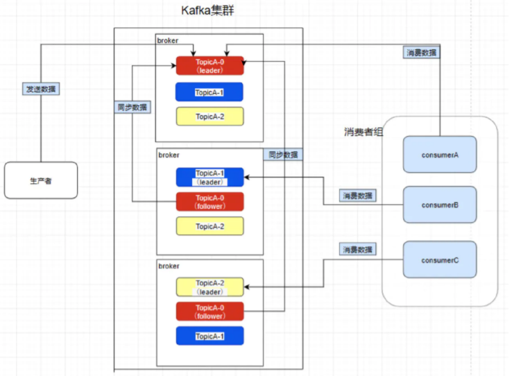
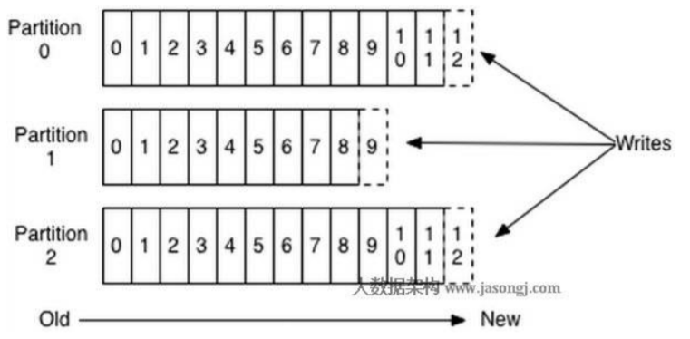
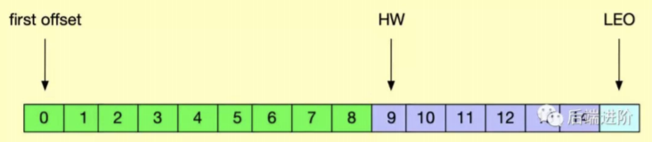
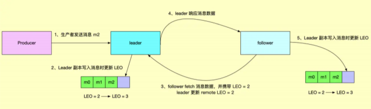
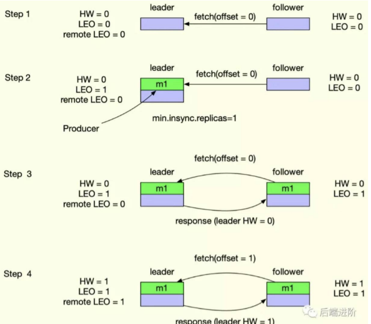
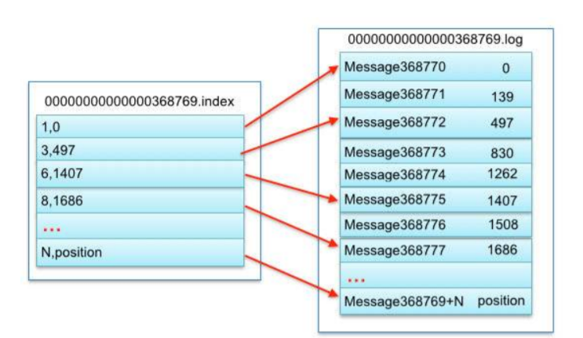
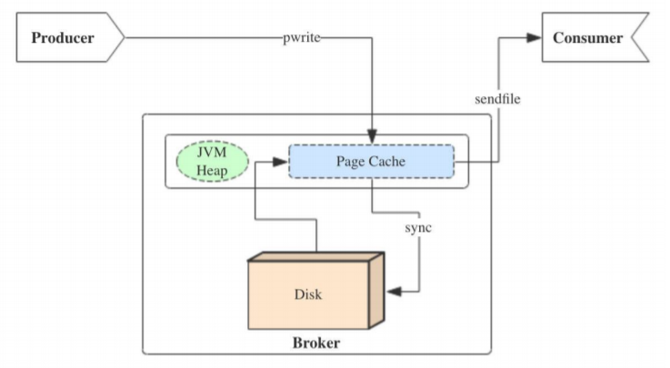
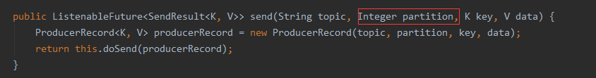

## 基础概念

**Broker**

> Server. 包含多个 Topic , Partition, 和 Replica. 负责协调 Producer 和 Consumer
>
> 主从结构为: 主节点为 Controller ,  Kafka 启动是会往 Zookeeper 中注册当前 Broker 信息. 谁先注册谁就是 Controller. 读取注册上来的从节点的数据(通过监听机制), 生成集群 的元数据信息, 之后把这些信息都分发给其他的服务器, 让其他服务器能感知到集群中其它成员的 存在

**Topic**

> 标准 MQ 中的 Queue. Kafka 中一个 Topic 的消息会保存在不同的 Partition (不同的 Broker)来保 证高可用

**Partition (分区)**

> 可以理解为将标准 MQ 的 Queue 的消息进行拆分, 来实现高可用 , Producer 发送的 Message, 根据 key 和 partition 数进行 hash, 然后进行投递 一个分区只能被同一个 Consumer Group 中的一个 Consumer 消费. 分区内消费有序
>
> 

**Replica (备份)**

> 每一个 Partition 的备份 .  Replica 的小于等于 Broker 的数量 
>
> Leader: Replica领导节点, 每一个 Partition 都有对应的 Leader 节点(Broker). Producer 写数据 时, 只会往 Leader 中写. Consumer 读数据也是从 Leader 中读 
>
> Follower: Replica跟随节点, 用于 复制领导节点的数据. 复制 Leader 消息采用 pull (拉)模式

**ISR (In-Sync Replica)**

> Leader维护一个与其基本保持同步的Replica列表, 每个Partition都会有一个ISR, 而且是由leader 动态维护. 如果一个flower比一个leader落后太多, 或者超过一定时间未发起数据复制请求, 则 leader将其重ISR中移除. 
>
> 当ISR中所有Replica都向Leader发送ACK时, leader才commit 
>
> Leader 宕机之后, 会从 ISR 选择数据最新的 Follower 来当做 Leader 如果 ISR 全部宕机, 则选择第 一个回复的 Replica 当做 Leader 节点 (消息可能会丢失或者重复消费)

**水印备份机制**

> LEO (last end offset): 日志末端位移, 记录了该副本对象底层日志文件中下一条消息的位移值, 副本写入消息的时候, 会自动更新 LEO 值 ,  Leader 会保存两个 LEO 值, 一个是自己的 LEO 值, 另外一 个是 remote 的 LEO 值.  Follower 每次 fetch 请求都会携带当前 LEO, Leader 会选择最小的 LEO 来更新 HW 
>
> HW (high watermark): 从名字可以知道, 该值叫高水印值 ,  HW 一定不会大于 LEO 值, 小于 HW 值 的消息被认为是"已提交"或"已备份"的消息, 并对消费者可见
>
> 
>
> 
>
> 
>
> LEO /HW : https://www.cnblogs.com/yoke/p/11486196.html

**Consumer**

> 标准 MQ 中的消费方. 接受 Broker 使用 pull (拉)模式, 默认 100ms 拉一次. Consumer 消费的是 Partition 的数据 
>
> 消息丢失: 手动确认 ack  而不是自动提交 
>
> 消息重复: 消费端幂等处理

**Consumer Group**

> 在 Kafka 中, 一个 Topic 是可以被一个消费组消费, 一个Topic 分发给 Consumer Group 中的 Consumer 进行消费, 保证同一条 Message 不会被不同的 Consumer 消费 
>
> 注意: 当Consumer Group的 Consumer 数量大于 Partition 的数量时, 超过 Partition 的数量将会 拿不到消息

**分片规则**

> Kafka分配Replica的算法有两种: RangeAssignor 和 RoundRobinAssignor
>
> 默认为 RangeAssignor: 
>
> 1. 将所有Broker(假设共n个Broker)和待分配的Partition排序 
> 2. 将第i个Partition分配到第(i mod n)个Broker上 
> 3. 将第i个Partition的第j个Replica分配到第((i + j) mod n)个Broker上

**Rebalance (重平衡)**

> Rebalance 本质上是一种协议, 规定了一个 Consumer Group 下的所有 consumer 如何达成一致, 来分配订阅 Topic 的每个分区 
>
> Rebalance 发生时, 所有的 Consumer Group 都停止工作, 直到 Rebalance 完成
>
> 触发条件 : 
>
> 1. 组成员个数发生变化 
>    1. 新的消费者加入到消费组 
>    2. 消费者主动退出消费组 
>    3. 消费者被动下线. 比如消费者长时间的GC, 网络延迟导致消费者长时间未向Group Coordinator发送心跳请求, 均会认为该消费者已经下线并踢出 
> 2. 订阅的 Topic 的 Consumer Group 个数发生变化 
> 3. Topic 的分区数发生变化

**Rebalace 流程**

> Rebalance 过程分为两步：Join 和 Sync
>
> 1. Join: 顾名思义就是加入组. 这一步中, 所有成员都向 Coordinator 发送 JoinGroup 请求, 请求加入消费组. 一旦所有成员都发送了 JoinGroup 请求, Coordinator 会从中选择一个 Consumer 担任 Leader 的角色, 并把组成员信息以及订阅信息发给 Consumer Leader 注意 Consumer Leader 和 Coordinator不是一个概念. Consumer Leader负责消费分配方案的制 定 
>
> 2. Sync: Consumer Leader 开始分配消费方案, 即哪个 Consumer 负责消费哪些 Topic 的哪些 Partition. 一旦完成分配, Leader 会将这个方案封装进 SyncGroup 请求中发给 Coordinator, 非 Leader 也会发 SyncGroup 请求, 只是内容为空. Coordinator 接收到分配方案之后会把方 案塞进SyncGroup的Response中发给各个Consumer. 这样组内的所有成员就都知道自己应 该消费哪些分区了
>
>    Rebalace 过程 : https://www.cnblogs.com/yoke/p/11405397.html

Coordinator :  Group Coordinator 是一个服务, 每个 Broker 在启动的时候都会启动一个该服务 Group Coordinator 的作用是用来存储 Group 的相关 Meta 信息, 并将对应 Partition 的 Offset 信息记录 到 Kafka 内置 Topic(__consumer_offsets)中

**日志索引**

> Kafka 能支撑 TB 级别数据, 在日志级别有两个原因: 顺序写和日志索引
>
> Kafka 在一个日志文件达到一定数据量 (1G) 之后, 会生成新的日志文件, 大数据情况下会有多个日 志文件, 通过偏移量来确定到某行纪录时, 如果遍历所有的日志文件, 那效率自然是很差的. Kafka 在日志级别上抽出来一层日志索引, 来方便根据 offset 快速定位到是某个日志文件
>
> 每一个 partition 对应多个个 log 文件(最大 1G), 每一个 log 文件又对应一个 index 文件
>
> 

**分区的原因**

>  如果我们假设像标准 MQ 的 Queue, 为了保证一个消息只会被一个消费者消费, 那么我们第一想到 的就是加锁. 对于发送者, 在多线程并且非顺序写环境下, 保证数据一致性, 我们同样也要加锁. 一旦 考虑到加锁, 就会极大的影响性能. 我们再来看Kafka 的 Partition, Kafka 的消费模式和发送模式都 是以 Partition 为分界. 也就是说对于一个 Topic 的并发量限制在于有多少个 Partition, 就能支撑 多少的并发.

**顺序写**

> 磁盘的顺序写的性能要比内存随机写的还要强. 磁盘顺序写和随机写的差距也 是天壤之别

**批发送**

> 批处理是一种常用的用于提高I/O性能的方式. 对Kafka而言, 批处理既减少了网络传输的 Overhead, 又提高了写磁盘的效率. Kafka 0.82 之后是将多个消息合并之后再发送, 而并不是send 一条就立马发送(之前支持)

**Page Cache**

> 内核会为每个文件单独维护一个page cache, 用户进程对于文件的大多数读写操作会直接作用到 page cache上, 内核会选择在适当的时候将page cache中的内容写到磁盘上 (当然我们可以手工 fsync控制回写),  这样可以大大减少磁盘的访问次数, 从而提高性能 
>
> 至于刷盘时机: page cache中的数据会随着内核中flusher线程的调度以及对sync()/fsync()的调用 写回到磁盘, 同样也可以通过手动调用写磁盘

**零拷贝**

> Kafka 写数据的时候, 会直接写到 Page Cache 中, 消费者拉数据时也会经过 Page Cache. 如果 Kafka 的写速率和消费速率差不多, 那么整个生产和消费过程是不会经过磁盘 IO. 全部都是内存操 作. 对于 Page Cache 没有刷盘导致的数据丢失, 如果发送方配置消息至少有一个副本接受, 那么也只会有已一次同步刷盘
>
> 

## Kafka 如何保证消息可靠性

**消费端会不会弄丢数据？**

唯一可能导致消费者弄丢数据的情况，就是说，你消拉取了这个消息，然后消费者那边自动提交了 offset，让 Kafka 以为你已经消费好了这个消息，但其实你才刚准备处理这个消息，你还没处理，你自己就挂了，此时这条消息就丢了。

大家都知道 Kafka 会自动提交 offset，那么只要**关闭自动提交 offset，在处理完之后自己手动提交 offset，就可以保证数据不会丢。**但是此时确实还是可能会有重复消费，比如你刚处理完，还没提交 offset，结果自己挂了，此时肯定会重复消费一次 , 出现了消息重复消费的 问题。这个时候可以通过一些其他的方式, 保证消息幂等就可以了

>  手动提交方案 :  同步提交 , 异步提交 , 同步异步结合

**Broker 会不会弄丢数据？**

这块比较常见的一个场景，就是 Kafka 某个 broker 宕机，然后重新选举 partition 的 leader。大家想想，要是此时其他的 follower 刚好还有些数据没有同步，结果此时 leader 挂了，然后选举某个 follower 成 leader 之后，不就少了一些数据？这就丢了一些数据啊。

所以此时一般是要求起码设置如下 4 个参数：

- **给 topic 设置 `replication.factor` 参数：这个值必须大于 1，要求每个 partition 必须有至少 2 个副本。**
- **在 Kafka 服务端设置 `min.insync.replicas` 参数：这个值必须大于 1，这个是要求一个 leader 至少感知到有至少一个 follower 还跟自己保持联系，没掉队，这样才能确保 leader 挂了还有一个 follower 吧。**
- 在 producer 端设置 `acks=all`：这个是要求每条数据，必须是写入所有 replica 之后，才能认为是写成功了。
- 在 producer 端设置 `retries=10000000`（很大很大很大的一个值，无限次重试的意思）：这个是要求一旦写入失败，就无限重试，卡在这里了。

**生产者会不会弄丢数据？**

如果设置了 `acks=all`，一定不会丢，要求是，你的 leader 接收到消息，所有的 follower 都同步到了消息之后，才认为本次写成功了。如果没满足这个条件，生产者会自动不断的重试，重试无限次

> - acks=0：生产者不会等待任何来自服务器的响应。
>
>   如果当中出现问题，导致服务器没有收到消息，那么生产者无从得知，会造成消息丢失
>
>   由于生产者不需要等待服务器的响应所以可以以网络能够支持的最大速度发送消息，从而达到很高的吞吐量
>
> - acks=1（默认值）：只要集群的Leader节点收到消息，生产者就会收到一个来自服务器的成功响应
>
>   如果消息无法到达Leader节点（例如Leader节点崩溃，新的Leader节点还没有被选举出来）生产者就会收到一个错误响应，为了避免数据丢失，生产者会重发消息
>
>   如果一个没有收到消息的节点成为新Leader，消息还是会丢失
>
>   此时的吞吐量主要取决于使用的是同步发送还是异步发送，吞吐量还受到发送中消息数量的限制，例如生产者在收到服务器响应之前可以发送多少个消息
>
> - acks=all：只有当所有参与复制的节点全部都收到消息时，生产者才会收到一个来自服务器的成功响应
>
>   这种模式是最安全的，可以保证不止一个服务器收到消息，就算有服务器发生崩溃，整个集群依然可以运行
>
>   延时比acks=1更高，因为要等待不止一个服务器节点接收消息
>
> 根据实际的应用场景，我们设置不同的 `acks`，以此保证数据的可靠性。

另外，Producer 发送消息还可以选择同步（默认，通过 `producer.type=sync` 配置） 或者异步（`producer.type=async`）模式。如果设置成异步，虽然会极大的提高消息发送的性能，但是这样会增加丢失数据的风险。如果需要确保消息的可靠性，必须将 `producer.type` 设置为 sync。

## Kafka中是怎么体现消息顺序性的？

1. 可以设置topic 有且只有一个partition

2. 根据业务需要，需要顺序的 指定为同一个partition

   

3. 根据业务需要，需要顺序的指定为同一个partition (比如同一个订单，使用同一个key，可以保证分配到同一个partition上)

> 如果指定了partition就会发送到指定的partition , 如果没指定就会根据key计算partition , 相同key肯定落到同一个partition

进阶问题 :  对于同一业务进入了同一个消费者组之后，用了多线程来处理消息，会导致消息的乱序

> 消费者内部根据线程数量创建等量的内存队列，对于需要顺序的一系列业务数据，根据key或者业务数据，放到同一个内存队列中，然后线程从对应的内存队列中取出并操作

## 创建topic时如何选择合适的分区数？

kafka集群中，单Topic的partition也并不是越多越好，但通常对于业务方来说，可能会简单的根据生产者或消费者的处理能力来提出扩partition的需求，此时就需要根据具体的场景进行分析以确定partition的数量。

通常Kafka集群中的分区越多，吞吐量就越高。但是，必须意识到总分区或每个Broker拥有太多分区对可用性和延迟等方面的潜在影响，通常这部分需要业务方和基础服务方进行合理规划和调整。

一般情况下，分区数可以配置为Broker节点数的整数倍，比如：Broker节点是3，那么可以设置分区数为3、6、9。但是不能无限扩展, 有临界值, 临界值多少, 需要通过压测工具进行测试

## 消费者提交消费位移时提交的是当前消费到的最新消息的offset还是offset+1?

offset+1

## 有哪些情形会造成重复消费？

消费者消费后没有commit offset(程序崩溃/强行kill/消费耗时/自动提交偏移情况下unscrible)

## 哪些情景下会造成消息丢失

消消费者没有处理完消息 提交offset(自动提交偏移 未处理情况下程序异常结束)

## MQ如何保证消息幂等

1. 乐观锁机制
2. 基于Redis的原子操作

Kafka相关设计思想 : https://gitbook.cn/books/5bc446269a9adf54c7ccb8bc/index.html

