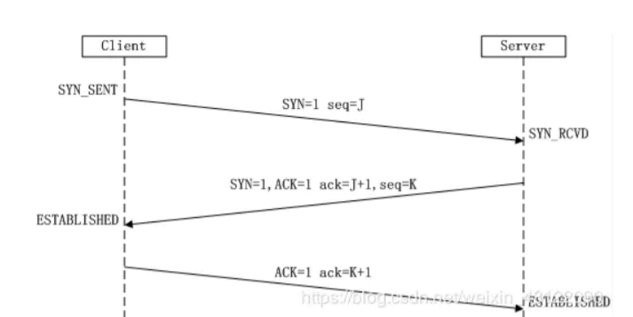

## 什么是OSI ? 

- OSI（Open System Interconnect），即开放式系统互联。一般都叫OSI参考模型，是 ISO（国际标准化组织）组织在1985年研究的网络互连模型。ISO为了更好的使网络应用更为 普及，推出了OSI参考模型，这样所有的公司都按照统一的标准来指定自己的网络，就可以互 通互联了。

- OSI定义了网络互连的七层框架（物理层、数据链路层、网络层、传输层、会话层、表示层、 应用层）。

  

##  什么是TCP/IP和UDP

TCP/IP即传输控制/网络协议，是面向连接的协议，发送数据前要先建立连接(发送方和接收方的成 对的两个之间必须建 立连接)，TCP提供可靠的服务，也就是说，通过TCP连接传输的数据不会丢 失，没有重复，并且按顺序到达 

UDP它是属于TCP/IP协议族中的一种。是无连接的协议，发送数据前不需要建立连接，是没有可 靠性的协议。因为不需要建立连接所以可以在在网络上以任何可能的路径传输，因此能否到达目的 地，到达目的地的时间以及内容的正确性都是不能被保证的。

## TCP与UDP区别 **

1. TCP是面向连接的协议，发送数据前要先建立连接，TCP提供可靠的服务，也就是说，通过TCP连 接传输的数据不会丢失，没有重复，并且按顺序到达； 

2. UDP是无连接的协议，发送数据前不需要建立连接，是没有可靠性； 

3. TCP通信类似于于要打个电话，接通了，确认身份后，才开始进行通行； 

4. UDP通信类似于学校广播，靠着广播播报直接进行通信。

5. TCP只支持点对点通信，UDP支持一对一、一对多、多对一、多对多； 

6. TCP是面向字节流的，UDP是面向报文的； 面向字节流是指发送数据时以字节为单位，一个数据 包可以拆分成若干组进行发送，而UDP一个报文只能一次发完。 

7. TCP首部开销（20字节）比UDP首部开销（8字节）要大 UDP 的主机不需要维持复杂的连接状态表

## TCP和UDP的应用场景

对某些实时性要求比较高的情况使用UDP，比如游戏，媒体通信，实时直播，即使出现传输错误也可以容忍；

其它大部分情况下，HTTP都是用TCP，因为要求传输的内容可靠，不出现丢失的情 况

## 从输入址到获得页面的过程  ? **

1. 浏览器查询 DNS，获取域名对应的IP地址:具体过程包括浏览器搜索自身的DNS缓存、搜索操作系 统的DNS缓存、读取本地的Host文件和向本地DNS服务器进行查询等。对于向本地DNS服务器进 行查询，如果要查询的域名包含在本地配置区域资源中，则返回解析结果给客户机，完成域名解析 (此解析具有权威性)；如果要查询的域名不由本地DNS服务器区域解析，但该服务器已缓存了此网 址映射关系，则调用这个IP地址映射，完成域名解析（此解析不具有权威性）。如果本地域名服务 器并未缓存该网址映射关系，那么将根据其设置发起递归查询或者迭代查询；
2. 浏览器获得域名对应的IP地址以后，浏览器向服务器请求建立链接，发起三次握手；
3. TCP/IP链接建立起来后，浏览器向服务器发送HTTP请求
4. 服务器接收到这个请求，并根据路径参数映射到特定的请求处理器进行处理，并将处理结果及相应 的视图返回给浏览器；
5. 浏览器解析并渲染视图，若遇到对js文件、css文件及图片等静态资源的引用，则重复上述步骤并 向服务器请求这些资源；
6. . 浏览器根据其请求到的资源、数据渲染页面，最终向用户呈现一个完整的页面。

## 什么是TCP的三次握手 **

在网络数据传输中，传输层协议TCP是要建立连接的可靠传输，TCP建立连接的过程，我们称为三 次握手。

第一次握手：Client将SYN置1，随机产生一个初始序列号seq发送给Server，进入SYN_SENT状 态；

. 第二次握手：Server收到Client的SYN=1之后，知道客户端请求建立连接，将自己的SYN置1，ACK 置1，产生一个acknowledge number=sequence number+1，并随机产生一个自己的初始序列 号，发送给客户端；进入SYN_RCVD状态；

第三次握手：客户端检查acknowledge number是否为序列号+1，ACK是否为1，检查正确之后将 自己的ACK置为1，产生一个acknowledge number=服务器发的序列号+1，发送给服务器；进入 ESTABLISHED状态；服务器检查ACK为1和acknowledge number为序列号+1之后，也进入 ESTABLISHED状态；完成三次握手，连接建立。

> 简单来说就是 ： 
>
> 1. 客户端向服务端发送SYN  
> 2. 服务端返回SYN,ACK 
> 3. 客户端发送ACK

## 什么是TCP的四次挥手

在网络数据传输中，传输层协议断开连接的过程我们称为四次挥手

. 第一次挥手：Client将FIN置为1，发送一个序列号seq给Server；进入FIN_WAIT_1状态；

第二次挥手：Server收到FIN之后，发送一个ACK=1，acknowledge number=收到的序列号+1； 进入CLOSE_WAIT状态。此时客户端已经没有要发送的数据了，但仍可以接受服务器发来的数据。

第三次挥手：Server将FIN置1，发送一个序列号给Client；进入LAST_ACK状态；

第四次挥手：Client收到服务器的FIN后，进入TIME_WAIT状态；接着将ACK置1，发送一个 acknowledge number=序列号+1给服务器；服务器收到后，确认acknowledge number后，变为 CLOSED状态，不再向客户端发送数

## 什么是Socket 

网络上的两个程序通过一个双向的通讯连接实现数据的交换，这个双向链路的一端称为一个 Socket。Socket通常用来实现客户方和服务方的连接。Socket是TCP/IP协议的一个十分流行的编 程界面，一个Socket由一个IP地址和一个端口号唯一确定。 

但是，Socket所支持的协议种类也不光TCP/IP、UDP，因此两者之间是没有必然联系的。在Java环 境下，Socket编程主要是指基于TCP/IP协议的网络编程。

 socket连接就是所谓的长连接，客户端和服务器需要互相连接，理论上客户端和服务器端一旦建立 起连接将不会主动断掉的，但是有时候网络波动还是有可能的 

Socket偏向于底层。一般很少直接使用Socket来编程，框架底层使用Socket比较多，

## socket属于网络的那个层面

Socket是应用层与TCP/IP协议族通信的中间软件抽象层，它是一组接口。在设计模式中，Socket 其实就是一个外观模式，它把复杂的TCP/IP协议族隐藏在Socket接口后面，对用户来说，一组简 单的接口就是全部，让Socket去组织数据，以符合指定的协议。

## 什么是Http协议？**

Http协议是对客户端和服务器端之间数据之间实现可靠性的传输文字、图片、音频、视频等超文 本数据的规范，格式简称为“超文本传输协议” 

Http协议属于应用层，及用户访问的第一层就是http

## Socket和http的区别和应用场景

Socket连接就是所谓的长连接，理论上客户端和服务器端一旦建立起连接将不会主动断掉；

>  Socket适用场景：网络游戏，银行持续交互，直播，在线视屏等。 

http连接就是所谓的短连接，即客户端向服务器端发送一次请求，服务器端响应后连接即会断开等 待下次连接

>  http适用场景：公司OA服务，互联网服务，电商，办公，网站等等等等

## http和https的区别？**

其实HTTPS就是从HTTP加上加密处理（一般是SSL安全通信线路）+认证+完整性保护

区别： 

 	1. https需要拿到ca证书，需要钱的
 	2. 端口不一样，http是80，https443 
 	3. http是超文本传输协议，信息是明文传输，https则是具有安全性的ssl加密传输协议。
 	4. http和https使用的是完全不同的连接方式（http的连接很简单，是无状态的；HTTPS 协议是 由SSL+HTTP协议构建的可进行加密传输、身份认证的网络协议，比http协议安全。）

## 一次完整的HTTP请求所经历几个步骤?

1. 建立TCP连接

2. Web浏览器向Web服务器发送请求行

3. Web浏览器发送请求头

4. Web服务器应答

5. Web服务器发送应答头

6. Web服务器向浏览器发送数据

7. Web服务器关闭TCP连接

## 常用HTTP状态码是怎么分类的，有哪些常见的状态码？**

HTTP状态码表示客户端HTTP请求的返回结果、标识服务器处理是否正常、表明请求出现的错误等

**常见状态码 :** 

