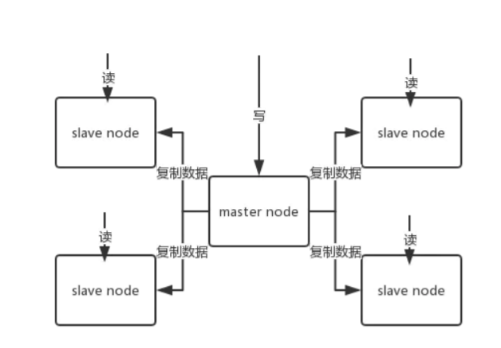
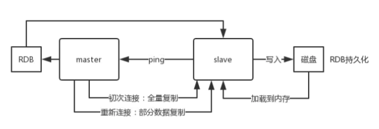
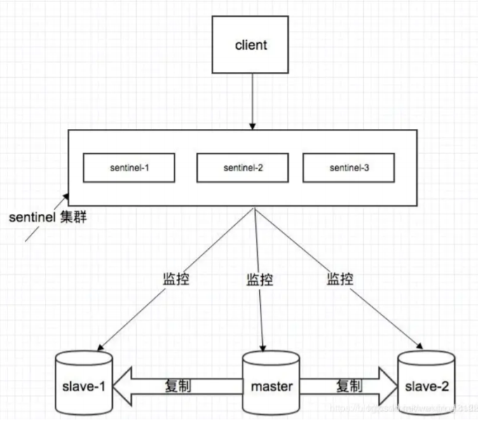
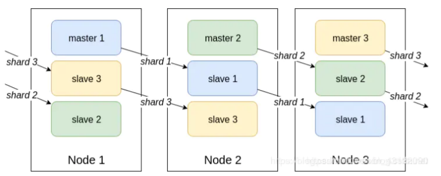
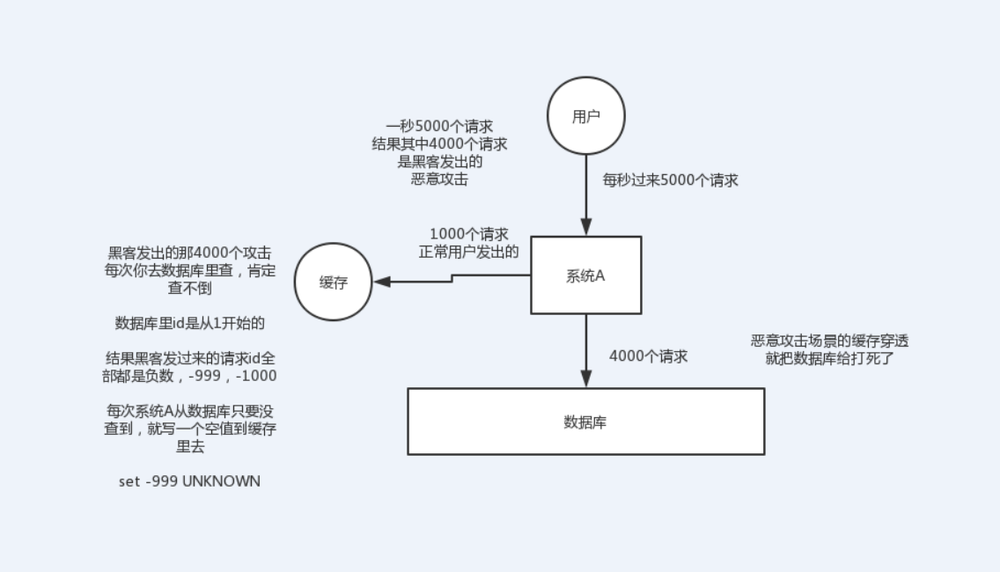
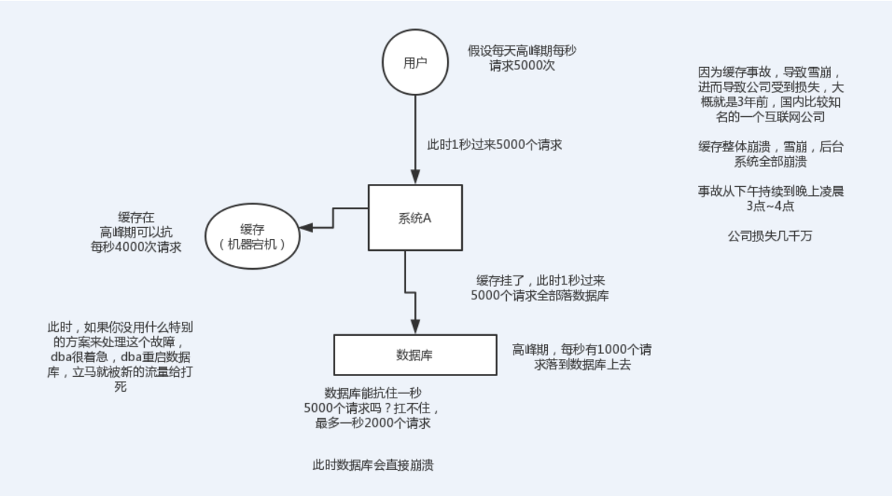

## Redis 的数据类型？

 Redis 支持五种数据类型： string（ 字符串），hash（ 哈希）， list（ 列表）， set（ 集合） 及 zsetsorted set： 有序集合)。

## Redis 相比Memcached 有哪些优势？

1. Memcached 所有的值均是简单的字符串， redis 作为其替代者， 支持更为丰富的数据类 
2. Redis 的速度比 Memcached 快很
3. Redis 可以持久化其数据

## Redis 是单进程单线程的？

Redis 是单进程单线程的， redis 利用队列技术将并发访问变为串行访问， 消除了传统数据库串行控制的开销。

## Redis为什么这么快

1. 完全基于内存，绝大部分请求是纯粹的内存操作，非常快速。数据存在内存中，类似于 HashMap，HashMap 的优势就是查找和操作的时间复杂度都是O(1)； 
2. 数据结构简单，对数据操作也简单，Redis 中的数据结构是专门进行设计的； 
3. 采用单线程，避免了不必要的上下文切换和竞争条件，也不存在多进程或者多线程导致的切换而消耗 CPU，不用去考虑各种锁的问题，不存在加锁释放锁操作，没有因为可能出现死锁而导致 的性能消耗； 
4. 使用多路 I/O 复用模型，非阻塞 IO；

   

## 一个字符串类型的值能存储最大容量是多少？

 512M

## Redis 的持久化机制是什么？各自的优缺点？

Redis 提供两种持久化机制 RDB 和 AOF 机制:

1. RDB持久化方式： 是指用数据集快照的方式半持久化模式) 记录 redis 数据库的所 有键值对,在某个时间点将数据写入一个临时文件， 持久化结束后， 用这个临时文件替换上次持久化的 文件， 达到数据恢复。

   > 优点： 
   >
   > 1. 只有一个文件 dump.rdb， 方便持久化。 
   > 2. 容灾性好， 一个文件可以保存到安全的磁盘。 
   > 3. 性能最大化， fork 子进程来完成写操作， 让主进程继续处理命令， 所以是 IO 最大化。使用单独子 进程来进行持久化，主进程不会进行任何 IO 操作，保证了 redis 的高性能
   > 4. 相对于数据集大时， 比 AOF 的启动效率更高。
   >
   > 缺点: 
   >
   > 1. 数据安全性低。RDB 是间隔一段时间进行持久化，如果持久化之间 redis 发生故障， 会发生数据丢 失。所以这种方式更适合数据要求不严谨的时候) 

2. AOF (Append-only file)持久化方式： 是指所有的命令行记录以 redis 命令请求协议的格式完全持久 化存储)保存为 aof 文件。

   > 优点： 
   >
   > 1. 数据安全， aof 持久化可以配置 appendfsync 属性， 有 always， 每进行一次命令操作就记录到 aof 文件中一次。
   > 2. 通过 append 模式写文件， 即使中途服务器宕机， 可以通过 redis-check-aof 工具解决数据一致性 问题。 
   > 3. AOF 机制的 rewrite 模式。AOF 文件没被 rewrite 之前（ 文件过大时会对命令进行合并重写）， 可以删除其中的某些命令（ 比如误操作的 flushall）) 
   >
   > 缺点： 
   >
   > 1. AOF 文件比 RDB 文件大， 且恢复速度慢。
   > 2. 数据集大的时候， 比 rdb 启动效率低。

## redis 过期键的删除策略

1. **定时删除:** 在设置键的过期时间的同时，创建一个定时器 timer). 让定时器在键的过期时间来临时， 立即执行对键的删除操作。 
2. **惰性删除:** 放任键过期不管，但是每次从键空间中获取键时，都检查取得的键是 否过期， 如果过期 的话， 就删除该键;如果没有过期， 就返回该键。 
3. **定期删除:** 每隔一段时间程序就对数据库进行一次检查，删除里面的过期键。至 于要删除多少过期 键， 以及要检查多少个数据库， 则由算法决定。

## Redis 的回收策略（淘汰策略）

1. volatile-lru：从已设置过期时间的数据集（ server.db[i].expires）中挑选最近最少使用的数据淘汰 
2. volatile-ttl： 从已设置过期时间的数据集（ server.db[i].expires） 中挑选将要过期的数据淘汰 
3. volatile-random： 从已设置过期时间的数据集（ server.db[i].expires） 中任意选择数据淘汰
4. volatile-lfu：挑选最近使用次数最少的数据淘汰
5. allkeys-lru： 从数据集（ server.db[i].dict） 中挑选最近最少使用的数据淘汰 
6. volatile-lfu：挑选最近使用次数最少的数据淘汰
7. allkeys-random： 从数据集（ server.db[i].dict） 中任意选择数据淘汰 
8. no-enviction（ 驱逐） ： 禁止驱逐数据

注意这里的 6 种机制，volatile 和 allkeys 规定了是对已设置过期时间的数据集淘汰数据还是从全部数据 集淘汰数据， 后面的 lru、ttl 以及 random 是三种不同的淘汰策略， 再加上一种 no-enviction 永不回 收的策略

**使用策略规则：** 

1. 如果数据呈现幂律分布，也就是一部分数据访问频率高，一部分数据访问频率 低， 则使用 allkeyslru 

2. 如果数据呈现平等分布， 也就是所有的数据访问频率都相同， 则使用allkeys-random

## Redis 的同步机制了解么？

Redis 可以使用主从同步，从从同步。

第一次同步时，主节点做一次 bgsave， 并同时将后续修改 操作记录到内存 buffer， 待完成后将 rdb 文件全量同步到复制节点， 复制节点接受完成后将 rdb 镜像 加载到内存。

加载完成后， 再通知主节点将期间修改的操作记录同步到复制节点进行重放就完成了同步 过程。

## 是否使用过 Redis 集群，集群的原理是什么？

1. 主从复制集群 (高可用基石)
2. Redis Sentinal 着眼于高可用， 在 master 宕机时会自动将 slave 提升为master， 继续提供服 务。
3. Redis Cluster 着眼于扩展性， 在单个 redis 内存不足时， 使用 Cluster 进行分片存储。

## Jedis 与 Redisson 对比有什么优缺点？

Jedis 是 Redis 的 Java 实现的客户端， 其 API 提供了比较全面的 Redis 命令的支持；

Redisson 实现了分布式和可扩展的 Java 数据结构，和 Jedis 相比，功能较为简单， 不支持字符串操作， 不支持排 序、事务、管道、分区等 Redis 特性。

Redisson 的宗旨是促进使用者对 Redis 的关注分离，从而让使 用者能够将精力更集中地放在处理业务逻辑上。

## 说说 Redis 哈希槽的概念？

Redis 集群没有使用一致性 hash,而是引入了哈希槽的概念， Redis 集群有16384 个哈希槽，每个 key 通过 CRC16 校验后对 16384 取模来决定放置哪个槽， 集群的每个节点负责一部分 hash 槽。

## Redis 主从架构

redis replication -> 主从架构 -> 读写分离 -> 水平扩容支撑读高并发

**redis replication 的核心机制**

redis 采用异步方式复制数据到 slave 节点，不过 redis2.8 开始，slave node 会周期性地确认自己 每次复制的数据量；

 一个 master node 是可以配置多个 slave node 的；

 slave node 也可以连接其他的 slave node；

 slave node 做复制的时候，不会 block master node 的正常工作；

 slave node 在做复制的时候，也不会 block 对自己的查询操作，它会用旧的数据集来提供服务； 但是复制完成的时候，需要删除旧数据集，加载新数据集，这个时候就会暂停对外服务了； 

slave node 主要用来进行横向扩容，做读写分离，扩容的 slave node 可以提高读的吞吐量。

> 如果采用了主从架构，那么建议必须开启 master node 的持久化，不建议用 slave node 作为 master node 的数据热备，因为那样的话，如果你关掉 master 的持久化，可能在 master 宕机重 启的时候数据是空的，然后可能一经过复制， slave node 的数据也丢了。 
>
> 另外，master 的各种备份方案，也需要做。万一本地的所有文件丢失了，从备份中挑选一份 rdb 去恢复 master，这样才能确保启动的时候，是有数据的，即使采用了后续讲解的高可用机制， slave node 可以自动接管 master node，但也可能 sentinel 还没检测到 master failure，master node 就自动重启了，还是可能导致上面所有的 slave node 数据被清空。

## redis 主从复制的核心原理

当启动一个 slave node 的时候，它会发送一个 PSYNC 命令给 master node。 

如果这是 slave node 初次连接到 master node，那么会触发一次 full resynchronization 全 量复制。此时 master 会启动一个后台线程，开始生成一份 RDB 快照文件， 同时还会将从客户端 client 新收到的所有写命令缓存在内存中。 

RDB 文件生成完毕后， master 会将这个 RDB 发送给 slave，slave 会先写入本地磁盘，然后再从本地磁盘加载到内存中， 接着 master 会将内存中缓存的写命令发送到 slave，slave 也会同步这些数据。 

slave node 如果跟 master node 有网络故障，断开了连接，会自动重连，连接之后 master node 仅会复制给 slave 部分缺少的数据。

## Redis集群方案

**哨兵模式**

集群监控：负责监控 redis master 和 slave 进程是否正常工作。 

消息通知：如果某个 redis 实例有故障，那么哨兵负责发送消息作为报警通知给管理员。 

故障转移：如果 master node 挂掉了，会自动转移到 slave node 上。 

配置中心：如果故障转移发生了，通知 client 客户端新的 master 地址。

> 哨兵至少需要 3 个实例，来保证自己的健壮性。 
>
> 哨兵 + redis 主从的部署架构，是不保证数据零丢失的，只能保证 redis 集群的高可用性。 

**Redis Cluster 集群方案**

Redis Cluster是一种服务端Sharding技术，3.0版本开始正式提供。Redis Cluster并没有使用一致 性hash，而是采用slot(槽)的概念，一共分成16384个槽。将请求发送到任意节点，接收到请求的 节点会将查询请求发送到正确的节点上执行

> 1. 通过哈希的方式，将数据分片，每个节点均分存储一定哈希槽(哈希值)区间的数据，默认分配了 16384 个槽位 
> 2. 每份数据分片会存储在多个互为主从的多节点上 
> 3. 数据写入先写主节点，再同步到从节点(支持配置为阻塞同步) 
> 4. 同一分片多个节点间的数据不保持一致性 
> 5. 读取数据时，当客户端操作的key没有分配在该节点上时，redis会返回转向指令，指向正确的节点 
> 6. 扩容时时需要需要把旧节点的数据迁移一部分到新节点 在 redis cluster 架构下，每个 redis 要放开两个端口号，比如一个是 6379，另外一个就是 加1w 的端口号，比如 16379。

## Redis 集群会有写操作丢失吗？为什么？

Redis 并不能保证数据的强一致性，这意味这在实际中集群在特定的条件下可能会丢失写操作

## Redis 集群最大节点个数是多少？

163840

## 怎么理解 Redis 事务？Redis 事务相关的命令有哪几个？

1. 事务是一个单独的隔离操作： 事务中的所有命令都会序列化、按顺序地执行。事务在执行的过程 中， 不会被其他客户端发送来的命令请求所打断。 
2. 事务是一个原子操作： 事务中的命令要么全部被执行， 要么全部都不执行。

Redis 事务相关的命令  : MULTI、EXEC、DISCARD、WATCH

## Redis key 的过期时间和永久有效分别怎么设置？

EXPIRE 和 PERSIST 命令。

## Redis 如何做内存优化？

尽可能使用散列表（ hashes）， 散列表（ 是说散列表里面存储的数少） 使用的内存非常小， 所 以你应该尽可能的将你的数据模型抽象到一个散列表里面。比如你的 web 系统中有一个用户对象， 不 要为这个用户的名称， 姓氏， 邮箱， 密码设置单独的 key,而是应该把这个用户的所有信息存储到一张散列表里面

## Redis 的内存用完了会发生什么？

如果达到设置的上限，Redis 的写命令会返回错误信息（ 但是读命令还可以正常返回。） 或者你可 以将 Redis 当缓存来使用配置淘汰机制， 当 Redis 达到内存上限时会冲刷掉旧的内容。

## MySQL 里有 2000w 数据，redis 中只存 20w 的数据，如何保证redis 中的数据都是热点数据？

Redis 内存数据集大小上升到一定大小的时候， 就会施行数据淘汰策略。

## 假如 Redis 里面有 1 亿个key，如何找出指定前缀的key？

使用 keys 指令可以扫出指定模式的 key 列表。  

> 注意 : redis 的单线程的。keys 指令会导致线程阻塞一段时间， 线 上服务会停顿， 直到指令执行完毕， 服务才能恢复。
>
> 这个时候可以使用 scan 指令， scan 指令可以无 阻塞的提取出指定模式的 key 列表， 但是会有一定的重复概率， 在客户端做一次去重就可以了， 但是 整体所花费的时间会比直接用 keys 指令长。

## 如果有大量的 key 需要设置同一时间过期，一般需要注意什 么？

如果大量的 key 过期时间设置的过于集中，到过期的那个时间点，redis 可能会出现雪崩。一般需要在时间上加一个随机值， 使得过期时间分散一些。

## 使用过 Redis 分布式锁么，它是什么回事？

先拿 setnx 来争抢锁， 抢到之后， 再用 expire 给锁加一个过期时间防止锁忘记了释放。 

思考 : 如果在 setnx 之后执行 expire 之前进程意外 crash 或者要重启维护了， 那会怎么样？  死锁

## 如何解决 Redis 的并发竞争 Key 问题

所谓 Redis 的并发竞争 Key 的问题也就是多个系统同时对一个 key 进行操作，但是最后执行的顺 序和我们期望的顺序不同，这样也就导致了结果的不同！

>  解决方案 ：分布式锁（zookeeper 和 redis 都可以实现分布式锁）。（如果不存在 Redis 的并 发竞争 Key 问题，不要使用分布式锁，这样会影响性能）

## Redis 持久化数据和缓存怎么做扩容？

如果 Redis 被当做缓存使用，使用一致性哈希实现动态扩容缩容。 

如果 Redis 被当做一个持久化存储使用，必须使用固定的 keys-to-nodes 映射关系，节点的数量一旦确定不能变化

## 什么是 RedLock

Redis 官方站提出了一种权威的基于 Redis 实现分布式锁的方式名叫 Redlock，此种方式比原先的 单节点的方法更安全。它可以保证以下特性：

1. 安全特性：互斥访问，即永远只有一个 client 能拿到锁 
2. 避免死锁：最终 client 都可能拿到锁，不会出现死锁的情况，即使原本锁住某资源的 client crash 了或者出现了网络分区 
3. 容错性：只要大部分 Redis 节点存活就可以正常提供服务

> JAVA RedLock实现方案 :  http://www.3qphp.com/java/Jgrammar/3324.html

## 什么是缓存穿透？

就是用户请求透过redis去请求mysql服务器，导致mysql压力过载。一般情况都是黑客攻击

解决方法：

1. 从缓存取不到的数据，在数据库中也没有取到，这时也可以将key-value对写为key-null，缓 存有效时间可以设置短点，如30秒（设置太长会导致正常情况也没法使用）。这样可以防止 攻击用户反复用同一个id暴力攻击
2. 接口层增加校验，如用户鉴权校验，id做基础校验，id<=0的直接拦截；
3. 采用布隆过滤器，将所有可能存在的数据哈希到一个足够大的 bitmap 中，一个一定不存在 的数据会被这个 bitmap 拦截掉，从而避免了对底层存储系统的查询压力

## 什么是缓存雪崩？

就是redis服务由于负载过大而宕机，导致mysql的负载过大也宕机，最终整个系统瘫痪

> 解决方法： 
>
> 1. redis集群，将原来一个人干的工作，分发给多个人干 
> 2. 缓存预热（关闭外网访问，先开启mysql，通过预热脚本将热点数据写入缓存中，启动缓 存。开启外网服务） 
> 3. 数据不要设置相同的生存时间，不然过期时，redis压力会大

## 什么是缓存击穿

缓存击穿是指缓存中没有但数据库中有的数据（一般是缓存时间到期），这时由于并发用户特别多，同时读缓存没读到数据，又同时去数据库去取数据，引起数据库压力瞬间增大，造成过大压力

> 1. 设置热点数据永远不过期。
> 2. 对缓存查询加锁，如果KEY不存在，就加锁，然后查DB入缓存，然后解锁；其他进程如果发现有锁就等待，然后等解锁后返回数据或者进入DB查询
> 3. 多级缓存架构 

## 如何实现集群中的 session 共享存储？

Session 是运行在一台服务器上的，所有的访问都会到达我们的唯一服务器上，这样我们可以根据客户 端传来的 sessionID，来获取 session，或在对应 Session 不存在的情况下（ session 生命周期到了/用 户第一次登录），创建一个新的 Session； 但是， 如果我们在集群环境下， 假设我们有两台服务器 A， B， 用户的请求会由Nginx 服务器进行转发（ 别的方案也是同理）， 用户登录时， Nginx 将请求 转发至服务器 A 上，A 创建了新的 session，并将 SessionID 返回给客户端，用户在浏览其他页面时， 客户端验证登录状态， Nginx 将请求转发至服务器 B， 由于 B 上并没有对应客户端发来 sessionId 的 session，所以会重新创建一个新的 session，并且再将这个新的 sessionID 返回给客户端， 这样， 我 们可以想象一下， 用户每一次操作都有 1/2 的概率进行再次的登录， 这样不仅对用户体验特别差， 还 会让服务器上的 session 激增， 加大服务器的运行压力。

为了解决集群环境下的 seesion 共享问题， 共有 4 种解决方案：

- 粘性 session

  > 粘性 session 是指 Ngnix 每次都将同一用户的所有请求转发至同一台服务器上， 即将用户与服务器绑 定

- 服务器 session 复制

  > 即每次 session 发生变化时， 创建或者修改， 就广播给所有集群中的服务器， 使所有的服务器上的 session 相同。

- session 共享

  > 缓存 session， 使用 redis， memcached

- session 持久化

  > 将 session 存储至数据库中， 像操作数据一样才做 session。

## Redis和Mysql如何保证数据⼀致

1. 先更新Mysql，再更新Redis，如果更新Redis失败，可能仍然不⼀致
2. 先删除Redis缓存数据，再更新Mysql，再次查询的时候在将数据添加到缓存中，这种⽅案能解决1 ⽅案的问题，但是在⾼并发下性能较低，⽽且仍然会出现数据不⼀致的问题，⽐如线程1删除了 Redis缓存数据，正在更新Mysql，此时另外⼀个查询再查询，那么就会把Mysql中⽼数据⼜查到 Redis中
3. 使用MQ异步同步, 保证数据的最终一致性

