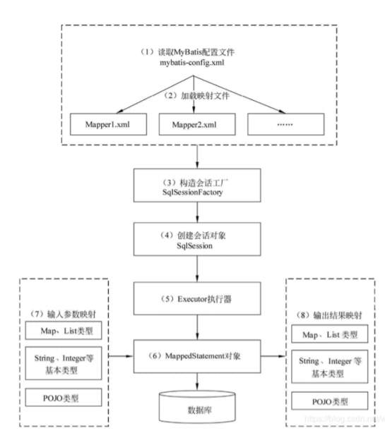

## 请说说MyBatis的工作原理



1. 读取 MyBatis 配置文件：mybatis-config.xml 为 MyBatis 的全局配置文件，配置了 MyBatis 的运 行环境等信息，例如数据库连接信息。 

2. 加载映射文件。映射文件即 SQL 映射文件，该文件中配置了操作数据库的 SQL 语句，需要在 MyBatis 配置文件 mybatis-config.xml 中加载。mybatis-config.xml 文件可以加载多个映射文 件，每个文件对应数据库中的一张表。 
3. 构造会话工厂：通过 MyBatis 的环境等配置信息构建会话工厂 SqlSessionFactory。
4. 创建会话对象：由会话工厂创建 SqlSession 对象，该对象中包含了执行 SQL 语句的所有方法。 
5. Executor 执行器：MyBatis 底层定义了一个 Executor 接口来操作数据库，它将根据 SqlSession 传递的参数动态地生成需要执行的 SQL 语句，同时负责查询缓存的维护。 
6. MappedStatement 对象：在 Executor 接口的执行方法中有一个 MappedStatement 类型的参 数，该参数是对映射信息的封装，用于存储要映射的 SQL 语句的 id、参数等信息。 update user set name = lis where id = ?
7. 输入参数映射：输入参数类型可以是 Map、List 等集合类型，也可以是基本数据类型和 POJO 类 型。输入参数映射过程类似于 JDBC 对 preparedStatement 对象设置参数的过程。 
8. 输出结果映射：输出结果类型可以是 Map、 List 等集合类型，也可以是基本数据类型和 POJO 类 型。输出结果映射过程类似于 JDBC 对结果集的解析过程。


## Mybatis是否支持延迟加载？如果支持，它的实现原理是什么？

Mybatis仅支持association关联对象和collection关联集合对象的延迟加载，association指的就是 一对一，collection指的就是一对多查询。在Mybatis配置文件中，可以配置是否启用延迟加载 lazyLoadingEnabled=true|false。

它的原理是，使用CGLIB创建目标对象的代理对象，当调用目标方法时，进入拦截器方法，比如调 a.getB().getName()，拦截器invoke()方法发现a.getB()是null值，那么就会单独发送事先保存好的查询关联B对象的sql，把B查询上来，然后调用a.setB(b)，于是a的对象b属性就有值了，接着完 成a.getB().getName()方法的调用。这就是延迟加载的基本原理。


## #{}和${}的区别

\#{}是占位符，预编译处理；${}是拼接符，字符串替换，没有预编译处理。

Mybatis在处理#{}时，#{}传入参数是以字符串传入，会将SQL中的#{}替换为?号，调用 PreparedStatement的set方法来赋值。

\#{} 可以有效的防止SQL注入，提高系统安全性；${} 不能防止SQL 注入

\#{} 的变量替换是在数据库系统中； ${} 的变量替换是在 数据库系统外


## 在mapper中如何传递多个参数

**方法1：顺序传参法**

```
public User selectUser(String name, int deptId);

<select id="selectUser" resultMap="UserResultMap">
	select * from user where user_name = #{arg0} and dept_id = #{arg1}
</select>

```

\#{}里面的数字代表传入参数的顺序。

**方法2：@Param注解传参法**

```
public User selectUser(@Param("userName") String name,  @Param("deptId") int deptId);
<select id="selectUser" resultMap="UserResultMap">
select * from user where user_name = #{userName} and dept_id = #{deptId}
</select>
```

**方法3：封装到对象或者Map集合**


## foreach表情有哪些属性

使用foreach标签 , foreach的主要用在构建in条件中，它可以在SQL语句中进行迭代一个集合。foreach标签的属性主 要有item，index，collection，open，separator，close。

- collection : 代表要遍历的集合 ,  
- item   表示集合中每一个元素进行迭代时的别名，随便起的变量名；
- index   指定一个名字，用于表示在迭代过程中，每次迭代到的位置，不常用；
- open   表示该语句以什么开始
- separator 表示在每次进行迭代之间以什么符号作为分隔符
- close   表示以什么结束


在使用foreach的时候最关键的也是最容易出错的就是collection属性，该属性是必须指定的，但是 在不同情况下，该属性的值是不一样的，主要有一下3种情况：

1. 如果传入的是单参数且参数类型是一个List的时候，collection属性值为list 

   ```
   void findByIds(List<String> ids);
   ```

2. 如果传入的是单参数且参数类型是一个array数组的时候，collection的属性值为array 

   ```
   void findByIds(String ...ids);
   void findByIds(String[] ids);
   ```

3. 如果传入的参数是多个的时候，我们就需要把它们封装成一个Map了collection属性值就是传入的List或array对象在自己封 装的map里面的key

##  如何获取生成的主键

新增标签中添加：keyProperty=" ID " 即可

```
<insert id="insert" useGeneratedKeys="true" keyProperty="userId" >
	insert into user(user_name, user_password, create_time) values(#{userName}, #{userPassword} , #{createTime})
</insert>
```

或者配置selectKey

```
<insert id="insert"  >
	<selectKey keyProperty="userId" resultType="int" order="BEFORE">
    	select last_insert_id();
  	</selectKey>
	insert into user(user_name, user_password, create_time) values(#{userName}, #{userPassword} , #{createTime})
</insert>


```


## 当实体类中的属性名和表中的字段名不一样 ，怎么办

第1种： 通过在查询的SQL语句中定义字段名的别名，让字段名的别名和实体类的属性名一致。

第2种： 通过  来映射字段名和实体类属性名的一一对应的关系。


## 使用MyBatis的mapper接口调用时有哪些要求？

1.  Mapper接口方法名和mapper.xml中定义的每个sql的id相同。 
2. Mapper接口方法的输入参数类型和mapper.xml中定义的每个sql 的parameterType的类型相 同。 
3. Mapper接口方法的输出参数类型和mapper.xml中定义的每个sql的resultType的类型相同。 
4. Mapper.xml文件中的namespace即是mapper接口的类路径。

## Dao接口里的方法，参数不同 时，方法能重载吗

Dao接口里的方法，是不能重载的，因为是全限名+方法名的保存和寻找策略。


## Mybatis动态sql是做什么的？都有哪些动态sql？能简述一下动 态sql的执行原理吗？

Mybatis动态sql可以让我们在Xml映射文件内，以标签的形式编写动态sql，完成逻辑判断和动态 拼接sql的功能，Mybatis提供了9种动态sql标签 trim|where|set|foreach|if|choose|when|otherwise|bind。

其执行原理为，使用OGNL从sql参数对象中计算表达式的值，根据表达式的值动态拼接sql，以此 来完成动态sql的功能。


## Mybatis是如何进行分页的？分页插件的原理是什么？

Mybatis使用RowBounds对象进行分页，它是针对ResultSet结果集执行的内存分页，而非物理分 页，可以在sql内直接书写带有物理分页的参数来完成物理分页功能，也可以使用分页插件来完成物理分页。 

分页插件的基本原理是使用Mybatis提供的插件接口，实现自定义插件，在插件的拦截方法内拦截 待执行的sql，然后重写sql，根据dialect方言，添加对应的物理分页语句和物理分页参数。 

举例：select * from student，拦截sql后重写为：select t.* from (select * from student) t limit 0, 10


## 简述Mybatis的插件运行原理，以及如何编写一个插件。

Mybatis仅可以编写针对ParameterHandler、ResultSetHandler、StatementHandler、 Executor这4种接口的插件，Mybatis使用JDK的动态代理，为需要拦截的接口生成代理对象以实现 接口方法拦截功能，每当执行这4种接口对象的方法时，就会进入拦截方法，具体就是 InvocationHandler的invoke()方法，当然，只会拦截那些你指定需要拦截的方法。

实现Mybatis的Interceptor接口并复写intercept()方法，然后在给插件编写注解，指定要拦截哪一 个接口的哪些方法即可，记住，别忘了在配置文件中配置你编写的插件。


## Mybatis的一级、二级缓存

一级缓存: 基于 PerpetualCache 的 HashMap 本地缓存，其存储作用域为 Session，当 Session flush 或 close 之后，该 Session 中的所有 Cache 就将清空，默认打开一级缓存

二级缓存与一级缓存其机制相同，默认也是采用 PerpetualCache，HashMap 存储，不同在于其 存储作用域为 Mapper(Namespace)，并且可自定义存储源，如 Ehcache。默认不打开二级缓 存，要开启二级缓存，使用二级缓存属性类需要实现Serializable序列化接口(可用来保存对象的状 态),可在它的映射文件中配置 

对于缓存数据更新机制，当某一个作用域(一级缓存 Session/二级缓存Namespaces)的进行了 C/U/D 操作后，默认该作用域下所有 select 中的缓存将被 clear

