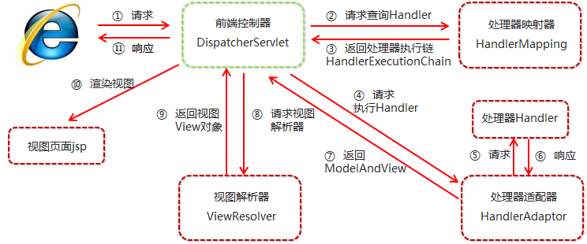

##  Spring MVC的主要组件？

1. 前端控制器 DispatcherServlet（不需要程序员开发）

   > 作用：接收请求、响应结果，相当于转发器，有了DispatcherServlet 就减少了其它组件之间 的耦合度。

2. 处理器映射器HandlerMapping（不需要程序员开发） 

   > 作用：根据请求的URL来查找Handler 

3. 处理器适配器HandlerAdapter

   > 注意：在编写Handler的时候要按照HandlerAdapter要求的规则去编写，这样适配器 HandlerAdapter才可以正确的去执行Handler。

4. 处理器Handler（需要程序员开发） 

5. 视图解析器 ViewResolver（不需要程序员开发） 

   > 作用：进行视图的解析，根据视图逻辑名解析成真正的视图（view） 

6. 视图View（需要程序员开发jsp） View是一个接口， 它的实现类支持不同的视图类型（jsp，freemarker，pdf等等）

## 请描述Spring MVC的工作流程？

1. 用户发送请求至前端控制器DispatcherServlet； 
2. DispatcherServlet收到请求后，调用HandlerMapping处理器映射器，请求获取Handle；
3. 处理器映射器根据请求url找到具体的处理器，生成处理器对象及处理器拦截器(如果有则生 成)一并返回给DispatcherServlet； 
4. DispatcherServlet 调用 HandlerAdapter处理器适配器； 
5. HandlerAdapter 经过适配调用具体处理器(Handler，也叫后端控制器)； 
6. Handler执行完成返回ModelAndView； 
7. HandlerAdapter将Handler执行结果ModelAndView返回给DispatcherServlet； 
8. DispatcherServlet将ModelAndView传给ViewResolver视图解析器进行解析； 
9. ViewResolver解析后返回具体View； 
10. DispatcherServlet对View进行渲染视图（即将模型数据填充至视图中） 
11. DispatcherServlet响应用户。

## Spring MVC常用的注解有哪些？

@RequestMapping：用于处理请求 url 映射的注解，可用于类或方法上。用于类上，则表示类中 的所有响应请求的方法都是以该地址作为父路径。 

@RequestBody：注解实现接收http请求的json数据，将json转换为java对象。 

@ResponseBody：注解实现将conreoller方法返回对象转化为json对象响应给客户。

 @Controller：控制器的注解，表示是表现层,不能用用别的注解代替

@RestController :  组合注解 @Conntroller + @ResponseBody

