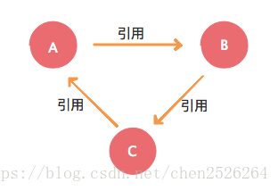

## Spring 框架中都用到了哪些设计模式？

1. 工厂模式：BeanFactory就是简单工厂模式的体现，用来创建对象的实例； 

2. 单例模式：Bean默认为单例模式。 
3. 代理模式：Spring的AOP功能用到了JDK的动态代理和CGLIB字节码生成技术；

4. 模板方法：用来解决代码重复的问题。比如. RestTemplate, JmsTemplate, JpaTemplate。

5. 观察者模式：定义对象键一种一对多的依赖关系，当一个对象的状态发生改变时，所有依赖于它的 对象都会得到通知被制动更新，如Spring中listener的实现–ApplicationListener。

## Spring容器启动流程是怎样的

创建Spring容器，也就是启动Spring时⾸先会进⾏扫描，扫描得到所有的BeanDefinition对象，并存在⼀个Map中 , 然后筛选出⾮懒加载的单例BeanDefinition进⾏创建Bean , 利⽤BeanDefinition创建Bean就是Bean的创建⽣命周期，这期间包括了合并BeanDefinition、推断 构造⽅法、实例化、属性填充、初始化前、初始化、初始化后等步骤，其中AOP就是发⽣在初始化 后这⼀步骤中  , 单例Bean创建完了之后，Spring会发布⼀个容器启动事件  ,之后 Spring启动结束 

还涉及到⼀些 BeanFactoryPostProcessor和BeanPostProcessor的注册，Spring的扫描就是通过 BenaFactoryPostProcessor来实现的，依赖注⼊就是通过BeanPostProcessor来实现的  , 在Spring启动过程中还会去处理@Import等注解加载配置类

## 什么是Spring IOC 容器？

控制反转即IOC (Inversion of Control)，它把传统上由程序代码直接操控的对象的调用权交给容 器，通过容器来实现对象组件的装配和管理。所谓的“控制反转”概念就是对组件对象控制权的转 移，从程序代码本身转移到了外部容器。 

Spring IOC 负责创建对象，管理对象（通过依赖注入（DI），装配对象，配置对象，并且管理这 些对象的整个生命周期。

**控制反转(IOC)有什么作用**

管理对象的创建和依赖关系的维护。对象的创建并不是一件简单的事，在对象关系比较复杂时，如 果依赖关系需要程序猿来维护的话，那是相当头疼的 

解耦，由容器去维护具体的对象 

托管了类的产生过程，比如我们需要在类的产生过程中做一些处理，最直接的例子就是代理，如果 有容器程序可以把这部分处理交给容器，应用程序则无需去关心类是如何完成代理的


**IOC的优点是什么？**

IOC 或 依赖注入把应用的代码量降到最低。 

它使应用容易测试，单元测试不再需要单例和JNDI查找机制。 

最小的代价和最小的侵入性使松散耦合得以实现。 

IOC容器支持加载服务时的饿汉式初始化和懒加载。


## BeanFactory 和 ApplicationContext有什么区别？

BeanFactory和ApplicationContext是Spring的两大核心接口，都可以当做Spring的容器。其中 ApplicationContext是BeanFactory的子接口。

**依赖关系**

BeanFactory：是Spring里面最底层的接口，包含了各种Bean的定义，读取bean配置文档， 管理bean的加载、实例化，控制bean的生命周期，维护bean之间的依赖关系

ApplicationContext接口作为BeanFactory的派生，除了提供BeanFactory所具有的功能外，还提 供了更完整的框架功能：

- 继承MessageSource，因此支持国际化。 
- 统一的资源文件访问方式。 
- 提供在监听器中注册bean的事件。 
- 同时加载多个配置文件。 
- 载入多个（有继承关系）上下文 ，使得每一个上下文都专注于一个特定的层次，比如应用的 web层。

**加载方式**

BeanFactroy采用的是延迟加载形式来注入Bean的，即只有在使用到某个Bean时(调用 getBean())，才对该Bean进行加载实例化。

ApplicationContext，它是在容器启动时，一次性创建了所有的Bean。

**注册方式**

BeanFactory和ApplicationContext都支持BeanPostProcessor、 BeanFactoryPostProcessor的使用，但两者之间的区别是：BeanFactory需要手动注册，而 ApplicationContext则是自动注册。


## 什么是Spring的依赖注入？

控制反转IOC是一个很大的概念，可以用不同的方式来实现。其主要实现方式有两种：依赖注入和依赖查找依赖注入：相对于IOC而言，依赖注入(DI)更加准确地描述了IOC的设计理念。

所谓依赖注 入（Dependency Injection），即组件之间的依赖关系由容器在应用系统运行期来决定，也就是 由容器动态地将某种依赖关系的目标对象实例注入到应用系统中的各个关联的组件之中。组件不做定位查询，只提供普通的Java方法让容器去决定依赖关系。


## 有哪些不同类型的依赖注入实现方式？

依赖注入是时下最流行的IOC实现方式，依赖注入分为接口注入（Interface Injection），Setter方 法注入（Setter Injection）和构造器注入（Constructor Injection）三种方式。其中接口注入由于 在灵活性和易用性比较差，现在从Spring4开始已被废弃。

构造器依赖注入：构造器依赖注入通过容器触发一个类的构造器来实现的，该类有一系列参数，每 个参数代表一个对其他类的依赖。

Setter方法注入：Setter方法注入是容器通过调用无参构造器或无参static工厂 方法实例化bean之 后，调用该bean的setter方法，即实现了基于setter的依赖注入。


## Spring支持的几种bean的作用域 Scope

Spring框架支持以下五种bean的作用域：

singleton : bean在每个Spring ioc 容器中只有一个实例。

prototype：一个bean的定义可以有多个实例。 

request：每次http请求都会创建一个bean，该作用域仅在基于web的Spring ApplicationContext情形下有效。 

session：在一个HTTP Session中，一个bean定义对应一个实例。该作用域仅在基于web的 Spring ApplicationContext情形下有效。 

global-session：在一个全局的HTTP Session中，一个bean定义对应一个实例。该作用域仅在基 于web的Spring ApplicationContext情形下有效。

> 注意： 缺省的Spring bean 的作用域是Singleton。使用 prototype 作用域需要慎重的思考，因为频繁 创建和销毁 bean 会带来很大的性能开销

## Spring框架中的单例bean是线程安全的吗？

不是，Spring框架中的单例bean不是线程安全的 , spring 中的 bean 默认是单例模式，spring 框架并没有对单例 bean 进行多线程的封装处理。

实际上大部分时候 spring bean 无状态的（比如 dao 类），所有某种程度上来说 bean 也是安全 的，但如果 bean 有状态的话（比如 view model 对象），那就要开发者自己去保证线程安全了， 最简单的就是改变 bean 的作用域，把“singleton”变更为“prototype”，这样请求 bean 相当于 new Bean()了，所以就可以保证线程安全了。


## Spring如何处理线程并发问题？

在一般情况下，只有无状态的Bean才可以在多线程环境下共享，在Spring中，绝大部分Bean都可 以声明为singleton作用域，因为Spring对一些Bean中非线程安全状态采用ThreadLocal进行处 理，解决线程安全问题

ThreadLocal和线程同步机制都是为了解决多线程中相同变量的访问冲突问题。同步机制采用了 “时间换空间”的方式，仅提供一份变量，不同的线程在访问前需要获取锁，没获得锁的线程则需要 排队。而ThreadLocal采用了“空间换时间”的方式。

ThreadLocal会为每一个线程提供一个独立的变量副本，从而隔离了多个线程对数据的访问冲突。 因为每一个线程都拥有自己的变量副本，从而也就没有必要对该变量进行同步了。ThreadLocal提 供了线程安全的共享对象，在编写多线程代码时，可以把不安全的变量封装进ThreadLocal。


## spring 自动装配 bean 有哪些方 式？

在spring中，对象无需自己查找或创建与其关联的其他对象，由容器负责把需要相互协作的对象引 用赋予各个对象，使用autowire来配置自动装载模式。

在Spring框架xml配置中共有5种自动装配： 

- no：默认的方式是不进行自动装配的，通过手工设置ref属性来进行装配bean  
- byName：通过bean的名称进行自动装配，如果一个bean的 property 与另一bean 的name 相 同，就进行自动装配。
- byType：通过参数的数据类型进行自动装配。
- constructor：利用构造函数进行装配，并且构造函数的参数通过byType进行装配。
- autodetect：自动探测，如果有构造方法，通过 construct的方式自动装配，否则使用 byType的方式自动装配。

## 使用@Autowired注解自动装配的过程是怎样的？

使用@Autowired注解来自动装配指定的bean。在使用@Autowired注解之前需要在Spring配置文 件进行配置，。

在启动spring IOC时，容器自动装载了一个AutowiredAnnotationBeanPostProcessor后置处理 器，当容器扫描到@Autowied、@Resource或 @Inject时，就会在IOC容器自动查找需要的bean， 并装配给该对象的属性。在使用@Autowired时，首先在容器中查询对应类型的bean：

- 如果查询结果刚好为一个，就将该bean装配给@Autowired指定的数据；
- 如果查询的结果不止一个，那么@Autowired会根据名称来查找；
- 如果上述查找的结果为空，那么会抛出异常。解决方法时，使用required=false

## Spring常用注解有哪些

创建对象 : @Component, @Controller, @Repository, @Service

注入数据注解 : 

- @Autowired 
- @Resource 
- @Qualifier

控制生命周期注解 : @PostConstruct   @PreDestroy

控制作用域注解 : @Scope


## Spring支持的事务管理类型， spring 事务实现方式有哪些

编程式事务管理：这意味你通过编程的方式管理事务，给你带来极大的灵活性，但是难维护。 

声明式事务管理：这意味着你可以将业务代码和事务管理分离，你只需用注解和XML配置来 管理事务。


## Spring中的事务是如何实现的

1. Spring事务底层是基于数据库事务和AOP机制的

2. ⾸先对于使⽤了@Transactional注解的Bean，Spring会创建⼀个代理对象作为Bean

3. 当调⽤代理对象的⽅法时，会先判断该⽅法上是否加了@Transactional注解

4. 如果加了，那么则利⽤事务管理器创建⼀个数据库连接

5. 并且修改数据库连接的autocommit属性为false，禁⽌此连接的⾃动提交，这是实现Spring事务⾮ 常重要的⼀步 

6. 然后执⾏当前⽅法，⽅法中会执⾏sql 
7. 执⾏完当前⽅法后，如果没有出现异常就直接提交事务
8.  如果出现了异常，并且这个异常是需要回滚的就会回滚事务，否则仍然提交事务 
9. Spring事务的隔离级别对应的就是数据库的隔离级别 
10. Spring事务的传播机制是Spring事务⾃⼰实现的，也是Spring事务中最复杂的 
11. Spring事务的传播机制是基于数据库连接来做的，⼀个数据库连接⼀个事务，如果传播机制配置为 需要新开⼀个事务，那么实际上就是先建⽴⼀个数据库连接，在此新数据库连接上执⾏sql

## Spring中什么时候 @Transactional会失效

因为Spring事务是基于代理来实现的，所以某个加了@Transactional的⽅法只有是被代理对象调⽤时， 那么这个注解才会⽣效，所以如果是被代理对象来调⽤这个⽅法，那么@Transactional是不会失效的。 

同时如果某个⽅法是private的，那么@Transactional也会失效，因为底层cglib是基于⽗⼦类来实现 的，⼦类是不能重载⽗类的private⽅法的，所以⽆法很好的利⽤代理，也会导致@Transactianal失效


## 说一下Spring的事务传播行为

spring事务的传播行为说的是，当多个事务同时存在的时候，spring如何处理这些事务的行为

> 1.  PROPAGATION_REQUIRED：如果当前没有事务，就创建一个新事务，如果当前存在事务，就 加入该事务，该设置是最常用的设置。 
>
> 2. PROPAGATION_SUPPORTS：支持当前事务，如果当前存在事务，就加入该事务，如果当前不 存在事务，就以非事务执行。 
>
> 3. PROPAGATION_MANDATORY：支持当前事务，如果当前存在事务，就加入该事务，如果当前 不存在事务，就抛出异常。
>
> 4. PROPAGATION_REQUIRES_NEW：创建新事务，无论当前存不存在事务，都创建新事务。
>
> 5.  PROPAGATION_NOT_SUPPORTED：以非事务方式执行操作，如果当前存在事务，就把当前 事务挂起。
>
> 6.  PROPAGATION_NEVER：以非事务方式执行，如果当前存在事务，则抛出异常。
>
> 7. PROPAGATION_NESTED：如果当前存在事务，则在嵌套事务内执行。如果当前没有事务，则 按REQUIRED属性执行。


## 什么是AOP

AOP(Aspect-Oriented Programming)，一般称为面向切面编程，作为面向对象的一种补充，用于 将那些与业务无关，但却对多个对象产生影响的公共行为和逻辑，抽取并封装为一个可重用的模 块，这个模块被命名为“切面”（Aspect），减少系统中的重复代码，降低了模块间的耦合度，同时 提高了系统的可维护性。可用于权限认证、日志、事务处理等


## Spring AOP and AspectJ AOP 有什么区别？AOP 有哪些实现 方式？

AOP实现的关键在于 代理模式，AOP代理主要分为静态代理和动态代理。静态代理的代表为 AspectJ；动态代理则以Spring AOP为代表。

- AspectJ是静态代理的增强，所谓静态代理，就是AOP框架会在编译阶段生成AOP代理 类，因此也称为编译时增强，他会在编译阶段将AspectJ(切面)织入到Java字节码中，运行的 时候就是增强之后的AOP对象。
- Spring AOP使用的动态代理，所谓的动态代理就是说AOP框架不会去修改字节码，而是每次 运行时在内存中临时为方法生成一个AOP对象，这个AOP对象包含了目标对象的全部方法，并且在 特定的切点做了增强处理，并回调原对象的方法。

## JDK动态代理和CGLIB动态代理的区别

Spring AOP中的动态代理主要有两种方式，JDK动态代理和CGLIB动态代理：

- JDK动态代理只提供接口的代理，不支持类的代理

  > ```
  > Proxy.newProxyInstance(类加载器, 代理对象实现的所有接口, 代理执行器)
  > ```

- CGLIB是通过继承的方式做的动态代理 , 如果某个类被标记为final，那么它是无法使用 CGLIB做动态代理的。

  > ```
  > Enhancer.create(父类的字节码对象, 代理执行器)
  > ```

## 什么是循环引用, 如何解决循环引用

循环引用的bean之间会构成一个环，如下图所示，A、B、C之间构成了一个环形。



要想打破这个环，那么这个环中至少需要有一个bean可以在自身的依赖还没有得到满足前，就能够被创建出来（最起码要被实例化出来，可以先不注入其需要的依赖）

这种bean只能是通过属性注入依赖的类，因为它们可以先使用默认构造器创建出实例，然后再通过setter方法注入依赖。而通过构造器注入依赖的类，在它的依赖没有被满足前，无法被实例化


## 知不知道什么是Spring Refresh

Spring容器创建之后，会调用它的refresh方法刷新Spring应用的上下文。

https://www.cnblogs.com/grasp/p/11942735.html

