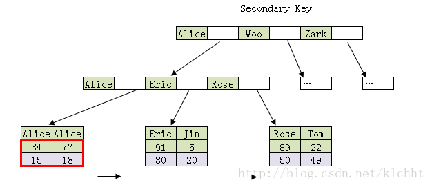
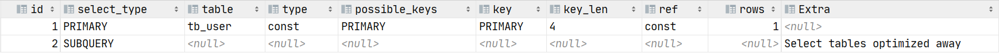
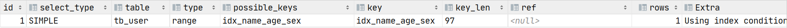

# 一. MYSQL索引

## 1.1 索引介绍

### 1.1.1 索引是什么                                   

官⽅方介绍索引是帮助MySQL高效获取数据的数据结构。更更通俗的说，数据库索引好比是一本书前面的目录，能加快数据库的查询速度。

一般来说索引本身也很大，不可能全部存储在内存中，因此索引往往是存储在磁盘上的文件中的（可能存储在单独的索引文件中，也可能和数据一起存储在数据文件中）。

我们通常所说的索引，包括聚集索引、覆盖索引、组合索引、前缀索引、唯⼀一索引等，没有特别说明，默认都是使用 B+树 结构组织的索引。


### 索引的优势和劣势                               

**优势：**

可以提高数据检索的效率，降低数据库的IO成本，类似于书的⽬目录。 

通过索引列对数据进行行排序，降低数据排序的成本，降低了了CPU的消耗。

被索引的列会自动进行排序，包括【单列索引】和【组合索引】，只是组合索引的排序要复杂一些。

如果按照索引列的顺序进行排序，对应order by语句句来说，效率就会提高很多。

where 索引列在存储引擎层处理覆盖索引，不需要回表查询

**劣势：**

索引会占据磁盘空间

索引虽然会提高查询效率，但是会降低更新表的效率。比如每次对表进行增删改操作，MySQL不仅要保存数据，还要保存或者更新对应的索引文件

## 1.2 索引分类

### 单列索引                                    

普通索引：MySQL中基本索引类型，没有什么限制，允许在定义索引的列中插入重复值和空值，纯粹为了查询数据更快一点。

唯一索引：索引列中的值必须是唯一的，但是允许为空值

主键索引：是一种特殊的唯一索引，不允许有空值

全文索引： 只有在MyISAM引擎、InnoDB（5.6以后）上才能使⽤用，而且只能在CHAR,VARCHAR,TEXT类型字段上使⽤用全⽂文索引。 

### 组合索引                                      

在表中的多个字段组合上创建的索引 

组合索引的使用，需要遵循左前缀原则

一般情况下，建议使用组合索引代替单列索引（主键索引除外）


### 空间索引                                   

一般使用不到


## 1.3 索引使用

### 1.3.1 创建索引

#### 单列索引

**普通索引**

```sql
create index 索引名称 on 表名(列名);

alter table 表名 add  index 索引名称 (列名);
```

例如 : 

```sql
create index index_category on tb_spu(category3_id);

alter table tb_spu add  index index_category (category3_id);
```


**唯一索引**

```sql
create unique index 索引名称 on 表名(列名);

alter table 表名 add unique  index 索引名称 (列名);
```

例如 :

```sql
create unique index unique_index_name on tb_brand(name);

alter table tb_brand add unique  index unique_index_name (name);
```

**全文索引**

```sql
create fulltext index 索引名称 on 表名(列名);

alter table 表名 add fulltext  index 索引名称 (列名);
```

例如 : 

```sql
create fulltext index fulltext_index_name on tb_brand(name);

alter table tb_brand add fulltext index fulltext_index_name (name);
```


#### 组合索引

```sql
create index 索引名称 on 表名(列名1,列名2);

alter table 表名 add  index 索引名称 (列名1,列名2);
```

例如 :

```sql
create  index index_category_brand on tb_spu(category3_id,brand_id);

alter table tb_spu add  index index_category_brand (category3_id,brand_id);
```


### 1.3.2 删除索引

```sql
drop index 索引名称 on 表名
```

### 1.3.3 查看索引

```
show index from 表名
```


## 1.4 索引原理分析

### 1.4.1 索引的存储结构                                 

索引是在**存储引擎中实现**的，也就是说不同的存储引擎，会使用不同的索引

MyISAM和InnoDB存储引擎：只⽀支持**B+ TREE索引**， 也就是说默认使用BTREE，不能够更换

MEMORY/HEAP存储引擎：支持HASH和BTREE索引

#### B树和B+树         

参考网站 : https://segmentfault.com/a/1190000020416577

数据结构示例：https://www.cs.usfca.edu/~galles/visualization/Algorithms.html


**B树** 

B树又名平衡多路查找树(查找路径不只两个)，不同于常见的二叉树，它是一种多叉树，我们常见的使用场景一般是在数据库索引技术里，大量使用者B树和B+树的数据结构。


B树大多用在磁盘上用于查找磁盘的地址。因为磁盘会有大量的数据，有可能没有办法一次将需要的所有数据加入到内存中，所以只能逐一加载磁盘页，每个磁盘页就对应一个节点，而对于B树来说，B树很好的将树的高度降低了，这样就会减少IO查询次数，虽然一次加载到内存的数据变多了，但速度绝对快于二插查找数或是红黑树的。

> B树的高度一般都是在2-4级 , 树的高度直接影响读写的次数
>
> 如果是三层树结构存储的数据量可以达到20G , 四层树结构存储的数据量可以达到几十T


**B+树**

B树和B+树的最大区别在于**非叶子节点是否存储数据**。

- B树是非叶子节点和叶子节点都会存储数据。

- B+树只有叶子节点才会存储数据，而且存储的数据都是在⼀行上，而且这些数据都是有指针指向的，也就是有顺序的。 


### 1.4.2 存储引擎

存储引擎是数据库底层软件组织，数据库管理系统（DBMS）使用数据引擎进行创建、查询、更新和删除数据。

不同的存储引擎提供不同的存储机制、索引技巧、锁定水平等功能，使用不同的存储引擎，还可以获得特定的功能。

使用哪一种引擎需要灵活选择，一个数据库中多个表可以使用不同引擎以满足各种性能和实际需求，使用合适的存储引擎，将会提高整个数据库的性能


Mysql数据库默认使用`InnoDB`存储引擎 


### 1.4.3 非聚集索引 (聚簇索引)

在使用`MyISAM`存储引擎的时候, B+树叶子节点只会存储数据行的指针，简单来说**数据和索引不在一起**

**主键索引**


这里假设表一共有三列,假设我们以 Col1 为主键,则上图是一个 MyISAM 表的主索引(Primary key)示意。

可以看出 MyISAM 的索引文件仅仅保存数据记录的地址。

**辅助索引**

在 MyISAM 中,主键索引和辅助索引在结构上没有任何区别, 只是主键索引要求 key 是唯一的, 而辅助索引的 key 可以重复。如果我们在 Col2 上建立一个辅助索引,则此索引的结构如下图所示


同样也是一颗B+Tree,data 域保存数据记录的地址。因此,MyISAM 中索引检索的算法为首先按照 B+Tree 搜索算法搜索索引,如果指定的 Key 存在,则取出其data 域的值 , 然后以 data 域的值为地址,读取相应数据记录。


**总结 : 以上这种索引和数据单独存储, 索引节点中保存数据存储地址的索引方式称之为非聚集索引**

### 1.4.4 聚集索引(聚簇索引)

在使用`InnoDB`存储引擎的时候, B+树叶子节点会存储数据行记录，简单来说**数据和索引在一起存储**

**主键索引**

InnoDB 要求表必须有主键 , 如果没有显式指定,则 MySQL系统会自动选择一个可以唯一标识数据记录的列作为主键,如果不存在这种列,则MySQL 自动为 InnoDB 表生成一个隐含字段作为主键, 类型为长整形。


上图是 InnoDB 主键索引(同时也是数据文件)的示意图,可以看到叶子节点包含了完整的数据记录。这种索引叫做聚集索引。因为 InnoDB 的数据文件本身按主键聚集


**辅助索引**

与 MyISAM 索引的不同是 InnoDB 的辅助索引 data 域存储相应记录主键的值而不是地址。换句话说 , InnoDB 的所有辅助索引都引用主键索引的data 域


聚集索引这种实现方式使得按主键的搜索十分高效,但是辅助索引搜索需要检索两遍索引:首先检索辅助索引获得主键 , 然后用主键到主索引中检索获得记录。


问 : 

1. 在一个非主键字段上创建了索引, 想要根据该字段查询到数据, 需要查询几次 ? 

2. 使用UUID作为数据库的主键, 是否合适 ? 

   
   
   

### 1.4.5 回表查询

如上述示例中所说 , 当我们为一张表的`name`字段建立了索引 , 执行如下查询语句 : 

`select name,age from user where name='Alice'`

那么获取到数据的过程为 : 

1. 根据`name='Alice'`查找索引树 , 定位到匹配数据的主键值为` id=18`

2. 根据`id=18`到主索引获取数据记录  (回表查询)

   

先定位主键值，再定位行记录就是所谓的**回表查询**，它的性能较扫一遍索引树低


### 1.4.6 覆盖索引

覆盖索引是指只需要在一棵索引树上就能获取SQL所需的所有列数据 , 因为无需回表查询效率更高

实现覆盖索引的常见方法是：将被查询的字段，建立到联合索引里去。如上列所示, 执行如下查询语句 :

`select name,age from user where name='Alice'`

因为要查询 `name `和 `age`二个字段 , 那么我们可以建立组合索引

```sql
create index index_name_age on user(name,age) 
```

那么索引存储结构如下 : 




这种情况下, 执行`select name,age from user where name='Alice'` , 会先根据`name='Alice'`, 找到记录 , 这条记录的索引上刚好又包含了 age 数据 , 直接把 ` Alice 77 `数据返回 , 就不会执行回表查询 , 这就是覆盖索引


### 1.4.7 左前缀原则

在mysql建立联合索引时会遵循左前缀匹配的原则，即最左优先，在检索数据时从联合索引的最左边开始匹配，组合索引的第一个字段必须出现在查询组句中，这个索引才会被用到 ; 

例如 : `create index index_age_name_sex on tb_user(age,name,sex);`

上述SQL语句对 `age`,`name`和`sex`建一个组合索引`index_age_name_sex `,实际上这条语句相当于建立了` (age) ,  (age,name) , (age,name,sex) `三个索引 .

```sql
select * from tb_user where age = 49 ;  -- 使用索引

select * from tb_user where age = 49 and name = 'Alice' ;  -- 使用索引

select * from tb_user where age = 49 and name = 'Alice' and sex = 'man';  -- 使用索引

select * from tb_user where age = 49  and sex = 'man';  -- 使用索引 , 但是只有 age 匹配索引 sex没有走索引

select * from tb_user where name = 'Alice' and age = 49 and sex = 'man' ;  -- 使用索引 ,  因为MySQL的查询优化器会自动调整 where 子句的条件顺序以使用适合的索引

select * from tb_user where name = 'Alice'  and sex = 'man' ;  -- 不会使用索引
```


**1. 范围查询**

mysql 会一直从左向右匹配直到遇到范围查询（`>、<、between、like`）就停止匹配。范围列可以用到索引，但是范围列后面的列无法用到索引。

```
select * from tb_user where  age >50 and name = 'Alice' and sex = 'man' ;
```


**2. like 语句的索引问题**

如果通配符 % 不出现在开头，则可以用到索引，` like “value%” `可以使用索引，但是 `like “%value%” `不会使用索引，走的是全表扫描

```
select * from tb_user where age = 18  and name like "%m" ; -- 不会使用索引

select * from tb_user where age = 18  and name like "J%" ; -- 会使用索引
```


**3. 不要在列上进行运算**

 如果查询条件中含有函数或表达式，将导致索引失效而进行全表扫描


**4. 索引不会包含有 NULL 值的列**

只要列中包含有 NULL 值都将不会被包含在索引中，复合索引中只要有一列含有 NULL 值，那么这一列对于此复合索引就是无效的。所以在数据库设计时不要让字段的默认值为 NULL

## 1.5 索引分析

MySQL 提供了⼀个 `EXPLAIN `命令, 它可以对 SELECT 语句的执⾏计划进⾏分析, 并输出 SELECT 执⾏的 详细信息, 以供开发⼈员针对性优化. 使⽤explain这个命令来查看⼀个这些SQL语句的执行计划，查看该SQL语句有没有使⽤上了索引，有没有做全表扫描，这都可以通过explain命令来查看。 可以通过explain命令深⼊了解MySQL的基于开销的优化器，还可以获得很多可能被优化器考虑到的访 问策略的细节，以及当运⾏SQL语句时哪种策略预计会被优化器采⽤。 EXPLAIN 命令⽤法⼗分简单, 在 SELECT 语句前加上 explain 就可以了, 例如:

```sql
explain select * from tb_user where  name = 'Alice';
```

### **1.5.1 环境准备**

```sql
-- 用户表
create table tb_user
(
    id     int auto_increment
        primary key,
    age    int      null,
    name   char(32) null,
    sex    char(10) null,
    deptId int      null,
    addrId int      null
);


INSERT INTO tb_user (age, name, sex, deptId, addrId) VALUES (34, 'Bob', 'man', 1, 2);
INSERT INTO tb_user (age, name, sex, deptId, addrId) VALUES (77, 'Alice', 'women', 1, 1);
INSERT INTO tb_user (age, name, sex, deptId, addrId) VALUES (5, 'Jim', 'man', 2, 1);
INSERT INTO tb_user (age, name, sex, deptId, addrId) VALUES (91, 'Eric', 'woman', 2, 2);
INSERT INTO tb_user (age, name, sex, deptId, addrId) VALUES (22, 'Tom', 'man', 2, 2);
INSERT INTO tb_user (age, name, sex, deptId, addrId) VALUES (89, 'Rose', 'woman', 1, 3);

-- 部⻔表
create table tb_dep
(
    id   int          not null
        primary key,
    name varchar(100) null
);

INSERT INTO tb_dep (id, name) VALUES (1, '咨询部');
INSERT INTO tb_dep (id, name) VALUES (2, '人事部');
INSERT INTO tb_dep (id, name) VALUES (3, '学工部');

-- 地址表
create table tb_addr
(
    id      int          not null
        primary key,
    address varchar(100) null
);
INSERT INTO tb_addr (id, address) VALUES (1, '湖北省');
INSERT INTO tb_addr (id, address) VALUES (2, '湖南省');
INSERT INTO tb_addr (id, address) VALUES (3, '北京市');

-- 创建普通索引
alter table tb_user add index idx_dep(did);
-- 创建唯⼀索引
alter table tb_user add unique index idx_name(name);
-- 创建组合索引
alter table tb_user add index idx_name_age_sex(name,age,sex);
-- 创建全⽂索引
alter table tb_addr add fulltext ft_addr(address);

```


### 1.5.2 参数说明 

expain 出来的信息有10列，分别是 


#### **id** 

每个 SELECT语句都会⾃动分配的⼀个唯⼀标识符. 表示查询中操作表的顺序，有三种情况： 

- id相同：执⾏顺序由上到下 

- id不同：如果是⼦查询，id号会⾃增，id越⼤，优先级越⾼。 

- id相同和不同同时存在 

id列为null的就表示这是⼀个结果集，不需要使⽤它来进⾏查询。


例如 : 

```sql
explain select (select name from tb_user) from tb_user ;
```


#### **select_type**

查询类型，主要⽤于区别普通查询、联合查询(union、union all)、⼦查询等复杂查询。

> **simple** 
>
> 表示不需要union操作或者不包含⼦查询的简单select查询。有连接查询时，外层的查询为simple，且 只有⼀个
>
> 
>
> 例如 : 
>
> ```
> explain select * from tb_user
> ```
>
> 
>
> **primary**
>
>  ⼀个需要union操作或者含有⼦查询的select，位于最外层的单位查询的select_type即为primary。且只 有⼀个
>
> 例如 : 
>
> ```
> explain select (select name from tb_user) from tb_user ;
> ```
>
> 
>
> **subquery** 
>
> 除了from字句中包含的⼦查询外，其他地⽅出现的⼦查询都可能是subquery
>
> 例如 : 
>
> ```
> explain select * from tb_user where id = (select max(id) from tb_user);
> ```
>
> 
>
> **dependent subquery**
>
> 与`dependent union`类似，表示这个subquery的查询要受到外部表查询的影响
>
> 例如 : 
>
> ```
> explain select id,name,(select name from tb_dep a where a.id=b.deptId) from tb_user b;
> ```
>
> 
>
> **union** 
>
> union连接的两个select查询，第⼀个查询是PRIMARY，除了第⼀个表外，第⼆个以后的表select_type 都是union
>
> 
>
> 例如 : 
>
> ```
> explain select * from tb_user where sex='man' union select * from tb_user where sex='2';
> ```
>
> 
>
> 
>
> **dependent union**
>
> 与union⼀样，出现在union 或union all语句中，但是这个查询要受到外部查询的影响
>
> 例如 : 
>
> ```
> explain select * from tb_user where sex in (select sex from tb_user where sex='1' union select sex from tb_user where sex='2');
> ```
>
> 
>
> 
>
> **union result**
>
> 包含union的结果集，在union和union all语句中,因为它不需要参与查询，所以id字段为null
>
> 
>
> **derived** 
>
> from字句中出现的⼦查询，也叫做派⽣表，其他数据库中可能叫做内联视图或嵌套select
>
> 例如 : 
>
> ```
> explain select * from (select * from tb_user where sex='man') b;
> ```
>
> 
>

**table**

显示的查询表名，

- 如果查询使⽤了别名，那么这⾥显示的是别名 

- 如果不涉及对数据表的操作，那么这显示为null 

- 如果显示为尖括号括起来的就表示这个是临时表，后边的N就是执⾏计划中的id，表示结果来⾃于 这个查询产⽣

- 如果是尖括号括起来的，与<unionM,N> 类似，也是⼀个临时表，表示这个结果来⾃于union查询 的id为M,N的结果集。

#### **type**

索引的使用类型 , 性能由好到差依次为 : `system，const，eq_ref，ref，fulltext，ref_or_null，unique_subquery，index_subquery，range，index_merge，index，ALL`

除了all之外，其他的type都可以使⽤到索引，除了index_merge之外，其他的type只可以⽤到⼀个索引

如果想让一条SQL的效率高, 那么最起码要使用到range级别

> **system**
>
> 表中只有⼀⾏数据或者是空表。
>
> ```
> explain select * from (select * from tb_user where id=1) a;
> ```
>
> 
>
> 
>
> **const**
>
> 使⽤唯⼀索引或者主键，返回记录⼀定是1⾏记录的等值where条件时，通常type是const。其他数据库 也叫做唯⼀索引扫描
>
> ```
> explain select * from tb_user where name = 'Bob';
> ```
>
> 
>
> 
>
> **eq_ref**
>
> 关键字: 连接字段为主键或者唯⼀性索引。 
>
> 此类型通常出现在多表的 join 查询, 表示对于前表的每⼀个结果, 都只能匹配到后表的⼀⾏结果. 并且查 询的⽐较操作通常是 '=', 查询效率较⾼
>
> ```
> explain select a.id from tb_user a left join tb_dep b on a.deptId=b.id;
> ```
>
> 
>
> **ref**
>
> 针对⾮唯⼀性索引，使⽤等值（=）查询⾮主键。或者是使⽤了最左前缀规则索引的查询。
>
> ```
> explain select * from tb_user where name = 'Bob';
> ```
>
> 
>
> **fulltext**
>
> 全⽂索引检索，要注意，全⽂索引的优先级很⾼，若全⽂索引和普通索引同时存在时，mysql不管代 价，优先选择使⽤全⽂索引
>
> ```
> explain select * from tb_addr where match(address) against('bei');
> ```
>
> 
>
> **ref_or_null** 
>
> 与ref⽅法类似，只是增加了null值的⽐较。
>
> 
>
> **unique_subquery**
>
> ⽤于where中的in形式⼦查询，⼦查询返回不重复值唯⼀值
>
> 
>
> **index_subquery** 
>
> ⽤于in形式⼦查询使⽤到了辅助索引或者in常数列表，子查询可能返回重复值，可以使⽤索引将子查询去重。
>
> **range**
>
> 索引范围扫描，常⻅于使⽤>,<,is null,between ,in ,like等运算符的查询中。
>
> ```
> explain select * from tb_user where name like 'B%';
> ```
>
> 
>
> 
>
> **index_merge** 
>
> 表示查询使⽤了两个以上的索引，最后取交集或者并集，常⻅and ，or的条件使⽤了不同的索引，官⽅ 排序这个在ref_or_null之后，但是实际上由于要读取多个索引，性能可能⼤部分时间都不如range
>
> **index** 
>
> 索引全表扫描，把索引从头到尾扫⼀遍，常见于使用索引列就可以处理不需要读取数据⽂件的查询、可 以使⽤索引排序或者分组的查询。
>
> ```
> explain select name  from tb_user;
> ```
>
> 
>
> **all**
>
> 这个就是全表扫描数据⽂件，然后再在server层进⾏过滤返回符合要求的记录。
>
> ```
> explain select * from tb_user;
> ```
>
> 
>

#### **possible_keys**

此次查询中可能选⽤的索引，⼀个或多个

#### **key**

查询真正使⽤到的索引，select_type为index_merge时，这⾥可能出现两个以上的索引，其他的 select_type这⾥只会出现⼀个。

#### **key_len**

⽤于处理查询的索引⻓度，如果是单列索引，那就整个索引⻓度算进去，如果是多列索引，那么查询不⼀定都能使⽤到所有的列

key_len只计算where条件⽤到的索引⻓度，⽽排序和分组就算⽤到了索引，也不会计算到 key_len中。

计算规则 : 

1. 所有的索引字段，如果没有设置not null，则需要加一个字节。
2. 定长字段，int占四个字节、date占三个字节、char(n)占n个字符。
3. 对于变成字段varchar(n)，则有n个字符+两个字节。
4. 不同的字符集，一个字符占用的字节数不同。latin1编码的，一个字符占用一个字节，gbk编码的，一个字符占用两个字节，utf8编码的，一个字符占用三个字节。

**key_len越小 索引效果越好**

#### **ref**

如果是使⽤的常数等值查询，这⾥会显示const 

如果是连接查询，被驱动表的执⾏计划这⾥会显示驱动表的关联字段 

如果是条件使⽤了表达式或者函数，或者条件列发⽣了内部隐式转换，这⾥可能显示为func

#### **rows**

这⾥是执⾏计划中估算的扫描⾏数，不是精确值


#### **Extra**

这个列包含不适合在其他列中显示单⼗分重要的额外的信息，这个列可以显示的信息⾮常多，有⼏⼗ 种，常⽤的有

> **using temporary**
>
> 表示使⽤了临时表存储中间结果。
>
> **using filesort**
>
> 排序时⽆法使⽤到索引时，就会出现这个。常⻅于order by和group by语句中
>
> 说明MySQL会使⽤⼀个外部的索引排序，⽽不是按照索引顺序进⾏读取。 
>
> MySQL中⽆法利⽤索引完成的排序操作称为“⽂件排序”
>
> ```
> explain select * from tb_addr order by address;
> ```
>
> 
>
> 
>
> **using index**
>
> 查询时不需要回表查询，直接通过索引就可以获取查询的数据。
>
> - 表示相应的SELECT查询中使⽤到了覆盖索引（Covering Index），避免访问表的数据⾏，效率不 错！ 
> - 如果同时出现Using Where ，说明索引被⽤来执⾏查找索引键值 
> - 如果没有同时出现Using Where ，表明索引⽤来读取数据⽽⾮执⾏查找动作。
>
> 
>
> ```
> explain select name,age,sex from tb_user where name like '%B';
> ```
>
> 
>
> 
>
> **using where**
>
> 表示存储引擎返回的记录并不是所有的都满⾜查询条件，需要在server层进⾏过滤
>


## 1.6 索引总结

### 1.6.1 需要创建索引情况

1. 主键自动建立主键索引

2. 频繁作为查询条件的字段应该创建索引

3. 多表关联查询中，关联字段应该创建索引 (on 两边都要创建索引)

4. 查询中排序的字段，应该创建索引

5. 频繁查找字段 , 应该创建索引

6. 查询中统计或者分组字段，应该创建索引


### 1.6.2 不要创建索引情况

1. 表记录太少

2. 经常进⾏行行增删改操作的表

3. 频繁更新的字段

4. where条件里使用频率不高的字段


### 1.6.3 多使用组合索引

在多个列上建立索引 , 这种索引叫做复合索引(组合索引) , 复合索引在数据库操作期间所需的开销更小,  可以代替多个单一索引 

如下表所示(tb_user) : 


如果后期我们需要经常根据age , name , sex 三个字段进行搜索 , 那么建立索引又二种选择

1. 分别为 age , name , sex  建立单列索引

   ```
   create index index_age on tb_user(age);
   create index index_name on tb_user(name);
   create index index_sex on tb_user(sex);
   ```


2. 为  age , name , sex 三个字段建立组合索引

   ```
   create index index_age_name_sex on tb_user(age,name,sex);
   ```

   

**很明显第二种方式在一棵索引树上创建组合索引更省空间, 而且更容易实现覆盖索引 , 所以建议多使用组合索引**


# 二. MYSQL锁

## 2.1 锁介绍

按照锁的粒度来说，MySQL主要包含三种类型（级别）的锁定机制：

- 全局锁：锁的是整个database。由MySQL的SQL layer层实现的
- 表级锁：锁的是某个table。由MySQL的SQL layer层实现的 
- ⾏级锁：锁的是某⾏数据，也可能锁定⾏之间的间隙。由某些存储引擎实现，⽐如InnoDB。

按照锁的功能来说分为：共享读锁和排他写锁。 

按照锁的实现⽅式分为：悲观锁和乐观锁（使⽤某⼀版本列或者唯⼀列进⾏逻辑控制）


## 2.2 表级锁

### 2.2.1 表锁

表锁有两种表现形式：**表共享读锁（Table Read Lock）**和 **表独占写锁（Table Write Lock）**

```
LOCK TABLES
    tbl_name [[AS] alias] lock_type
    [, tbl_name [[AS] alias] lock_type] ...

lock_type: {
    READ [LOCAL]
  | [LOW_PRIORITY] WRITE
}

UNLOCK TABLES
```


例如 :

```sql
session1: lock table tb_user read; -- 给mylock表加读锁

session1: select * from tb_user; -- 可以查询
session1：select * from tb_dep; --不能访问⾮锁定表

session2：select * from tb_user; -- 可以查询 没有锁
session2：update tb_user set name='x' where id=2; -- 修改阻塞,⾃动加⾏写锁

session1：unlock tables; -- 释放表锁

session2：Rows matched: 1 Changed: 1 Warnings: 0 -- 修改执⾏完成

session1：select * from tb_dep; --可以访问
```


### 2.2.2 元数据锁

元数据锁不需要显式使⽤，在访问⼀个表的时候会被⾃动加上。元数据锁的作⽤是，保证读写的正确性。

可以想象⼀下，如果⼀个查询正在遍历⼀个表中的数据，⽽执⾏期间另⼀个线程对这个表结构做变更，删了⼀列，那么查询线程拿到的结果跟表结构对不上，肯定是不⾏的。 

因此，在 MySQL 5.5 版本中引⼊了 元数据锁，当对⼀个表做增删改查操作的时候，加元数据读锁；当要对表做结构变更操作的时候，加 元数据写锁。 

读锁之间不互斥，因此你可以有多个线程同时对⼀张执行查询。 

读写锁之间、写锁之间是互斥的，⽤来保证变更表结构操作的安全性。

因此，如果有两个线程要同时给⼀个表加字段，其中⼀个要等另⼀个执⾏完才能开始执⾏。


例如 : 

```sql
session1: begin;--开启事务
session1: select * from tb_user;--加MDL读锁

session2: alter table tb_user add email varchar(20); -- 修改阻塞

session1：commit; --提交事务 或者 rollback 释放读锁

session2：Query OK, 0 rows affected (38.67 sec) --修改完成
```


### 2.2.3 意向锁

InnoDB 支持多粒度的锁，允许表级锁和行级锁共存。一个类似于 [LOCK TABLES ... WRITE](https://dev.mysql.com/doc/refman/5.7/en/lock-tables.html) 的语句会获得这个表的 x 锁。为了实现多粒度锁，InnoDB 使用了[意向锁](https://dev.mysql.com/doc/refman/5.7/en/glossary.html#glos_intention_lock)（简称 I 锁）。I 锁是表明一个事务稍后要获得针对一行记录的某种锁（s or x）的对应表的表级锁，有两种：

- 意向排它锁（简称 IX 锁）表明一个事务意图在某个表中设置某些行的 x 锁

  ```
  SELECT * FROM table_name WHERE ... FOR UPDATE
  ```

- 意向共享锁（简称 IS 锁）表明一个事务意图在某个表中设置某些行的 s 锁

  ```
  SELECT * FROM table_name WHERE ... LOCK IN SHARE MODE
  ```

意向锁的原则如下：

- 一个事务必须先持有该表上的 IS 或者更强的锁才能持有该表中某行的 S 锁
- 一个事务必须先持有该表上的 IX 锁才能持有该表中某行的 X 锁

```
-- 意向排它锁

session1 : begin ;
session1 : select * from tb_user where id = 1 for update ; -- 设置tb_user的排它锁


session2 : select * from tb_user where id = 1 for update ;  --阻塞

session1 : commit ;  --提交事务

session2 : -- session2执行查询
+----+------+------+------+--------+--------+-------+
| id | age  | name | sex  | deptId | addrId | email |
+----+------+------+------+--------+--------+-------+
|  1 |   34 | Bob  | man  |      1 |      2 | NULL  |
+----+------+------+------+--------+--------+-------+
1 row in set (8.64 sec)


-- 意向共享锁

session1 : begin ;
session1 : select * from tb_user where id = 1 LOCK IN SHARE MODE ; -- 设置tb_user的共享

session2 : select * from tb_user where id = 1  LOCK IN SHARE MODE ;  -- 查询
+----+------+------+------+--------+--------+-------+
| id | age  | name | sex  | deptId | addrId | email |
+----+------+------+------+--------+--------+-------+
|  1 |   34 | Bob  | man  |      1 |      2 | NULL  |
+----+------+------+------+--------+--------+-------+

```


## 2.4 行级锁

MySQL的⾏级锁，是由存储引擎来实现的，利⽤存储引擎锁住索引来实现的

InnoDB的⾏级锁，按照锁定范围来说，分为三种：

- 记录锁（Record Locks）:锁定索引中⼀条记录。 id=1
- 间隙锁（Gap Locks）:要么锁住索引记录中间的值，要么锁住第⼀个索引记录前⾯的值或者最后⼀个索引记录后⾯的值。
- Next-Key Locks:是索引记录上的记录锁和在索引记录之前的间隙锁的组合。

InnoDB的⾏级锁，按照功能来说，分为两种：

 - 共享锁：允许⼀个事务去读⼀⾏，阻⽌其他事务获得相同数据集的排他锁。
 - 排他锁（独占锁）：允许获得排他锁的事务更新数据，阻⽌其他事务取得相同数据集的共享读锁（不是读）
和排他写锁。


### 2.4.1 记录锁

记录锁针对索引记录。举个例子， `SELECT c1 FROM t WHERE c1 = 10 FOR UPDATE;` 会阻止其他所有事务插入、修改或者删除 t.c1 是 10 的行。

记录锁总是锁定索引记录，即使表没有索引（这种情况下，InnoDB会创建隐式的索引，并使用这个索引实施记录锁）


### 2.4.2 间隙锁

间隙锁（gap）是索引记录之间上的锁，或者说第一个索引记录之前或最后一个索引记录之后的间隔上的锁。例如，`SELECT c1 FROM t WHERE c1 BETWEEN 10 and 20 FOR UPDATE;` 阻止其他事务插入 t.c1 = 15 的记录，不管是否已经有这种值在本列中，因为这个范围内的所有值都被上锁了。

一个间隙可能是一个索引值、多个索引值，甚至是空的。

间隙锁是性能与并发的部分折中，并只适用于一些事务隔离级别。

使用唯一索引的时候用不上间隙锁。例如，id 列有唯一索引，下面的语句只是用索引记录锁（针对id=100的行）不管其他会话是否在前面的间隙中插入行。

```
SELECT * FROM child WHERE id = 100;
```

如果id列没有索引或者是非唯一索引，那么这条语句的确会锁住前面的间隙。

```
session1 : begin ;
session1 : SELECT c1 FROM tb_user WHERE age BETWEEN 20 and 40 FOR UPDATE; -- 加

session2 : insert into tb_user values(null,30,'JAY','man',1,1,'JAY@163.com'); --阻塞
```

间隙锁（Gap Lock）是Innodb在可重复读提交下为了解决幻读问题时引入的锁机制


### 2.4.3 Next-Key Locks

Next-Key Locks （简称 NK 锁）是记录锁和间隙锁的组合。

Innodb是这样执行行级别锁的，它搜索或者扫描一个表的索引，在他遇上的索引记录上设置共享或者排他锁，这样行级锁实际就是索引记录锁，一个NK 锁同样影响索引记录之前的间隙。所以，NK 锁是一个索引记录锁和索引记录之前的间隙上的间隙锁。如果一个会话在一行 R 上有一个共享、排它锁，其他会话不能立即在R之前的间隙中插入新的索引记录。

假设一个索引包含值 10,11,13和20，索引上可能的NK 锁包括如下几个区间（注意开闭区间）

```
(negative infinity, 10]
(10, 11]
(11, 13]
(13, 20]
(20, positive infinity)
```

对于最后一个区间，NK 锁锁住了索引中最大值和比索引值中任何值都大的上确界伪值之上的间隙。上确界不是一个真正的索引记录，所以事实上NK锁只锁住了最大索引值上的间隙。

默认情况下，Innodb 是[可重复读](https://dev.mysql.com/doc/refman/5.7/en/innodb-transaction-isolation-levels.html#isolevel_repeatable-read)隔离级别，这样的话，Innodb使用NK 锁来进行索引搜索和扫描，阻止了[幻读](https://dev.mysql.com/doc/refman/5.7/en/innodb-next-key-locking.html)。


### 2.4.1 共享锁与独占锁

InnoDB 实现了标准的行级锁，包括两种：共享锁（简称 s 锁）、排它锁（简称 x 锁）

- 共享锁允许持锁事务读取数据
- 排它锁允许持锁事务更新或者删除数据

如果事务 T1 持有行 r 的 s 锁，那么另一个事务 T2 请求 r 的锁时，会做如下处理：

- T2 请求 s 锁立即被允许，结果 T1 T2 都持有 r 行的 s 锁
- T2 请求 x 锁不能被立即允许

如果 T1 持有 r 的 x 锁，那么 T2 请求 r 的 x、s 锁都不能被立即允许，T2 必须等待T1释放 x 锁才行。


## 2.6 死锁

所谓死锁(DeadLock)是指两个或两个以上的进程在执行过程中,因争夺资源而造成的一种互相等待的现象,若无外力作用，它们都将无法推进下去.此时称系统处于死锁状态或系统产生了死锁，这些永远在互相等待的进程称为死锁进程。**表级锁不会产生死锁 , 只有行级锁才会产生死锁**

```
session1 : begin ; 
session1 : update tb_user set name = 'JIMY' where id = 1 ; 

session2 : begin ; 
session2 : update tb_user set name = 'JIMY' where id = 2 ;   --阻塞

session1 : update tb_user set name = 'Heim' where id = 2 ; 

session2 : 
ERROR 1213 (40001): Deadlock found when trying to get lock; try restarting transaction
```


# 三. MySQL优化

MYSQL优化主要分为以下四大方面：

设计：存储引擎，字段类型，范式与逆范式

功能：索引，缓存，分库分表。

> 分库 : 水平分库, 垂直分库
>
> 分表 : 水平分表, 垂直分表
>
> ​    字段数量比较多 : 垂直分表
>
> ​    数据条数比较多 : 水平分表

架构：主从复制，读写分离，负载均衡。

合理SQL：测试，经验

> 优化技巧 : https://www.cnblogs.com/sharpest/p/10390035.html

